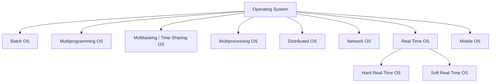

# 💻 Types of Operating Systems

## 📖 Definition

Different operating systems are designed to meet different computing requirements. Some are optimized for executing jobs in batches, while others focus on multitasking, real-time response, distributed computing, or mobile devices.

> **One-line Interview Definition:**
>
> **Operating systems are classified based on how they manage processes, users, hardware resources, and system execution.** 

---

# 🗂️ Classification of Operating Systems



---

# 1️⃣ Batch Operating System

## 📖 Definition

A **Batch Operating System** executes a group of similar jobs together (**batch**) without any user interaction. Jobs are collected, queued, and executed one after another automatically. 

### How it Works

```text
Jobs Submitted
      │
      ▼
 Operator Groups Jobs
      │
      ▼
 Batch Queue
      │
      ▼
 CPU Executes One by One
      │
      ▼
 Results Generated
```

### ✅ Advantages

- Minimal CPU idle time
- Handles repetitive jobs efficiently
- High throughput

### ❌ Disadvantages

- Long response time
- No user interaction
- Poor CPU utilization during I/O

### 💡 Examples

- Payroll Processing
- Insurance Claims
- Library Records
- Stock Market Reports

---

# 2️⃣ Multiprogramming Operating System

## 📖 Definition

A **Multiprogramming Operating System** keeps multiple programs in memory simultaneously. Whenever one process waits for I/O, the CPU switches to another process, improving CPU utilization. 

### How it Works

```text
Memory

+---------+
| Process1|
+---------+
| Process2|
+---------+
| Process3|
+---------+

CPU switches between them whenever one waits for I/O.
```

### ✅ Advantages

- Better CPU utilization
- Higher throughput
- Efficient resource sharing

### ❌ Disadvantages

- Complex memory management
- Higher RAM requirement
- Security challenges

### 💡 Examples

- Banking Systems
- Railway Reservation Systems
- Billing Machines

---

# 3️⃣ Multitasking (Time-Sharing) Operating System

## 📖 Definition

A **Multitasking (Time-Sharing) Operating System** allows multiple tasks to execute seemingly at the same time by giving each task a small **time slice (quantum)**. 

### Time Sharing

```text
CPU Timeline

| P1 | P2 | P3 | P1 | P2 | P3 |

Each process gets a fixed time quantum.
```

### ✅ Advantages

- Fair CPU allocation
- Better user experience
- Low CPU idle time

### ❌ Disadvantages

- Lower reliability
- Security concerns
- Communication conflicts

### 💡 Examples

- Windows
- Linux
- UNIX Time Sharing
- IBM VM/CMS

---

# 4️⃣ Multiprocessing Operating System

## 📖 Definition

A **Multiprocessing Operating System** uses **two or more CPUs** to execute multiple processes simultaneously, improving performance and reliability. 

### Architecture

```text
             Main Memory
                 │
      ┌──────────┴──────────┐
      │                     │
     CPU1                 CPU2
      │                     │
   Process A           Process B
```

### ✅ Advantages

- Faster execution
- High reliability
- Better performance

### ❌ Disadvantages

- Expensive hardware
- Complex synchronization
- Difficult scheduling

### 💡 Examples

- Linux
- UNIX
- macOS

---

# 5️⃣ Distributed Operating System

## 📖 Definition

A **Distributed Operating System** connects multiple independent computers through a network so they work together as a single system. 

### Architecture

```text
 Computer A
      │
──────Network──────
      │
 Computer B
      │
──────Network──────
      │
 Computer C

Appears as one system.
```

### ✅ Advantages

- Fault tolerance
- Easy scalability
- Faster execution

### ❌ Disadvantages

- Network dependency
- Complex implementation
- High cost

### 💡 Examples

- LOCUS
- Amoeba
- MICROS

---

# 6️⃣ Network Operating System (NOS)

## 📖 Definition

A **Network Operating System** runs on a server and manages users, files, printers, security, and other network resources for connected computers. 

### Architecture

```text
          Server
        /   |   \
      PC1  PC2  PC3

Shared Resources
```

### ✅ Advantages

- Centralized management
- Easy upgrades
- Remote access

### ❌ Disadvantages

- Server dependency
- High setup cost
- Regular maintenance

### 💡 Examples

- Windows Server
- Linux Server
- UNIX Server

---

# 7️⃣ Real-Time Operating System (RTOS)

## 📖 Definition

A **Real-Time Operating System (RTOS)** processes data and responds within a guaranteed time limit called the **response time**. 

---

## Types of RTOS

### Hard Real-Time OS

Missing a deadline is unacceptable.

#### Examples

- Airbags
- Missile Systems
- Aircraft Control
- Automatic Parachutes

---

### Soft Real-Time OS

Occasional deadline misses are acceptable.

#### Examples

- Video Streaming
- Online Gaming
- Multimedia Systems

---

### ✅ Advantages

- Very fast response
- High reliability
- Efficient resource utilization

### ❌ Disadvantages

- Complex design
- Limited multitasking
- Difficult scheduling algorithms

---

# 8️⃣ Mobile Operating System

## 📖 Definition

A **Mobile Operating System** is designed specifically for smartphones and tablets. It manages touch interfaces, applications, sensors, networking, and battery usage. 

### ✅ Advantages

- User-friendly interface
- Large app ecosystem
- Excellent connectivity

### ❌ Disadvantages

- Battery limitations
- Security threats
- Fragmentation (especially Android)

### 💡 Examples

- Android
- iOS
- BlackBerry OS

---

# 📊 Comparison Table

| OS Type | Main Idea | User Interaction | CPUs | Example |
|----------|-----------|-----------------|------|---------|
| Batch | Executes jobs in batches | ❌ No | 1 | Payroll System |
| Multiprogramming | Multiple programs in memory | Limited | 1 | Banking Systems |
| Multitasking | Time-sharing using quantum | ✅ Yes | 1 | Windows, Linux |
| Multiprocessing | Multiple CPUs execute together | ✅ Yes | Multiple | Linux, macOS |
| Distributed | Multiple computers work as one | ✅ Yes | Multiple Systems | Amoeba |
| Network | Server manages network resources | ✅ Yes | Server-Based | Windows Server |
| Real-Time | Guaranteed response time | Depends | 1 or More | Airbags, Robots |
| Mobile | Smartphone operating system | ✅ Yes | Mobile Processor | Android, iOS |

---

# 🎯 Frequently Asked Interview Questions

### Q1. Difference between Multiprogramming and Multitasking?

| Multiprogramming | Multitasking |
|------------------|--------------|
| CPU switches when a process waits for I/O | CPU switches after a fixed time quantum |
| Objective is CPU utilization | Objective is user responsiveness |
| Mostly batch systems | Interactive systems |

---

### Q2. Difference between Multiprocessing and Multiprogramming?

| Multiprocessing | Multiprogramming |
|-----------------|------------------|
| Uses multiple CPUs | Uses a single CPU |
| True parallel execution | Concurrent execution |
| Faster | Relatively slower |

---

### Q3. Difference between Hard and Soft RTOS?

| Hard RTOS | Soft RTOS |
|------------|-----------|
| Deadline must never be missed | Small delays are acceptable |
| Safety-critical systems | Multimedia applications |
| Airbags, Missiles | Gaming, Video Streaming |

---

### Q4. Which Operating System is used in smartphones?

- Android
- iOS
- (Earlier: BlackBerry OS)

---

# 📝 Key Points (30-Second Revision)

- ✅ **Batch OS** → Executes jobs in batches without user interaction.
- ✅ **Multiprogramming OS** → Multiple programs stay in memory to maximize CPU utilization.
- ✅ **Multitasking (Time-Sharing) OS** → CPU gives each process a fixed **time quantum**.
- ✅ **Multiprocessing OS** → Uses **multiple CPUs** for parallel execution.
- ✅ **Distributed OS** → Multiple independent computers work as one system.
- ✅ **Network OS** → Manages shared resources over a network using a server.
- ✅ **Real-Time OS (RTOS)** → Guarantees response within strict deadlines.
- ✅ **Hard RTOS** → Missing a deadline is unacceptable.
- ✅ **Soft RTOS** → Minor delays are acceptable.
- ✅ **Mobile OS** → Designed for smartphones and tablets (Android, iOS).
- ✅ **Most asked interview topics:** Multiprogramming vs Multitasking, Multiprocessing vs Multiprogramming, Hard RTOS vs Soft RTOS.