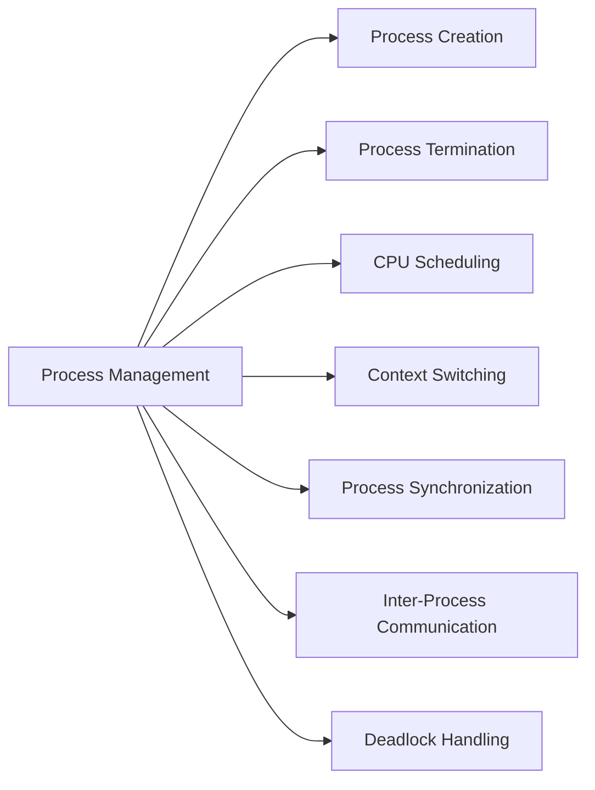
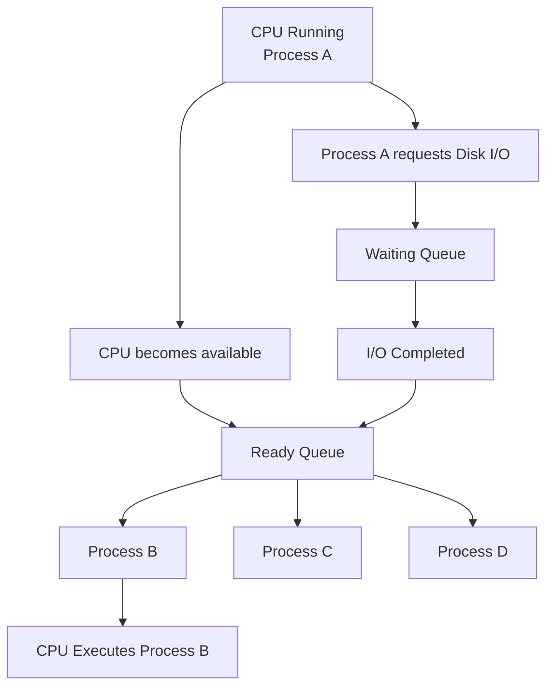
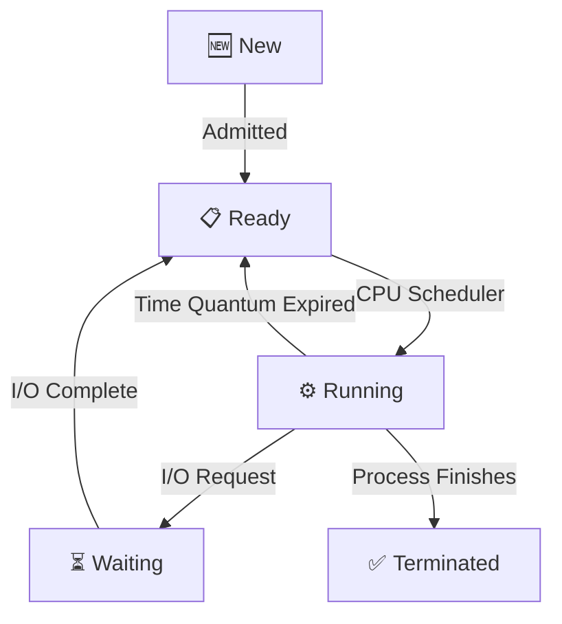

# ⚙️ Introduction to Process Management

## 📖 Definition

**Process Management** is one of the primary functions of an **Operating System (OS)**. It is responsible for creating, scheduling, executing, synchronizing, and terminating processes while ensuring efficient CPU utilization and smooth system performance.

> **One-line Interview Definition:**
>
> **Process Management is the OS function that manages the lifecycle of processes—from creation to termination—while efficiently allocating CPU and other system resources.**

---

# 🏗️ Why is Process Management Needed?

- In a **single-tasking system**, only one process executes at a time, making management simple.
- In **multiprogramming** and **multitasking systems**, multiple processes compete for CPU and resources.
- Processes may share memory, files, and devices, requiring coordination.
- The OS ensures that all processes execute efficiently without conflicts.

---

# 🗂️ Responsibilities of Process Management



---

# 🖥️ CPU-Bound vs I/O-Bound Processes

Processes can be classified based on the resource they use the most.

---

## 1️⃣ CPU-Bound Process

### 📖 Definition

A **CPU-Bound Process** spends most of its time performing computations and requires more CPU time than I/O operations.

### Characteristics

- High CPU utilization
- Less waiting for I/O
- Mostly remains in the **Running** state

### Examples

- Scientific Calculations
- Video Rendering
- Image Processing
- Machine Learning Training

---

## 2️⃣ I/O-Bound Process

### 📖 Definition

An **I/O-Bound Process** spends most of its time waiting for input/output devices rather than using the CPU.

### Characteristics

- Frequent I/O operations
- Low CPU utilization
- Mostly remains in the **Waiting** state

### Examples

- File Copying
- Database Queries
- Web Browsing
- Printing Documents

---

# 📊 CPU-Bound vs I/O-Bound

| Feature | CPU-Bound | I/O-Bound |
|----------|-----------|-----------|
| Uses More | CPU | I/O Devices |
| CPU Time | High | Low |
| Waiting Time | Low | High |
| Dominant State | Running | Waiting |
| Examples | Video Rendering, ML | File Transfer, Web Browser |

---

# 💡 Why Process Scheduling is Needed?

Since the **CPU is much faster than I/O devices**, the CPU should never remain idle while a process waits for I/O.

### Example



This improves **CPU Utilization** and **System Throughput**.

---

# ⚙️ Process Management Tasks

## 1️⃣ Process Creation

The Operating System creates a new process by:

- Assigning a unique **Process ID (PID)**
- Creating a **Process Control Block (PCB)**
- Allocating memory
- Initializing required resources

---

## 2️⃣ Process Termination

After execution completes, the Operating System:

- Releases allocated memory
- Closes open files
- Removes the PCB
- Frees all resources

---

## 3️⃣ CPU Scheduling

The scheduler decides:

- Which process gets the CPU
- How long it executes
- When another process should execute

**Goal:** Maximize CPU utilization and minimize waiting time.

---

## 4️⃣ Deadlock Handling

The Operating System ensures that processes do not become permanently blocked while waiting for resources.

Deadlock handling involves:

- Prevention
- Avoidance
- Detection
- Recovery

---

## 5️⃣ Inter-Process Communication (IPC)

Processes often need to communicate.

The OS provides mechanisms such as:

- Shared Memory
- Message Passing
- Pipes
- Sockets

---

## 6️⃣ Process Synchronization

When multiple processes access shared resources simultaneously, synchronization ensures correct execution.

Common synchronization mechanisms include:

- Semaphores
- Mutex Locks
- Monitors
- Critical Sections

---

# 🔄 Process Life Cycle



---

# 🔁 Context Switching

## 📖 Definition

**Context Switching** is the process in which the CPU stops executing one process, saves its current state, and loads the state of another process.

This allows multiple processes to share the CPU efficiently.

---

## Context Switching Steps

```text
Running Process A
        │
        ▼
Save Process A Context
        │
        ▼
Scheduler Chooses Process B
        │
        ▼
Load Process B Context
        │
        ▼
CPU Starts Executing Process B
```

---

## What is Saved During Context Switching?

- Program Counter (PC)
- CPU Registers
- Process State
- Stack Pointer
- Memory Information
- Scheduling Information

---

## When Does Context Switching Occur?

- Time Quantum Expires
- I/O Interrupt
- Higher Priority Process Arrives
- System Call
- Hardware Interrupt

---

## Advantages

- Enables multitasking
- Improves CPU utilization
- Better responsiveness
- Fair CPU sharing

---

## Disadvantages

- Context switching consumes CPU time
- No useful work is done during switching
- Excessive switching reduces performance

---

# 🌍 Real-Life Example

Suppose three applications are running simultaneously.

```text
Chrome
    │
VS Code
    │
Spotify
```

The CPU executes:

```text
Chrome → VS Code → Spotify → Chrome → VS Code ...
```

This rapid switching creates the illusion that all applications run simultaneously.

---

# 🎯 Interview Questions

### Q1. What is Process Management?

Process Management is the Operating System function responsible for creating, scheduling, synchronizing, and terminating processes.

---

### Q2. What is the main goal of Process Scheduling?

To maximize CPU utilization while minimizing waiting and response time.

---

### Q3. Difference between CPU-Bound and I/O-Bound Process?

| CPU-Bound | I/O-Bound |
|------------|-----------|
| Requires more CPU time | Requires more I/O time |
| Mostly Running | Mostly Waiting |
| Computational tasks | Input/Output tasks |

---

### Q4. What is Context Switching?

Context Switching is the process of saving one process's execution state and restoring another process's state so multiple processes can share the CPU.

---

### Q5. Why is Context Switching necessary?

Because only one process can execute on a CPU core at a time, context switching enables multitasking and efficient CPU utilization.

---

# 📝 Key Points (30-Second Revision)

- ✅ **Process Management** controls the complete lifecycle of processes.
- ✅ Main responsibilities include **process creation, scheduling, synchronization, IPC, deadlock handling, and termination**.
- ✅ **CPU-Bound Process** spends more time using the CPU.
- ✅ **I/O-Bound Process** spends more time waiting for I/O devices.
- ✅ Process Scheduling keeps the CPU busy by switching to another process during I/O waits.
- ✅ **Context Switching** saves the current process state and loads another process's state.
- ✅ Context Switching enables **multitasking**, **fair CPU allocation**, and **better responsiveness**.
- ✅ Every process has a unique **Process ID (PID)** and a **Process Control Block (PCB)**.
- ✅ Efficient Process Management improves **CPU utilization**, **throughput**, and **overall system performance**.