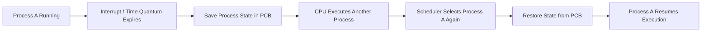
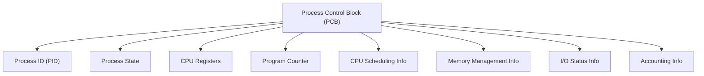
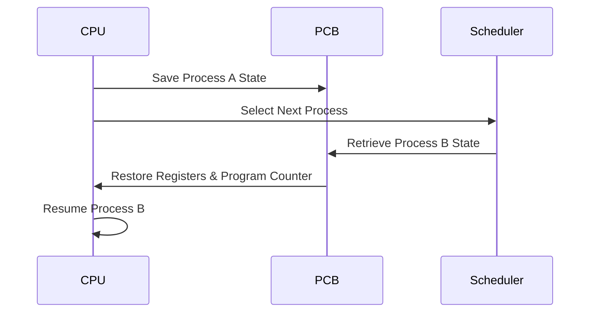

# 📋 Process Control Block (PCB)

## 📖 Definition

A **Process Control Block (PCB)** is a data structure maintained by the **Operating System (OS)** that stores all the information required to manage and execute a process.

Whenever a running process is interrupted (due to time slice expiration, I/O request, or preemption), the OS saves its current state in the PCB so that the process can resume execution later from exactly where it stopped.

> **One-line Interview Definition:**
>
> **A Process Control Block (PCB) is a data structure used by the operating system to store all the information needed to manage and resume a process.**

---

# 🤔 Why Do We Need a PCB?

During execution, a process may be interrupted because:

- Its **time quantum expires**.
- A **higher-priority process** arrives.
- It requests an **I/O operation**.
- An interrupt or exception occurs.

When this happens, the Operating System **pauses** the process and switches the CPU to another process.

To continue the paused process later, the OS must remember its exact state.

The PCB stores this information.

---

# 🔄 How PCB Helps During Context Switching



---

# 🏗️ Role of the PCB

The PCB acts as the **identity card** of a process.

It stores everything the Operating System needs to:

- Create a process
- Schedule it
- Pause it
- Resume it
- Terminate it

Without the PCB, the Operating System would not know where a process stopped or how to continue its execution.

---

# 🛡️ Where is the PCB Stored?

- PCB is stored in **kernel memory**.
- It is protected from user programs.
- Only the Operating System can access or modify it.

This prevents user processes from corrupting important process information.

---

# 📦 Contents of a Process Control Block (PCB)

Although the exact contents vary between operating systems, the following fields are commonly present.

---

## 1️⃣ Process ID (PID)

Every process is assigned a **unique Process ID (PID)** by the Operating System.

It is used to uniquely identify the process throughout its lifetime.

**Example:**

```text
Chrome      → PID 1250
VS Code     → PID 2031
Spotify     → PID 3105
```

---

## 2️⃣ Process State

Stores the current state of the process.

Possible states include:

- New
- Ready
- Running
- Waiting (Blocked)
- Terminated

The scheduler uses this information to determine which process should execute next.

---

## 3️⃣ CPU Registers

When a process is interrupted, the values stored in CPU registers must be preserved.

The PCB stores:

- General Purpose Registers
- Stack Pointer (SP)
- Base Register
- Index Registers
- Program Status Word (PSW)

These values are restored when the process resumes.

---

## 4️⃣ Program Counter (PC)

The **Program Counter (PC)** stores the address of the **next instruction** to be executed.

When a process resumes after context switching, execution continues from this instruction instead of starting over.

```text
Instruction 1
Instruction 2
Instruction 3
Instruction 4  ← Program Counter
Instruction 5
Instruction 6
```

---

## 5️⃣ CPU Scheduling Information

Stores information required by the CPU scheduler.

Examples include:

- Process Priority
- Scheduling Queue
- Time Quantum
- Scheduling Algorithm Information

This helps the scheduler decide which process should run next.

---

## 6️⃣ Memory Management Information

Stores details about the memory allocated to the process.

Examples include:

- Base Address
- Limit Register
- Page Table
- Segment Table
- Memory Allocation Information

This allows the OS to correctly access the process's memory.

---

## 7️⃣ I/O Status Information

Stores information related to input/output operations.

Examples include:

- Open Files
- I/O Devices Being Used
- Pending I/O Requests
- File Descriptors

This enables the OS to continue unfinished I/O operations after the process resumes.

---

## 8️⃣ Accounting Information

Stores statistics related to process execution.

Examples include:

- CPU Time Used
- User ID
- Process Creation Time
- Resource Usage
- Execution Statistics

This information is useful for process monitoring and resource management.

---

# 🗂️ PCB Structure



---

# 🔁 PCB During Context Switching



---

# 🌍 Real-Life Analogy

Imagine watching a movie.

You pause it at **1 hour 15 minutes**.

The streaming service remembers:

- Current timestamp
- Audio language
- Subtitle language
- Video quality

When you play it again, it resumes exactly where you left off.

Similarly, the **PCB remembers the exact execution state of a process**, allowing it to continue seamlessly after being paused.

---

# 🎯 Interview Questions

### Q1. What is a Process Control Block (PCB)?

A PCB is a kernel data structure that stores all the information required to manage and resume a process.

---

### Q2. Why is PCB required?

The PCB enables the Operating System to save a process's state during context switching and resume it later without losing progress.

---

### Q3. Where is the PCB stored?

PCB is stored in **kernel memory**, where it is protected from user processes.

---

### Q4. What information is stored inside a PCB?

Typical fields include:

- Process ID (PID)
- Process State
- CPU Registers
- Program Counter
- Scheduling Information
- Memory Information
- I/O Information
- Accounting Information

---

### Q5. Is the PCB the same for every operating system?

No. The exact structure and fields of a PCB vary between operating systems, although the core information remains similar.

---

# 📝 Key Points (30-Second Revision)

- ✅ PCB stands for **Process Control Block**.
- ✅ It is the **most important process management data structure** in an Operating System.
- ✅ The PCB stores everything required to manage a process.
- ✅ During **context switching**, the OS saves the current process state into the PCB.
- ✅ The PCB stores **PID, Process State, CPU Registers, Program Counter, Scheduling Information, Memory Information, I/O Information, and Accounting Information**.
- ✅ The **Program Counter** stores the address of the next instruction to execute.
- ✅ PCB is stored in **kernel memory** for protection and security.
- ✅ Every process has its own PCB.
- ✅ Without the PCB, a paused process cannot resume execution correctly.