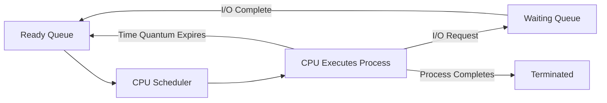
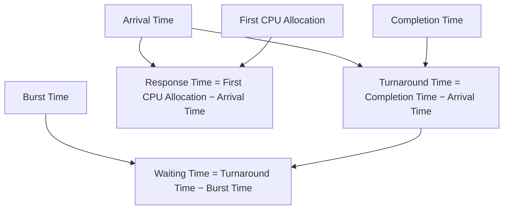
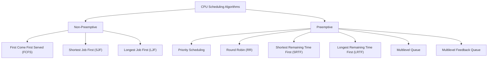

# ⚙️ CPU Scheduling Criteria

## 📖 Definition

**CPU Scheduling** is the process by which the Operating System decides **which process should get the CPU next** and for **how long**.

Since multiple processes compete for the CPU, the scheduler uses different scheduling algorithms to allocate CPU time efficiently, fairly, and according to system requirements.

> **One-line Interview Definition:**
>
> **CPU Scheduling is the process of selecting the next process from the ready queue for execution by the CPU.**

---

# 🎯 Objectives of CPU Scheduling

The primary goals of CPU scheduling are:

- Maximize CPU utilization
- Increase system throughput
- Reduce waiting time
- Reduce turnaround time
- Improve response time
- Ensure fairness among processes
- Prevent starvation
- Efficiently utilize system resources

---

# 🏗️ How CPU Scheduling Works



---

# 📊 CPU Scheduling Criteria

CPU scheduling algorithms are evaluated using several performance metrics.

---

# 1️⃣ CPU Utilization

## 📖 Definition

**CPU Utilization** is the percentage of time the CPU remains busy executing processes.

### Goal

✅ **Maximize CPU Utilization**

An ideal scheduler keeps the CPU busy as much as possible.

### Formula

```text
CPU Utilization = (CPU Busy Time / Total Time) × 100%
```

### Typical Values

| System | CPU Utilization |
|----------|----------------|
| Ideal | 100% |
| Practical Systems | 40% – 90% |

---

# 2️⃣ Throughput

## 📖 Definition

**Throughput** is the number of processes completed per unit time.

### Goal

✅ **Maximize Throughput**

Higher throughput means more work is completed.

### Formula

```text
Throughput = Number of Completed Processes / Unit Time
```

### Example

If 25 processes finish in 5 seconds:

```text
Throughput = 25 / 5 = 5 Processes per Second
```

---

# 3️⃣ Turnaround Time (TAT)

## 📖 Definition

**Turnaround Time** is the total time taken by a process from its arrival until completion.

It includes:

- Waiting Time
- CPU Execution Time
- I/O Waiting Time

### Formula

```text
Turnaround Time = Completion Time − Arrival Time
```

### Example

| Arrival Time | Completion Time |
|--------------|-----------------|
| 2 ms | 18 ms |

```text
Turnaround Time = 18 − 2 = 16 ms
```

### Goal

✅ **Minimize Turnaround Time**

---

# 4️⃣ Waiting Time (WT)

## 📖 Definition

**Waiting Time** is the total time a process spends waiting in the **Ready Queue** before getting CPU time.

It does **not** include execution time.

### Formula

```text
Waiting Time = Turnaround Time − Burst Time
```

### Example

```text
Turnaround Time = 20 ms
Burst Time = 8 ms

Waiting Time = 20 − 8 = 12 ms
```

### Goal

✅ **Minimize Waiting Time**

---

# 5️⃣ Response Time (RT)

## 📖 Definition

**Response Time** is the time taken from the arrival of a process until it receives the CPU **for the first time**.

Unlike Turnaround Time, it does **not** wait for the process to finish.

### Formula

```text
Response Time = First CPU Allocation Time − Arrival Time
```

### Example

| Arrival | First CPU Allocation |
|----------|----------------------|
| 5 ms | 8 ms |

```text
Response Time = 8 − 5 = 3 ms
```

### Goal

✅ **Minimize Response Time**

This metric is especially important in **interactive systems**.

---

# 6️⃣ Completion Time (CT)

## 📖 Definition

**Completion Time** is the exact time at which a process finishes its execution.

### Example

```text
Arrival Time = 2 ms
Burst Time = 8 ms

Process finishes at 14 ms

Completion Time = 14 ms
```

---

# 7️⃣ Priority

## 📖 Definition

Some operating systems assign priorities to processes.

Processes with **higher priority** are scheduled before lower-priority processes.

### Goal

- Execute critical tasks first.
- Improve responsiveness for important processes.

---

# 8️⃣ Predictability

## 📖 Definition

A scheduling algorithm should produce **consistent execution times** under similar system loads.

### Goal

Users should experience predictable system performance instead of random delays.

---

# 📋 Summary of Scheduling Criteria

| Criteria | Goal |
|----------|------|
| CPU Utilization | Maximize |
| Throughput | Maximize |
| Turnaround Time | Minimize |
| Waiting Time | Minimize |
| Response Time | Minimize |
| Completion Time | Earlier Completion |
| Priority | Execute High Priority First |
| Predictability | Consistent Performance |

---

# 📈 Relationship Between Scheduling Metrics



---

# 🎯 Which Metrics Should Be Maximized or Minimized?

| Metric | Desired Goal |
|----------|--------------|
| CPU Utilization | ⬆️ Maximize |
| Throughput | ⬆️ Maximize |
| Turnaround Time | ⬇️ Minimize |
| Waiting Time | ⬇️ Minimize |
| Response Time | ⬇️ Minimize |

---

# 🤔 Why Different Scheduling Algorithms?

No single scheduling algorithm performs best for every workload.

Different systems have different priorities.

| System Type | Preferred Goal |
|--------------|---------------|
| Interactive Systems | Fast Response Time |
| Batch Systems | High Throughput |
| Real-Time Systems | Predictability |
| General Purpose Systems | Balanced Performance |

---

# 🌍 Real-Life Analogies

## 🍔 Round Robin (RR)

A fast-food restaurant serves each customer for a fixed amount of time before serving the next customer.

Everyone gets a fair chance.

---

## 🧵 Shortest Job First (SJF)

A tailor completes small clothing alterations before beginning large stitching jobs.

More customers are served quickly.

---

## 🏥 Priority Scheduling

In a hospital emergency room, patients with life-threatening conditions are treated before those with minor injuries.

---

# 📌 Factors Influencing CPU Scheduling

The choice of a scheduling algorithm depends on:

- Number of processes
- Burst time of processes
- Urgency of tasks
- System requirements
- CPU utilization requirements
- Fairness
- Response time requirements
- Type of operating system

---

# 🗂️ Types of CPU Scheduling Algorithms



---

# 📊 Preemptive vs Non-Preemptive Scheduling

| Feature | Non-Preemptive | Preemptive |
|----------|----------------|------------|
| CPU can be taken away | ❌ No | ✅ Yes |
| Better Response Time | ❌ | ✅ |
| Easier to Implement | ✅ | ❌ |
| Context Switching | Less | More |
| Used In | Batch Systems | Interactive & Real-Time Systems |

---

# 🎯 Interview Questions

### Q1. What is CPU Scheduling?

CPU Scheduling is the process of selecting the next process from the ready queue to execute on the CPU.

---

### Q2. What are the main scheduling criteria?

- CPU Utilization
- Throughput
- Turnaround Time
- Waiting Time
- Response Time
- Completion Time
- Priority
- Predictability

---

### Q3. Which metrics should be maximized?

- CPU Utilization
- Throughput

---

### Q4. Which metrics should be minimized?

- Waiting Time
- Turnaround Time
- Response Time

---

### Q5. What is the difference between Turnaround Time and Response Time?

| Turnaround Time | Response Time |
|-----------------|---------------|
| Time from arrival until completion | Time from arrival until first CPU allocation |
| Includes total execution | Only measures first response |

---

### Q6. Why is CPU Scheduling important?

CPU Scheduling ensures efficient CPU utilization, improves system performance, reduces waiting time, and provides fair CPU allocation among processes.

---

# 📝 Key Points (30-Second Revision)

- ✅ CPU Scheduling decides **which process gets the CPU next**.
- ✅ Main goal is to maximize CPU efficiency and fairness.
- ✅ **CPU Utilization** → Maximize.
- ✅ **Throughput** → Maximize.
- ✅ **Turnaround Time** = Completion Time − Arrival Time.
- ✅ **Waiting Time** = Turnaround Time − Burst Time.
- ✅ **Response Time** = First CPU Allocation − Arrival Time.
- ✅ Different scheduling algorithms are suitable for different workloads.
- ✅ Scheduling algorithms are broadly classified into **Preemptive** and **Non-Preemptive**.