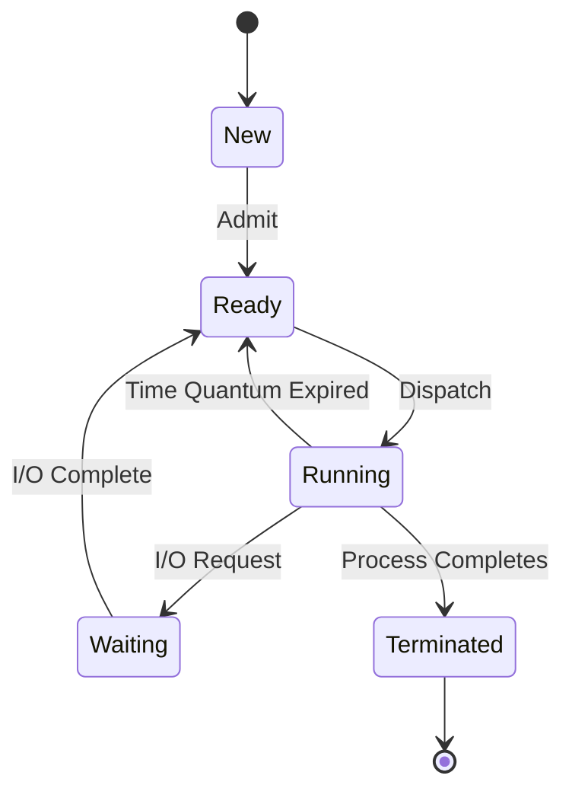
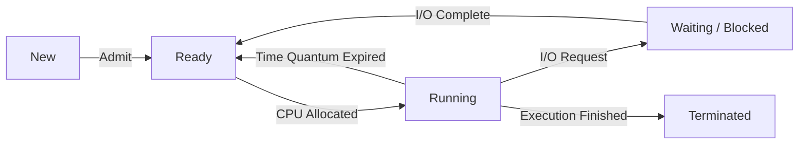

# 🔄 Five-State Process Model in Operating System

## 📖 Definition

The **Five-State Process Model** is a process management model used by an Operating System to describe the different stages a process goes through during its lifetime.

It helps the OS efficiently manage process execution, CPU allocation, multitasking, and system resources.

> **One-line Interview Definition:**
>
> **The Five-State Process Model represents the lifecycle of a process using five states: New, Ready, Running, Waiting (Blocked), and Terminated (Exit).**

---

# 🤔 What is a Process?

A **process** is a **program in execution**.

It consists of:

- Program Code
- Program Data
- CPU Registers
- Stack
- Heap
- Process Control Block (PCB)

Unlike a program (which is passive), a process is an active entity that is managed by the Operating System.

---

# ❓ Why Do We Need the Five-State Process Model?

Earlier operating systems used a simpler **Two-State Model (Running and Not Running)**.

However, modern systems execute multiple programs simultaneously, making the two-state model insufficient.

The Five-State Model separates processes into more specific states, allowing the OS to:

- Manage multiple processes efficiently.
- Distinguish between ready and waiting processes.
- Improve CPU utilization.
- Support multitasking.
- Handle I/O operations effectively.

---

# 🏗️ The Five Process States



---

# 📋 Overview of Process States

| State | Description |
|--------|-------------|
| **New** | Process has been created but is not yet admitted into the Ready Queue. |
| **Ready** | Process is in memory and waiting for CPU allocation. |
| **Running** | Process is currently executing on the CPU. |
| **Waiting (Blocked)** | Process is waiting for an event (usually I/O) before it can continue. |
| **Terminated (Exit)** | Process has finished execution or has been aborted. |

---

# 1️⃣ New State

## 📖 Definition

A process enters the **New** state immediately after it is created.

At this stage:

- The Process Control Block (PCB) is created.
- Required resources are identified.
- The process has **not yet been admitted** to the Ready Queue.

### Characteristics

- Process exists.
- PCB is created.
- Not executing.
- Waiting for admission.

---

# 2️⃣ Ready State

## 📖 Definition

A process enters the **Ready** state after being admitted by the Operating System.

The process:

- Is loaded into main memory.
- Has all required resources except the CPU.
- Waits in the **Ready Queue** until scheduled.

### Characteristics

- Ready to execute.
- Waiting for CPU allocation.
- Can immediately start when selected.

---

# 3️⃣ Running State

## 📖 Definition

A process is in the **Running** state when it is actively executing instructions on the CPU.

In a **single-core CPU**, only **one process** can be in the Running state at any given time.

### Possible Events

While running, a process may:

- Finish execution.
- Request I/O.
- Get preempted after its time quantum expires.

---

# 4️⃣ Waiting (Blocked) State

## 📖 Definition

A process enters the **Waiting** (or **Blocked**) state when it cannot continue execution until an external event occurs.

Common reasons include:

- Waiting for disk I/O.
- Waiting for keyboard input.
- Waiting for network data.
- Waiting for another process.
- Waiting for a resource.

Once the required event occurs, the process returns to the Ready state.

---

# 5️⃣ Terminated (Exit) State

## 📖 Definition

A process enters the **Terminated** state after:

- Successful completion.
- Manual termination.
- Runtime error.
- Operating System abortion.

The Operating System then:

- Releases memory.
- Closes files.
- Removes the PCB.
- Frees allocated resources.

---

# 🔄 Process Execution Flow



---

# 🔀 State Transitions

## 1️⃣ Null → New

A new process is created.

Example:

```text
User opens Google Chrome
        ↓
OS creates a new process
```

---

## 2️⃣ New → Ready

The Operating System admits the process into memory and places it in the Ready Queue.

Reason:

- Resources are available.
- Process is ready to execute.

---

## 3️⃣ Ready → Running

The CPU Scheduler selects one process from the Ready Queue and assigns it the CPU.

This transition is called **Dispatch**.

---

## 4️⃣ Running → Waiting

The running process requests something it cannot immediately obtain.

Examples:

- Disk Read
- Printer Access
- Network Packet
- User Input

The process is blocked until the event completes.

---

## 5️⃣ Waiting → Ready

The event the process was waiting for has completed.

Examples:

- Disk I/O finishes.
- File is loaded.
- Network response arrives.

The process returns to the Ready Queue.

---

## 6️⃣ Running → Ready

Occurs in **Preemptive Scheduling** when:

- Time Quantum expires.
- Higher-priority process arrives.

The process is paused and placed back in the Ready Queue.

---

## 7️⃣ Running → Terminated

Occurs when:

- Process completes execution.
- Process is aborted.
- Fatal error occurs.

---

## 8️⃣ Ready → Terminated (Rare)

Some operating systems allow a parent process or the OS to terminate a process before it starts executing.

---

# 📊 State Transition Summary

| Transition | Reason |
|------------|--------|
| Null → New | Process Created |
| New → Ready | Process Admitted |
| Ready → Running | CPU Allocated |
| Running → Waiting | I/O Request / Event Wait |
| Waiting → Ready | Event Completed |
| Running → Ready | Time Quantum Expired / Preemption |
| Running → Terminated | Execution Completed |
| Ready → Terminated | Parent or OS Terminates Process (Rare) |

---

# 🌍 Real-Life Analogy

Imagine visiting a restaurant.

| Process State | Restaurant Example |
|---------------|--------------------|
| **New** | Customer enters the restaurant. |
| **Ready** | Customer waits for a free table. |
| **Running** | Customer is eating. |
| **Waiting** | Customer waits for food after ordering. |
| **Terminated** | Customer finishes eating and leaves. |

---

# ✅ Advantages

- Separates process execution into well-defined states.
- Improves CPU scheduling efficiency.
- Supports multitasking.
- Better management of I/O operations.
- Simplifies process management.
- Efficient use of system resources.

---

# ❌ Disadvantages

- Slightly more complex than the Two-State Model.
- Frequent state changes increase context switching overhead.
- If all processes become blocked simultaneously, the CPU may remain idle until one becomes ready.
- Process data is removed after termination unless explicitly saved.

---

# 🎯 Interview Questions

### Q1. What are the five states of a process?

- New
- Ready
- Running
- Waiting (Blocked)
- Terminated

---

### Q2. What is the difference between Ready and Waiting states?

| Ready | Waiting |
|--------|----------|
| Waiting for CPU | Waiting for an external event (usually I/O) |
| Can execute immediately when scheduled | Cannot execute until the event completes |

---

### Q3. Can multiple processes be in the Running state?

- **Single-Core CPU:** Only one process.
- **Multi-Core CPU:** One process per CPU core.

---

### Q4. What causes a process to move from Running to Ready?

- Time Quantum expires.
- Higher-priority process arrives.
- CPU preemption.

---

### Q5. What causes a process to move from Running to Waiting?

- I/O request.
- Resource request.
- Waiting for another process or event.

---

### Q6. What is the purpose of the New state?

The New state allows the Operating System to create the PCB, allocate initial resources, and decide when the process should be admitted into the Ready Queue.

---

# 📝 Key Points (30-Second Revision)

- ✅ A **process** is a program in execution.
- ✅ The **Five-State Process Model** consists of **New, Ready, Running, Waiting, and Terminated**.
- ✅ **New:** Process created but not yet admitted.
- ✅ **Ready:** Waiting for CPU allocation.
- ✅ **Running:** Currently executing on the CPU.
- ✅ **Waiting:** Waiting for an I/O operation or another event.
- ✅ **Terminated:** Process has completed or has been aborted.
- ✅ The **CPU Scheduler** moves processes from **Ready → Running**.
- ✅ **Preemption** moves a process from **Running → Ready**.
- ✅ **I/O Completion** moves a process from **Waiting → Ready**.