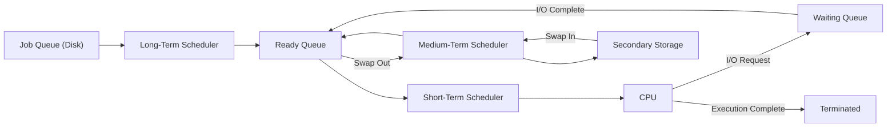
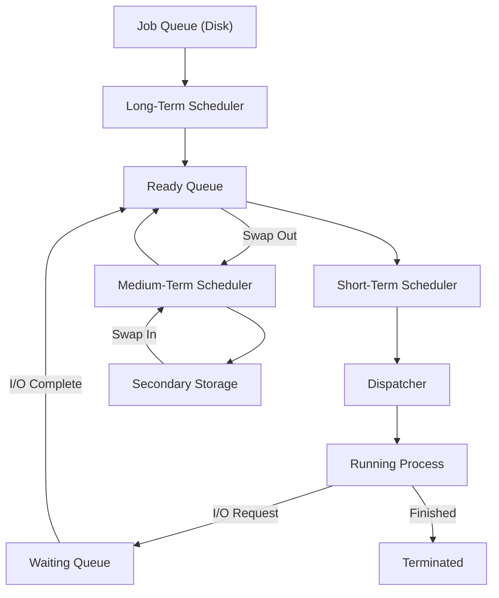

# ⚙️ Process Schedulers in Operating System

## 📖 Definition

A **Process Scheduler** is an Operating System component responsible for deciding **which process should be executed next** and **when**.

Since multiple processes compete for the CPU, schedulers ensure efficient CPU utilization, fair execution, and effective resource management.

> **One-line Interview Definition:**
>
> **A Process Scheduler is an OS component that selects processes for execution and manages their movement between different scheduling queues.**

---

# 🤔 Why Do We Need Process Schedulers?

In a multiprogramming operating system, several processes are present in memory simultaneously.

However,

- Only one process (per CPU core) can execute at a time.
- Many processes compete for CPU time.
- Some processes wait for I/O.
- Some processes are newly created.
- Some processes are swapped to secondary storage.

The scheduler manages all these processes efficiently.

---

# 🏗️ Process Scheduling Overview



---

# 📋 Types of Process Schedulers

Operating Systems mainly use three schedulers:

1. Long-Term Scheduler (Job Scheduler)
2. Short-Term Scheduler (CPU Scheduler)
3. Medium-Term Scheduler (Swapper)

---

# 1️⃣ Long-Term Scheduler (Job Scheduler)

## 📖 Definition

The **Long-Term Scheduler** decides **which newly created processes should be admitted into main memory**.

It moves processes from the **Job Queue (Disk)** to the **Ready Queue (Main Memory)**.

---

## 🎯 Responsibilities

- Selects processes from secondary storage.
- Loads selected processes into memory.
- Controls the **degree of multiprogramming**.
- Maintains a balanced mix of CPU-bound and I/O-bound processes.
- Prevents CPU or I/O devices from remaining idle.

---

## 📊 Working


---

## ⚡ Characteristics

- Slowest scheduler.
- Runs infrequently.
- Controls the number of processes in memory.
- May not exist in modern time-sharing operating systems (e.g., Windows).

---

# 📌 Degree of Multiprogramming

The **Degree of Multiprogramming** is the number of processes present in main memory at a given time.

The Long-Term Scheduler controls this number.

Example:

```text
Main Memory

P1
P2
P3
P4

Degree of Multiprogramming = 4
```

---

# 2️⃣ Short-Term Scheduler (CPU Scheduler)

## 📖 Definition

The **Short-Term Scheduler** selects **one process from the Ready Queue** and allocates the CPU to it.

It is also called the **CPU Scheduler**.

---

## 🎯 Responsibilities

- Chooses the next process to execute.
- Maximizes CPU utilization.
- Ensures fairness among processes.
- Uses CPU scheduling algorithms such as:
  - FCFS
  - SJF
  - Priority Scheduling
  - Round Robin
  - SRTF

---

## 📊 Working


---

## ⚡ Characteristics

- Fastest scheduler.
- Executes every few milliseconds.
- Runs whenever CPU becomes free.
- Responsible for CPU allocation.

---

# 2.1️⃣ Dispatcher

## 📖 Definition

The **Dispatcher** is a special Operating System module that gives control of the CPU to the process selected by the Short-Term Scheduler.

> **The Scheduler selects the process.**
>
> **The Dispatcher actually starts its execution.**

---

## 🎯 Functions of Dispatcher

### 1. Context Switching

- Saves the state of the currently running process.
- Restores the state of the next process.

---

### 2. Mode Switching

Switches the CPU from:

- Kernel Mode
- User Mode

before execution begins.

---

### 3. Program Control Transfer

Transfers execution to the correct instruction of the selected process.

---

## 📊 Dispatcher Workflow


---

## ⏱️ Dispatch Latency

**Dispatch Latency** is the time required by the dispatcher to stop one process and start another.

```text
Dispatch Latency =
Time Taken for Context Switch +
Mode Switch +
Program Transfer
```

Smaller dispatch latency means better system performance.

---

# 3️⃣ Medium-Term Scheduler (Swapper)

## 📖 Definition

The **Medium-Term Scheduler** temporarily removes processes from main memory and stores them on disk.

This process is called **Swapping**.

---

## 🎯 Responsibilities

- Swaps blocked processes out of memory.
- Frees memory for active processes.
- Swaps processes back into memory when needed.
- Controls memory usage.
- Helps maintain an efficient degree of multiprogramming.

---

## 📊 Working


---

## ⚡ Characteristics

- Faster than Long-Term Scheduler.
- Slower than Short-Term Scheduler.
- Responsible for swapping.

---

# 🔄 Swapping

Swapping is the process of:

- Moving a process from **Main Memory → Disk**
- Bringing it back later from **Disk → Main Memory**

This frees RAM for other active processes.

---

# 🌍 Real-Life Analogy

Imagine a restaurant.

### Long-Term Scheduler

The manager decides which customers are allowed inside.

---

### Short-Term Scheduler

The waiter decides who gets served next.

---

### Dispatcher

The waiter actually serves the selected customer.

---

### Medium-Term Scheduler

If the restaurant becomes overcrowded, some customers wait outside until seats become available.

---

# 🧩 Other Types of Schedulers

## I/O Scheduler

Responsible for scheduling read/write operations.

### Responsibilities

- Minimize disk access time.
- Improve I/O throughput.
- Reduce waiting time.

Common algorithms include:

- FCFS
- SCAN
- C-SCAN
- Round Robin

---

## Real-Time Scheduler

Used in systems where tasks must complete before deadlines.

Examples:

- Aircraft control systems
- Medical devices
- Industrial automation

Common algorithms include:

- Earliest Deadline First (EDF)
- Rate Monotonic (RM)

---

# 📊 Comparison of Process Schedulers

| Feature | Long-Term Scheduler | Short-Term Scheduler | Medium-Term Scheduler |
|----------|---------------------|----------------------|----------------------|
| Also Called | Job Scheduler | CPU Scheduler | Swapper |
| Main Function | Admits new processes into memory | Selects next process for CPU | Swaps processes in/out of memory |
| Source Queue | Job Queue | Ready Queue | Main Memory |
| Destination | Ready Queue | CPU | Secondary Storage / Memory |
| Speed | Slowest | Fastest | Moderate |
| Frequency | Rare | Very Frequent | Occasional |
| Controls Multiprogramming | ✅ Yes | ❌ No | ✅ Reduces It |
| Used in Time-Sharing Systems | Often Absent | Essential | Present |

---

# 📈 Relationship Between Schedulers



---

# 📝 Long-Term vs Short-Term vs Medium-Term Scheduler

| Property | Long-Term | Short-Term | Medium-Term |
|-----------|-----------|------------|-------------|
| Purpose | Admit processes | Allocate CPU | Swap processes |
| Acts On | New Processes | Ready Processes | Waiting/Ready Processes |
| Memory Management | Yes | No | Yes |
| CPU Allocation | No | Yes | No |
| Swapping | No | No | Yes |
| Execution Frequency | Low | Very High | Medium |

---

# 🎯 Interview Questions

### Q1. What is a Process Scheduler?

A Process Scheduler is an OS component that decides which process should execute next and manages process movement between scheduling queues.

---

### Q2. What are the three main process schedulers?

- Long-Term Scheduler
- Short-Term Scheduler
- Medium-Term Scheduler

---

### Q3. Which scheduler is the fastest?

**Short-Term Scheduler**

---

### Q4. Which scheduler controls the degree of multiprogramming?

**Long-Term Scheduler**

---

### Q5. What is the role of the Dispatcher?

The Dispatcher performs:

- Context Switching
- Mode Switching
- Program Control Transfer

after the Short-Term Scheduler selects a process.

---

### Q6. What is Dispatch Latency?

Dispatch Latency is the time taken by the dispatcher to stop one process and start another.

---

### Q7. What is Swapping?

Swapping is the process of temporarily moving processes between main memory and secondary storage to free memory.

---

### Q8. Why is the Medium-Term Scheduler called the Swapper?

Because it swaps processes out of memory and later swaps them back into memory when required.

---

# 📝 Key Points (30-Second Revision)

- ✅ Process Schedulers decide **which process runs next**.
- ✅ **Long-Term Scheduler** moves processes from the **Job Queue** to the **Ready Queue**.
- ✅ It controls the **Degree of Multiprogramming**.
- ✅ **Short-Term Scheduler** selects a process from the **Ready Queue** for CPU execution.
- ✅ **Dispatcher** performs **Context Switching**, **Mode Switching**, and **Program Transfer**.
- ✅ **Dispatch Latency** is the time required to switch between processes.
- ✅ **Medium-Term Scheduler** performs **Swapping** between memory and disk.
- ✅ **Long-Term = Slowest**, **Short-Term = Fastest**, **Medium-Term = Moderate**.
- ✅ Modern time-sharing operating systems often do **not** use a Long-Term Scheduler.