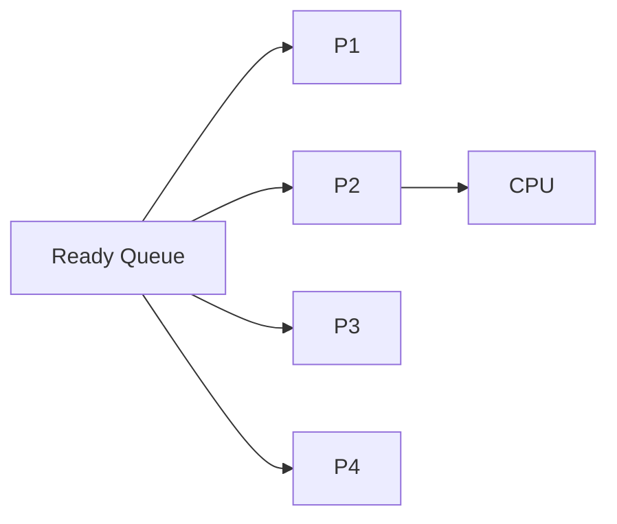
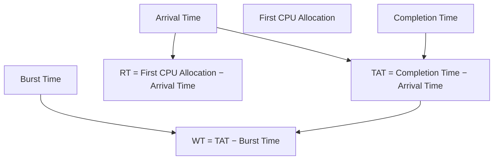

# ⚙️ CPU Scheduling Fundamentals

## 📖 Overview

Before studying individual CPU scheduling algorithms (FCFS, SJF, Round Robin, etc.), it is important to understand some fundamental concepts:

- Types of schedulers
- Scheduling queues
- Dispatcher
- Events that trigger scheduling
- Gantt Charts
- Scheduling time calculations

> **Important:** All CPU scheduling algorithms (FCFS, SJF, RR, Priority, etc.) are used by the **Short-Term Scheduler** to select a process from the **Ready Queue**.

---

# 📋 Quick Recap of Process Schedulers

| Scheduler | Responsibility |
|-----------|----------------|
| **Long-Term Scheduler** | Moves processes from **Job Queue → Ready Queue** and controls the degree of multiprogramming. |
| **Short-Term Scheduler** | Selects a process from the **Ready Queue** and assigns the CPU. |
| **Medium-Term Scheduler** | Swaps processes between RAM and secondary storage. |

---

# 🗂️ Scheduling Queues

An operating system maintains several queues to organize processes.

---

## 1️⃣ Job Queue

The **Job Queue** contains all newly created jobs that are waiting to enter main memory.

These jobs are not yet ready for CPU execution.

### Example

```text
User Opens:

Chrome
VS Code
Spotify
Notepad

↓

All enter Job Queue
```

The **Long-Term Scheduler** selects which jobs are admitted into memory.

---

## 2️⃣ Ready Queue ⭐ (Most Important)

The **Ready Queue** contains all processes that:

- Are loaded into RAM.
- Have all required resources.
- Are waiting only for CPU allocation.

This is the queue used by all CPU scheduling algorithms.



---

## 3️⃣ I/O Queue

Whenever a running process requests an I/O operation, it moves to an **I/O Queue**.

Each I/O device generally has its own queue.

Examples:

- Printer Queue
- Disk Queue
- Keyboard Queue
- Network Queue

After the I/O completes, the process returns to the Ready Queue.

---

# 🎯 Which Queue Do Scheduling Algorithms Use?

CPU scheduling algorithms operate **only on the Ready Queue**.


---

# 🧩 Short-Term Scheduler vs Dispatcher

## Short-Term Scheduler

### Responsibility

- Selects **which process** should run next.
- Uses scheduling algorithms like:
  - FCFS
  - SJF
  - Round Robin
  - Priority
  - SRTF

**Think of it as making the decision.**

---

## Dispatcher

### Responsibility

After the scheduler selects a process, the Dispatcher:

- Performs Context Switching.
- Switches CPU mode (Kernel → User).
- Restores CPU registers.
- Restores the Program Counter.
- Transfers CPU control to the selected process.

**Think of it as executing the decision.**

---

## Scheduler vs Dispatcher

| Short-Term Scheduler | Dispatcher |
|----------------------|------------|
| Chooses the next process | Starts the chosen process |
| Uses scheduling algorithms | Performs context switch |
| Makes the decision | Executes the decision |

---

# 🔄 Process Lifecycle During Scheduling


---

# 🚀 When is the Short-Term Scheduler Invoked?

The Short-Term Scheduler is called whenever the CPU needs to decide which process should execute next.

---

## 1️⃣ Running → Waiting

Occurs when the running process:

- Requests I/O.
- Waits for an event.
- Executes a wait system call.

```text
Running
   │
I/O Request
   ▼
Waiting

↓

CPU becomes free

↓

Scheduler selects another process
```

---

## 2️⃣ Running → Ready (Preemption)

Occurs when:

- Time Quantum expires.
- Higher-priority process arrives.

The current process is moved back to the Ready Queue.

```text
Running
    │
Time Slice Ends
    ▼
Ready Queue

↓

Scheduler selects another process
```

---

## 3️⃣ Higher-Priority Process Becomes Ready (Preemptive Scheduling)

A higher-priority process may become ready because:

- A new process is created.
- A blocked process completes its I/O.

The currently running process is preempted.

```text
Low Priority Process Running

↓

High Priority Process Arrives

↓

CPU switches to High Priority Process
```

---

## 4️⃣ Running → Terminated

When the running process finishes execution, the CPU becomes free and another ready process is selected.

---

# 📊 Summary of Scheduling Events

| Event | Scheduler Invoked? |
|--------|--------------------|
| Running → Waiting | ✅ Yes |
| Running → Ready | ✅ Yes |
| Higher-Priority Process Becomes Ready | ✅ Yes (Preemptive) |
| Running → Terminated | ✅ Yes |

---

# ⚡ Preemptive vs Non-Preemptive Events

Only some scheduling events require **preemption**.

| Event | Preemptive? |
|--------|-------------|
| Running → Waiting | ❌ No |
| Running → Ready | ✅ Yes |
| Higher-Priority Process Becomes Ready | ✅ Yes |
| Running → Terminated | ❌ No |

---

# 📊 Gantt Chart

## 📖 Definition

A **Gantt Chart** is a graphical representation of CPU execution over time.

It shows:

- Which process is executing.
- Start time.
- End time.
- CPU idle periods.

---

## Example

```text
Time

0      1      3      5      6
|------|------|------|------|

 Idle     P0      P1     P0
```

---

# ⏰ Scheduling Time Metrics

Consider the following Gantt Chart:

```text
Time

0      1      3      5      6
|------|------|------|------|

 Idle     P0      P1     P0
```

Assume:

| Property | Value |
|----------|-------|
| Arrival Time | 1 |
| Completion Time | 6 |
| Burst Time | 3 |

---

# 1️⃣ Arrival Time (AT)

The time at which a process enters the system.

```text
Arrival Time = 1
```

---

# 2️⃣ Completion Time (CT)

The time at which the process finishes execution.

```text
Completion Time = 6
```

---

# 3️⃣ Burst Time (BT)

Total CPU execution time required by the process.

```text
P0 executes:

1 → 3 = 2 units

5 → 6 = 1 unit

Burst Time = 2 + 1 = 3
```

---

# 4️⃣ Turnaround Time (TAT)

The total time from arrival until completion.

### Formula

```text
Turnaround Time = Completion Time − Arrival Time
```

### Example

```text
6 − 1 = 5
```

---

# 5️⃣ Waiting Time (WT)

The total time spent waiting in the Ready Queue.

### Formula

```text
Waiting Time = Turnaround Time − Burst Time
```

### Example

```text
5 − 3 = 2
```

The process waited from:

```text
3 → 5

Total Waiting Time = 2
```

---

# 6️⃣ Response Time (RT)

The time from arrival until the process gets the CPU **for the first time**.

### Formula

```text
Response Time = First CPU Allocation − Arrival Time
```

### Example

```text
Arrival = 1

First CPU Allocation = 1

Response Time = 0
```

---

# 📈 Relationship Between Time Metrics



---

# 🎯 Expectations from a Good Scheduling Algorithm

An ideal scheduling algorithm should:

- Maximize CPU Utilization.
- Maximize Throughput.
- Minimize Turnaround Time.
- Minimize Waiting Time.
- Minimize Response Time.
- Ensure Fair CPU Allocation.
- Prevent Starvation.

---

# 📊 Scheduling Goals

| Metric | Goal |
|----------|------|
| CPU Utilization | ⬆️ Maximize |
| Throughput | ⬆️ Maximize |
| Turnaround Time | ⬇️ Minimize |
| Waiting Time | ⬇️ Minimize |
| Response Time | ⬇️ Minimize |
| Fairness | Ensure Equal Opportunity |

---

# ⚠️ Trade-Offs

No scheduling algorithm is perfect.

Every algorithm compromises one or more objectives.

For example:

| Algorithm | Main Strength | Weakness |
|-----------|--------------|-----------|
| FCFS | Simple | Poor Response Time |
| SJF | Minimum Average Waiting Time | May Cause Starvation |
| Round Robin | Fairness | More Context Switching |
| Priority Scheduling | Important Processes First | Starvation of Low-Priority Processes |

---

# 🎯 Interview Questions

### Q1. Which queue is used by CPU scheduling algorithms?

The **Ready Queue**.

---

### Q2. What is the difference between the Short-Term Scheduler and Dispatcher?

The **Short-Term Scheduler selects** the process, while the **Dispatcher performs the context switch and starts execution**.

---

### Q3. When is the Short-Term Scheduler invoked?

- Running → Waiting
- Running → Ready
- Higher-Priority Process Becomes Ready
- Running → Terminated

---

### Q4. What is a Gantt Chart?

A Gantt Chart is a graphical representation showing which process occupies the CPU over time.

---

### Q5. What is the difference between Waiting Time and Response Time?

- **Waiting Time:** Total time spent in the Ready Queue.
- **Response Time:** Time until the process receives the CPU for the first time.

---

# 📝 Key Points (30-Second Revision)

- ✅ CPU scheduling algorithms work **only on the Ready Queue**.
- ✅ The **Short-Term Scheduler** chooses the next process.
- ✅ The **Dispatcher** performs context switching and transfers CPU control.
- ✅ Scheduler is invoked when a process waits, is preempted, terminates, or when a higher-priority process becomes ready.
- ✅ A **Gantt Chart** shows CPU execution over time.
- ✅ **Turnaround Time = Completion Time − Arrival Time**.
- ✅ **Waiting Time = Turnaround Time − Burst Time**.
- ✅ **Response Time = First CPU Allocation − Arrival Time**.
- ✅ No scheduling algorithm optimizes every performance metric simultaneously.