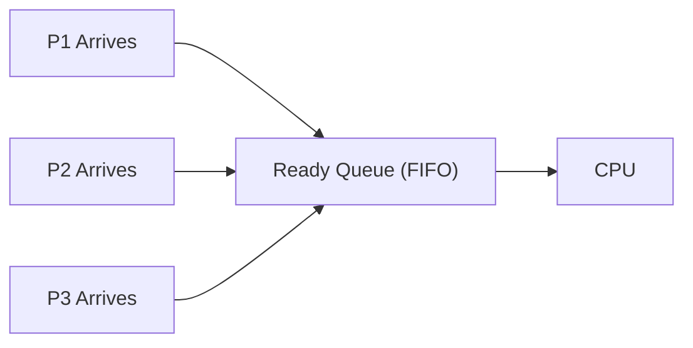

# 🥇 First Come First Serve (FCFS) CPU Scheduling

## 📖 Definition

**First Come First Serve (FCFS)** is the simplest CPU scheduling algorithm in which the process that **arrives first in the Ready Queue gets the CPU first**.

It follows the **FIFO (First In, First Out)** principle.

FCFS is a **Non-Preemptive Scheduling Algorithm**, meaning once a process starts executing, it **cannot be interrupted** until it finishes or voluntarily enters the waiting state (e.g., for I/O).

> **One-line Interview Definition:**
>
> **FCFS is a non-preemptive scheduling algorithm that allocates the CPU to processes in the order of their arrival.**

---

# 🎯 Key Characteristics

- Non-Preemptive
- FIFO Queue
- Simple to implement
- No starvation
- Poor average waiting time for mixed workloads
- Suffers from the **Convoy Effect**

---

# 🏗️ How FCFS Works

1. A process arrives and enters the **Ready Queue**.
2. The CPU picks the **first process** in the queue.
3. The selected process executes until completion.
4. The next process in the queue gets the CPU.
5. This continues until the Ready Queue becomes empty.

---

# 🔄 Working of FCFS



---

# 📊 FCFS Scheduling Flow


---

# 📋 Example 1: Same Arrival Time

## Process Table

| Process | Arrival Time (AT) | Burst Time (BT) |
|----------|------------------:|----------------:|
| P1 | 0 | 5 |
| P2 | 0 | 3 |
| P3 | 0 | 8 |

Since all processes arrive together, FCFS executes them in the given order.

---

## Gantt Chart

```text
0        5       8               16
|--------|-------|---------------|
    P1       P2        P3
```

---

## Calculations

| Process | AT | BT | CT | TAT = CT − AT | WT = TAT − BT |
|----------|---:|---:|---:|--------------:|--------------:|
| P1 | 0 | 5 | 5 | 5 | 0 |
| P2 | 0 | 3 | 8 | 8 | 5 |
| P3 | 0 | 8 | 16 | 16 | 8 |

### Average Turnaround Time

```text
(5 + 8 + 16) / 3 = 9.67 ms
```

### Average Waiting Time

```text
(0 + 5 + 8) / 3 = 4.33 ms
```

---

# 📋 Example 2: Different Arrival Times

## Process Table

| Process | Arrival Time (AT) | Burst Time (BT) |
|----------|------------------:|----------------:|
| P1 | 2 | 5 |
| P2 | 0 | 3 |
| P3 | 4 | 4 |

---

## Step-by-Step Execution

- P2 arrives first at **0**, so it executes first.
- P1 arrives at **2**, waits until P2 finishes.
- P3 arrives at **4**, waits until P1 finishes.

---

## Gantt Chart

```text
0        3              8            12
|--------|--------------|------------|
    P2           P1            P3
```

---

## Calculations

| Process | AT | BT | CT | TAT | WT |
|----------|---:|---:|---:|----:|---:|
| P2 | 0 | 3 | 3 | 3 | 0 |
| P1 | 2 | 5 | 8 | 6 | 1 |
| P3 | 4 | 4 | 12 | 8 | 4 |

### Average Turnaround Time

```text
(3 + 6 + 8) / 3 = 5.67 ms
```

### Average Waiting Time

```text
(0 + 1 + 4) / 3 = 1.67 ms
```

---

# ⚙️ FCFS Algorithm

```text
1. Sort processes by Arrival Time.
2. Pick the first process.
3. Execute it until completion.
4. Remove it from the Ready Queue.
5. Execute the next process.
6. Repeat until all processes finish.
```

---

# ⏱️ Time Complexity

| Operation | Complexity |
|-----------|-----------|
| Sorting by Arrival Time | O(n log n) |
| Scheduling | O(n) |
| Overall | O(n log n) |

> If the processes are already arranged by arrival time, the scheduling itself takes **O(n)** time.

---

# ⚖️ Advantages of FCFS

- ✅ Very simple to understand and implement.
- ✅ Uses the FIFO principle.
- ✅ No process starvation.
- ✅ Fair because processes execute in arrival order.
- ✅ Suitable for batch processing systems.
- ✅ Low scheduling overhead.

---

# ❌ Disadvantages of FCFS

- ❌ High average waiting time.
- ❌ High turnaround time for short processes.
- ❌ Poor response time.
- ❌ Not suitable for interactive systems.
- ❌ Not suitable for time-sharing operating systems.
- ❌ Suffers from the **Convoy Effect**.

---

# 🚚 Convoy Effect

## 📖 Definition

The **Convoy Effect** occurs when a **long CPU-bound process executes before several short processes**, forcing the shorter processes to wait for a long time.

As a result:

- CPU utilization decreases.
- Waiting time increases.
- Overall system performance degrades.

---

## Example

| Process | Burst Time |
|----------|-----------:|
| P1 | 20 |
| P2 | 2 |
| P3 | 1 |

### Gantt Chart

```text
0                    20      22     23
|--------------------|-------|------|
         P1             P2      P3
```

Although P2 and P3 require very little CPU time, they must wait until P1 finishes.

This is called the **Convoy Effect**.

---

# 🌍 Real-Life Analogy

Imagine standing in a supermarket billing queue.

Customers are served strictly in the order they arrive.

If the first customer has a huge cart full of groceries, everyone behind them—including customers with just one item—must wait.

This is exactly how **FCFS Scheduling** works.

---

# 📊 FCFS Summary

| Property | Value |
|-----------|-------|
| Type | Non-Preemptive |
| Queue Used | FIFO |
| Starvation | No |
| Convoy Effect | Yes |
| Fairness | High |
| Response Time | Poor |
| Waiting Time | High |
| Turnaround Time | High |
| Suitable For | Batch Systems |

---

# 🆚 FCFS vs Round Robin

| Feature | FCFS | Round Robin |
|----------|------|-------------|
| Type | Non-Preemptive | Preemptive |
| CPU Sharing | No | Yes |
| Context Switching | Low | High |
| Response Time | Poor | Good |
| Fairness | Moderate | High |
| Interactive Systems | No | Yes |

---

# 🎯 Interview Questions

### Q1. What is FCFS Scheduling?

FCFS is a non-preemptive CPU scheduling algorithm where the process that arrives first gets the CPU first.

---

### Q2. Is FCFS preemptive or non-preemptive?

**Non-Preemptive**

---

### Q3. Which data structure is used in FCFS?

A **FIFO Queue**.

---

### Q4. What is the Convoy Effect?

The Convoy Effect occurs when a long process blocks several short processes, causing increased waiting time and reduced system performance.

---

### Q5. Does FCFS cause starvation?

No. Every process eventually gets CPU time in arrival order.

---

### Q6. Is FCFS suitable for interactive operating systems?

No. It has poor response time and therefore is not suitable for interactive or time-sharing systems.

---

# 💻 C++ Simulation (Optional)

> **Note:** In interviews, you are generally expected to manually draw the Gantt chart and calculate scheduling metrics. Writing the complete FCFS simulation code is rarely required, but understanding its implementation is useful.

---

# 📝 Key Points (30-Second Revision)

- ✅ FCFS stands for **First Come First Serve**.
- ✅ It is a **Non-Preemptive** scheduling algorithm.
- ✅ Uses the **FIFO Queue**.
- ✅ Processes execute strictly in arrival order.
- ✅ Once a process starts, it runs until completion.
- ✅ No starvation occurs.
- ✅ Suffers from the **Convoy Effect**.
- ✅ Simple to implement but has poor waiting and response times.
- ✅ Best suited for **Batch Processing Systems**.