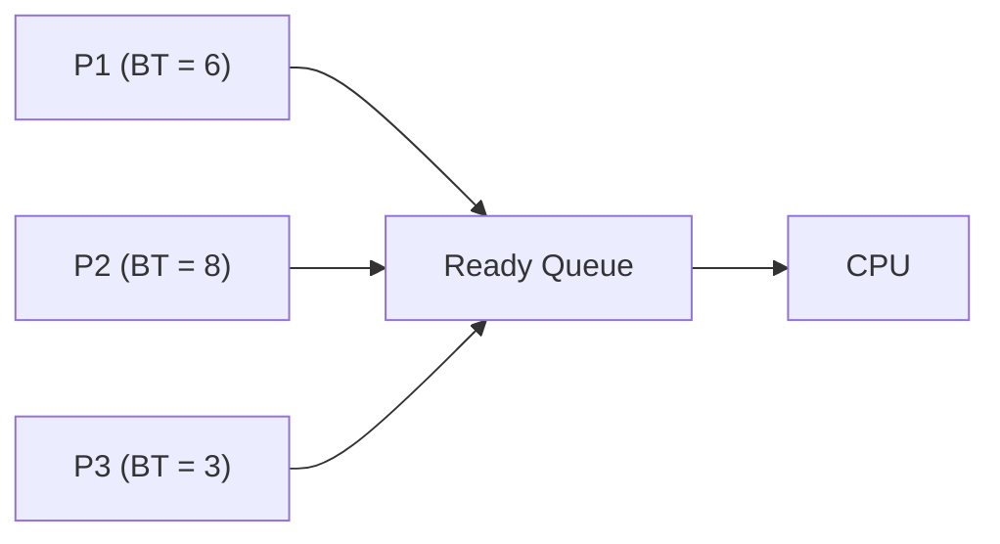
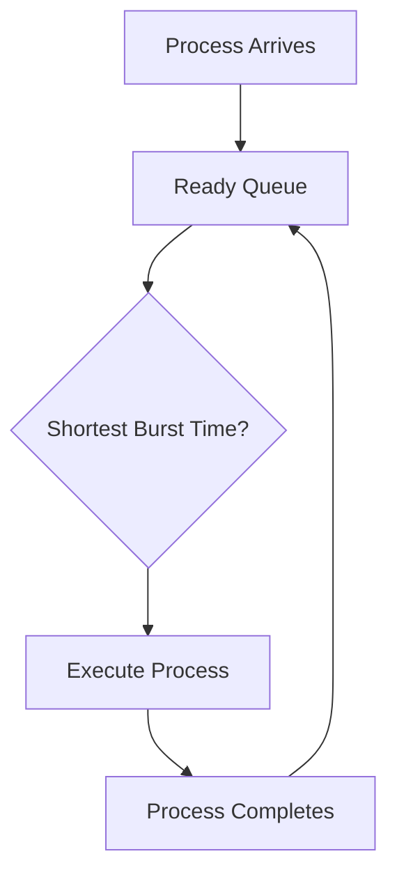

# ⚡ Shortest Job First (SJF) CPU Scheduling

## 📖 Definition

**Shortest Job First (SJF)**, also known as **Shortest Job Next (SJN)**, is a CPU scheduling algorithm that selects the **waiting process with the smallest CPU Burst Time** for execution.

The main objective of SJF is to **minimize the average waiting time** of all processes.

SJF can be implemented in two forms:

- **Non-Preemptive SJF** – Once a process starts executing, it continues until completion.
- **Preemptive SJF (Shortest Remaining Time First - SRTF)** – A newly arriving process can preempt the currently running process if it has a shorter remaining burst time.

> **One-line Interview Definition:**
>
> **SJF is a CPU scheduling algorithm that always selects the process with the shortest burst time among the available processes.**

---

# 🎯 Key Characteristics

- Can be **Preemptive** or **Non-Preemptive**
- Chooses the process with the **smallest Burst Time**
- Produces the **minimum average waiting time**
- May lead to **starvation**
- Requires knowledge (or estimation) of CPU Burst Time
- Used mainly in **Batch Processing Systems**

---

# 🏗️ How SJF Works

1. Processes enter the Ready Queue.
2. Among all available processes, the one with the **shortest Burst Time** is selected.
3. The selected process executes.
4. After completion (or preemption in SRTF), the scheduler again chooses the shortest available process.
5. The process repeats until all processes finish.

---

# 🔄 Working of SJF



The scheduler always chooses the process with the **smallest Burst Time**.

---

# 📊 SJF Scheduling Flow



---

# 🧠 Burst Time Estimation

## Why is Burst Time Estimation Needed?

The **Shortest Job First (SJF)** algorithm selects the process with the **smallest CPU Burst Time**.

However, the operating system **does not know the future Burst Time** of a process. Therefore, it estimates the next CPU Burst Time using the process's previous CPU burst history.

---

## Burst Time Estimation Formula

```text
Next Predicted Burst Time
= (α × Latest Actual Burst Time)
+ ((1 − α) × Previous Predicted Burst Time)
```

Or mathematically,

```text
T(n+1) = α × t(n) + (1 − α) × T(n)
```

Where:

- **T(n+1)** → Predicted Burst Time for the next CPU burst
- **t(n)** → Actual Burst Time of the latest CPU burst
- **T(n)** → Previously predicted Burst Time
- **α** → Weight (0 ≤ α ≤ 1)

---

## 📌 Key Point

SJF requires Burst Time to choose the shortest process, but since the exact Burst Time is usually unknown, the operating system **predicts it using Exponential Averaging** based on previous CPU bursts.

---

# 📋 Example

## Process Table

| Process | Arrival Time (AT) | Burst Time (BT) |
|----------|------------------:|----------------:|
| P1 | 0 | 6 |
| P2 | 2 | 8 |
| P3 | 4 | 3 |

---

## Step-by-Step Execution

### Time 0 – 6

Only **P1** is available.

Execute **P1**.

---

### Time 6

Ready Queue contains

- P2 (BT = 8)
- P3 (BT = 3)

Choose **P3** because it has the smaller Burst Time.

---

### Time 9

Only **P2** remains.

Execute **P2**.

---

# 📈 Gantt Chart

```text
0          6        9                 17
|----------|--------|-----------------|
     P1         P3          P2
```

---

# 🧮 Calculations

## Formula

```text
Turnaround Time = Completion Time - Arrival Time

Waiting Time = Turnaround Time - Burst Time
```

---

## Scheduling Table

| Process | AT | BT | CT | TAT | WT |
|----------|---:|---:|---:|----:|---:|
| P1 | 0 | 6 | 6 | 6 | 0 |
| P2 | 2 | 8 | 17 | 15 | 7 |
| P3 | 4 | 3 | 9 | 5 | 2 |

---

## Average Turnaround Time

```text
(6 + 15 + 5) / 3

= 26 / 3

= 8.67 ms
```

---

## Average Waiting Time

```text
(0 + 7 + 2) / 3

= 9 / 3

= 3 ms
```

---

# ⚙️ SJF Algorithm

```text
1. Read all processes.
2. Add all arrived processes to the Ready Queue.
3. Select the process having the smallest Burst Time.
4. Execute the process.
5. Calculate Completion Time.
6. Calculate Turnaround Time.
7. Calculate Waiting Time.
8. Repeat until every process completes.
```

---

# ⏱️ Time Complexity

| Implementation | Complexity |
|---------------|-----------|
| Simple Sorting | O(n log n) |
| Using Priority Queue | O(n log n) |
| Naive Search Every Time | O(n²) |

---

# ⚖️ Advantages of SJF

- ✅ Produces the **minimum average waiting time**.
- ✅ Better performance than FCFS.
- ✅ Reduces average Turnaround Time.
- ✅ Suitable for Batch Processing Systems.
- ✅ Efficient when Burst Times are known.

---

# ❌ Disadvantages of SJF

- ❌ Can cause **Starvation**.
- ❌ Difficult to know Burst Time beforehand.
- ❌ Requires Burst Time prediction.
- ❌ Not suitable for Interactive Systems.
- ❌ Long processes may wait indefinitely.

---

# 🚫 Starvation

## 📖 Definition

**Starvation** occurs when a process keeps waiting because other shorter processes continuously arrive before it.

---

## Example

| Process | Burst Time |
|----------|-----------:|
| P1 | 20 |
| P2 | 2 |
| P3 | 1 |
| P4 | 2 |
| P5 | 1 |

If small jobs keep arriving,

P1 may **never execute**.

This is called **Starvation**.

---

# 🛡️ Solution to Starvation

The starvation problem is solved using **Ageing**.

## 📖 What is Ageing?

Ageing gradually **increases the priority** of processes that have been waiting for a long time.

Eventually,

even a long process becomes the highest priority process and gets executed.

---

# 🌍 Real-Life Analogy

Imagine a hospital.

Patients with **minor injuries** take only a few minutes to treat, while a patient requiring a **long surgery** needs much more time.

If the hospital always chooses the patient requiring the **least treatment time**, more patients can be treated quickly.

This is exactly how **Shortest Job First** works.

---

# 📊 SJF Summary

| Property | Value |
|-----------|-------|
| Type | Preemptive / Non-Preemptive |
| Selection Criteria | Shortest Burst Time |
| Starvation | Yes |
| Convoy Effect | No |
| Average Waiting Time | Minimum |
| Average Turnaround Time | Minimum |
| Response Time | Good |
| Suitable For | Batch Systems |

---

# 🆚 FCFS vs SJF

| Feature | FCFS | SJF |
|----------|------|-----|
| Selection Basis | Arrival Time | Burst Time |
| Waiting Time | Higher | Lower |
| Turnaround Time | Higher | Lower |
| Starvation | No | Yes |
| Convoy Effect | Yes | No |
| Complexity | Simple | More Complex |

---

# 🎯 Interview Questions

### Q1. What is SJF Scheduling?

SJF is a scheduling algorithm that executes the process having the smallest Burst Time first.

---

### Q2. Is SJF preemptive?

SJF can be both:

- Non-Preemptive
- Preemptive (Shortest Remaining Time First)

---

### Q3. Why is SJF considered optimal?

Because it gives the **minimum average waiting time** among all CPU scheduling algorithms.

---

### Q4. What is the major drawback of SJF?

It can cause **Starvation** of longer processes.

---

### Q5. How is starvation prevented?

Using **Ageing**, where the priority of long-waiting processes is gradually increased.

---

### Q6. Why is Burst Time estimation required?

Because the operating system usually **does not know the future CPU Burst Time** of a process.

---

### Q7. Where is SJF commonly used?

Mainly in **Batch Processing Systems**, where Burst Times are known or can be estimated.

---

# 💻 C++ Simulation (Optional)

> **Note:** The complete C++ implementation can be added later after understanding the algorithm thoroughly.

---

# 📝 Key Points (30-Second Revision)

- ✅ SJF stands for **Shortest Job First**.
- ✅ Chooses the process with the **smallest Burst Time**.
- ✅ Can be **Preemptive (SRTF)** or **Non-Preemptive**.
- ✅ Produces the **minimum average waiting time**.
- ✅ May cause **Starvation**.
- ✅ Starvation is solved using **Ageing**.
- ✅ Requires Burst Time estimation in practical systems.
- ✅ Mainly used in **Batch Processing Systems**.