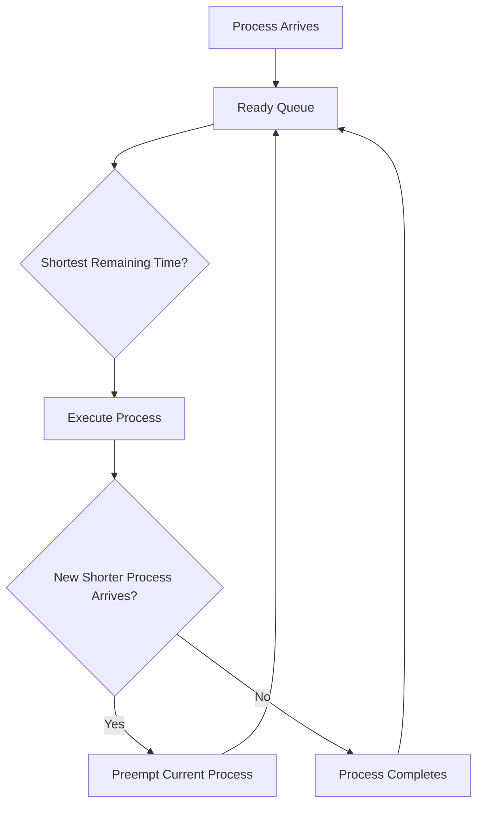

# ⚡ Shortest Remaining Time First (SRTF) Scheduling

## 📖 Definition

**Shortest Remaining Time First (SRTF)** is the **preemptive version of Shortest Job First (SJF)** scheduling.

In SRTF, the process with the **shortest remaining Burst Time** is always selected for execution. If a new process arrives with a **smaller remaining Burst Time** than the currently running process, the CPU immediately switches to the new process.

> **One-line Interview Definition:**
>
> **SRTF is a preemptive CPU scheduling algorithm that always executes the process having the shortest remaining CPU Burst Time.**

---

# 🎯 Key Characteristics

- Preemptive Scheduling Algorithm
- Executes the process with the shortest remaining Burst Time
- Minimizes Average Waiting Time
- Performs Context Switching whenever a shorter job arrives
- Can cause Starvation of long processes
- Requires Burst Time estimation

---

# 🏗️ How SRTF Works

1. Processes enter the Ready Queue.
2. The scheduler selects the process with the **shortest Remaining Burst Time**.
3. If a new process arrives with a **smaller Remaining Burst Time**, the current process is **preempted**.
4. The new shorter process starts executing.
5. This continues until all processes complete.

---

# 🔄 Working of SRTF



---

# 📊 Example 1: Same Arrival Time

## Process Table

| Process | Arrival Time (AT) | Burst Time (BT) |
|----------|------------------:|----------------:|
| P1 | 0 | 6 |
| P2 | 0 | 8 |
| P3 | 0 | 5 |

---

## Step-by-Step Execution

- **Time 0 – 5:** Execute **P3** (Shortest Burst Time = 5 ms)
- **Time 5 – 11:** Execute **P1** (Remaining shortest Burst Time = 6 ms)
- **Time 11 – 19:** Execute **P2** (Remaining Burst Time = 8 ms)

Since all processes arrive together, SRTF behaves exactly like Non-Preemptive SJF.

---

## Gantt Chart

```text
0          5          11                 19
|----------|----------|------------------|
     P3          P1            P2
```

---

## Formula

```text
Turnaround Time = Completion Time - Arrival Time

Waiting Time = Turnaround Time - Burst Time
```

---

## Scheduling Table

| Process | AT | BT | CT | TAT | WT |
|----------|---:|---:|---:|----:|---:|
| P1 | 0 | 6 | 11 | 11 | 5 |
| P2 | 0 | 8 | 19 | 19 | 11 |
| P3 | 0 | 5 | 5 | 5 | 0 |

---

## Average Turnaround Time

```text
(11 + 19 + 5) / 3

= 35 / 3

= 11.67 ms
```

---

## Average Waiting Time

```text
(5 + 11 + 0) / 3

= 16 / 3

= 5.33 ms
```

---

# 📊 Example 2: Different Arrival Times

## Process Table

| Process | Arrival Time (AT) | Burst Time (BT) |
|----------|------------------:|----------------:|
| P1 | 0 | 6 |
| P2 | 1 | 3 |
| P3 | 2 | 7 |

---

## Step-by-Step Execution

- **Time 0 – 1:** Execute **P1** (Remaining = 5 ms)
- **Time 1:** P2 arrives with Burst Time = 3 ms. Since **3 < 5**, P1 is **preempted**.
- **Time 1 – 4:** Execute **P2** until completion.
- **Time 4 – 9:** Resume **P1** and complete execution.
- **Time 9 – 16:** Execute **P3**.

---

## Gantt Chart

```text
0      1         4              9                 16
|------|---------|--------------|-----------------|
   P1      P2          P1               P3
```

---

## Scheduling Table

| Process | AT | BT | CT | TAT | WT |
|----------|---:|---:|---:|----:|---:|
| P1 | 0 | 6 | 9 | 9 | 3 |
| P2 | 1 | 3 | 4 | 3 | 0 |
| P3 | 2 | 7 | 16 | 14 | 7 |

---

## Average Turnaround Time

```text
(9 + 3 + 14) / 3

= 26 / 3

= 8.67 ms
```

---

## Average Waiting Time

```text
(3 + 0 + 7) / 3

= 10 / 3

= 3.33 ms
```

---

# ⚙️ SRTF Algorithm

```text
1. Read Arrival Time and Burst Time of all processes.
2. Initialize Remaining Time = Burst Time.
3. At every time unit, check all arrived processes.
4. Select the process with the shortest Remaining Time.
5. If a shorter process arrives, preempt the current process.
6. Execute the selected process for one time unit.
7. Update Remaining Time.
8. When Remaining Time becomes zero:
      Completion Time = Current Time
      Turnaround Time = CT - AT
      Waiting Time = TAT - BT
9. Repeat until all processes complete.
10. Calculate Average Waiting Time and Average Turnaround Time.
```

---

# ⏱️ Time Complexity

| Implementation | Complexity |
|---------------|-----------|
| Naive Implementation | O(n²) |
| Using Priority Queue | O(n log n) |

---

# ⚖️ Advantages of SRTF

- ✅ Produces the minimum average waiting time.
- ✅ Short processes finish quickly.
- ✅ Improves system responsiveness.
- ✅ Better throughput than FCFS in most cases.
- ✅ Gives priority to short CPU-bound processes.

---

# ❌ Disadvantages of SRTF

- ❌ Long processes may suffer from starvation.
- ❌ Burst Time prediction is difficult.
- ❌ Frequent Context Switching increases overhead.
- ❌ More complex than FCFS and SJF.

---

# 🚫 Starvation

A long process may never get CPU time if shorter processes continue arriving.

This problem can be reduced using **Ageing**.

---

# 🔄 Context Switching

Since SRTF is a **preemptive** scheduling algorithm, the CPU may frequently switch between processes whenever a shorter process arrives.

More Context Switching leads to:

- Increased CPU overhead
- Reduced overall efficiency
- Extra scheduling cost

---

# 📊 SJF vs SRTF

| Feature | SJF | SRTF |
|----------|-----|------|
| Type | Non-Preemptive | Preemptive |
| Process Selection | Shortest Burst Time | Shortest Remaining Time |
| Context Switching | Low | High |
| Waiting Time | Low | Lowest |
| Starvation | Yes | Yes |
| Complexity | Lower | Higher |

---

# 🎯 Interview Questions

### Q1. What is SRTF?

SRTF is the **preemptive version of SJF** that executes the process with the shortest remaining Burst Time.

---

### Q2. When does preemption occur?

Whenever a new process arrives with a smaller Remaining Burst Time than the currently executing process.

---

### Q3. Why is SRTF better than SJF?

Because it immediately switches to shorter arriving processes, resulting in a lower average waiting time.

---

### Q4. What is the biggest disadvantage of SRTF?

Frequent Context Switching and Starvation.

---

### Q5. Can SRTF cause starvation?

Yes. Long processes may wait indefinitely if shorter processes keep arriving.

---

# 💻 C++ Simulation (Optional)

> **Note:** The complete C++ implementation can be added later after understanding the algorithm thoroughly.

---

# 📝 Key Points (30-Second Revision)

- ✅ SRTF is the **preemptive version of SJF**.
- ✅ Executes the process with the **shortest Remaining Burst Time**.
- ✅ Preempts the running process if a shorter job arrives.
- ✅ Produces the **minimum average waiting time**.
- ✅ Can cause **Starvation**.
- ✅ Suffers from frequent **Context Switching**.
- ✅ Burst Time estimation is required in practical systems.
