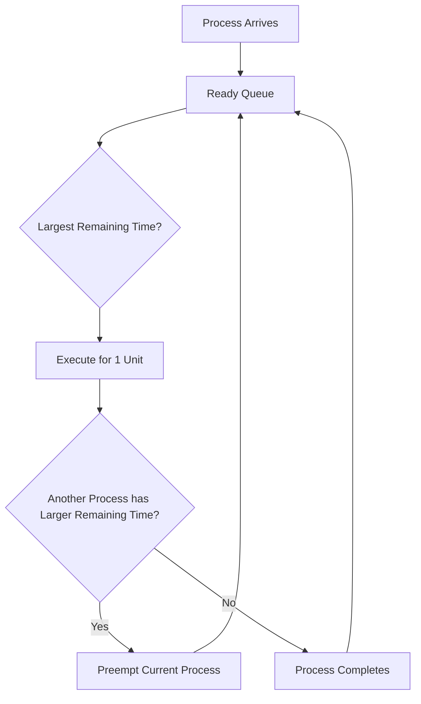

# ⏳ Longest Remaining Time First (LRTF) Scheduling

## 📖 Definition

**Longest Remaining Time First (LRTF)** is the **preemptive version of Longest Job First (LJF)** CPU Scheduling Algorithm.

In LRTF, the scheduler always selects the process having the **maximum remaining Burst Time** among all the processes present in the Ready Queue. The selected process executes for a fixed time interval (usually one unit). After every unit of execution, the scheduler again checks whether another process with a **larger remaining Burst Time** has arrived. If yes, the currently running process is preempted.

> **One-Line Interview Definition**
>
> **LRTF is a preemptive CPU scheduling algorithm in which the process having the largest remaining Burst Time gets the CPU.**

---

# 🎯 Characteristics of LRTF

- Preemptive scheduling algorithm.
- CPU is always assigned to the process with the **largest remaining Burst Time**.
- Scheduling decision is taken after every unit of execution.
- If two processes have the same Remaining Burst Time, **FCFS** is used to break the tie.
- Opposite behaviour of **Shortest Remaining Time First (SRTF)**.
- May lead to starvation of short processes.

---

# ⚙️ How LRTF Works

1. Processes enter the Ready Queue according to their Arrival Time.
2. The scheduler selects the process with the **largest Remaining Burst Time**.
3. The selected process executes for **one time unit**.
4. After one unit, the scheduler again checks the Ready Queue.
5. If another process now has a larger Remaining Burst Time, the current process is preempted.
6. This continues until all processes finish execution.

---

# 🔄 Working of LRTF



---

# 📋 LRTF Scheduling Algorithm

```text
Step 1: Sort all processes according to Arrival Time.

Step 2: Select the process having the largest Remaining Burst Time.

Step 3: Execute the selected process for one time unit.

Step 4: Reduce its Remaining Burst Time by one.

Step 5: Check whether a new process has arrived.

Step 6: If another process has a larger Remaining Burst Time,
        preempt the current process.

Step 7: Repeat until all processes complete execution.

Step 8: Calculate:

Turnaround Time = Completion Time − Arrival Time

Waiting Time = Turnaround Time − Burst Time

Step 9: Calculate Average Waiting Time and
Average Turnaround Time.
```

---

# 📊 Example 1

## Process Table

| Process | Arrival Time (AT) | Burst Time (BT) |
|----------|------------------:|----------------:|
| P1 | 1 | 2 |
| P2 | 2 | 4 |
| P3 | 3 | 6 |
| P4 | 4 | 8 |

---

## Step-by-Step Execution

### Time 0 – 1

No process has arrived.

**CPU remains Idle.**

---

### Time 1 – 2

Available Process:

- P1

Only one process is available.

Execute **P1** for one unit.

Remaining Time:

| Process | Remaining Time |
|----------|---------------:|
| P1 | 1 |

---

### Time 2 – 3

Available Processes:

- P1 (Remaining = 1)
- P2 (Remaining = 4)

Since **P2 has larger Remaining Burst Time**, P1 is preempted.

Execute **P2**.

Remaining Times:

| Process | Remaining Time |
|----------|---------------:|
| P1 | 1 |
| P2 | 3 |

---

### Time 3 – 4

Available Processes

- P1 (1)
- P2 (3)
- P3 (6)

Largest Remaining Burst Time = **P3**

Execute **P3**

Remaining Times

| Process | Remaining Time |
|----------|---------------:|
| P1 | 1 |
| P2 | 3 |
| P3 | 5 |

---

### Time 4 – 5

P4 arrives.

Available Processes

- P1 (1)
- P2 (3)
- P3 (5)
- P4 (8)

Largest Remaining Burst Time = **P4**

Execute **P4**

Remaining Times

| Process | Remaining Time |
|----------|---------------:|
| P1 | 1 |
| P2 | 3 |
| P3 | 5 |
| P4 | 7 |

---

### Time 5 – 7

P4 still has the largest Remaining Burst Time.

Continue executing **P4**.

Remaining Times

| Process | Remaining Time |
|----------|---------------:|
| P1 | 1 |
| P2 | 3 |
| P3 | 5 |
| P4 | 5 |

---

### Time 7 – 8

P3 and P4 both have Remaining Time = **5**.

Tie is broken using **FCFS**.

Since **P3 arrived earlier**, execute **P3**.

---

### Time 8 – 9

Remaining Times

- P3 = 4
- P4 = 5

Execute **P4**.

---

### Time 9 – 10

Remaining Times

- P3 = 4
- P4 = 4

Tie is again resolved using **FCFS**.

Execute **P3**.

---

### Time 10 – 11

Remaining Times

- P2 = 3
- P3 = 3
- P4 = 4

Execute **P4**.

---

### Time 11 – 12

Remaining Times

- P2 = 3
- P3 = 3
- P4 = 3

All are equal.

Using **FCFS**, execute **P2**.

---

### Time 12 – 13

Remaining Times

- P2 = 2
- P3 = 3
- P4 = 3

Execute **P3**.

---

### Time 13 – 14

Remaining Times

- P2 = 2
- P3 = 2
- P4 = 3

Execute **P4**.

---

### Time 14 – 15

Remaining Times

- P2 = 2
- P3 = 2
- P4 = 2

All equal.

Execute **P2** using FCFS.

---

### Time 15 – 16

Execute **P3**

---

### Time 16 – 17

Execute **P4**

---

### Time 17 – 18

Execute **P1**

P1 completes.

---

### Time 18 – 19

Execute **P2**

P2 completes.

---

### Time 19 – 20

Execute **P3**

P3 completes.

---

### Time 20 – 21

Execute **P4**

P4 completes.

---

## Gantt Chart

```text
0    1    2    3    4    7    8    9   10   11   12   13   14   15   16   17   18   19   20   21
|Idle| P1 | P2 | P3 | P4 | P3 | P4 | P3 | P4 | P2 | P3 | P4 | P2 | P3 | P4 | P1 | P2 | P3 | P4 |
```

---

## Formula

```text
Turnaround Time = Completion Time − Arrival Time

Waiting Time = Turnaround Time − Burst Time
```

---

## Final Scheduling Table

| Process | AT | BT | CT | TAT | WT |
|----------|---:|---:|---:|----:|---:|
| P1 | 1 | 2 | 18 | 17 | 15 |
| P2 | 2 | 4 | 19 | 17 | 13 |
| P3 | 3 | 6 | 20 | 17 | 11 |
| P4 | 4 | 8 | 21 | 17 | 9 |

---

## Average Turnaround Time

```text
Total Turnaround Time = 68 ms

Average Turnaround Time

= 68 / 4

= 17 ms
```

---

## Average Waiting Time

```text
Total Waiting Time = 48 ms

Average Waiting Time

= 48 / 4

= 12 ms
```

---

# 📊 Example 2

## Process Table

| Process | Arrival Time (AT) | Burst Time (BT) |
|----------|------------------:|----------------:|
| P1 | 0 | 2 |
| P2 | 0 | 3 |
| P3 | 2 | 2 |
| P4 | 3 | 5 |
| P5 | 4 | 4 |

---

## Step-by-Step Execution

### Time 0 – 2

Initially, both **P1** and **P2** are available.

Since **P2** has a larger Burst Time, it gets the CPU first.

---

### Time 2

Process **P3** arrives.

Remaining Burst Times:

- P1 = 2
- P2 = 1
- P3 = 2

The largest Remaining Burst Time is **2**.

Since P1 arrived before P3, **P1** is selected using **FCFS**.

---

### Time 3

Process **P4** arrives with Burst Time = **5**.

Since P4 has the largest Remaining Burst Time, it immediately preempts the running process.

---

### Time 4

Process **P5** arrives with Burst Time = **4**.

Remaining Times:

- P1 = 1
- P2 = 1
- P3 = 2
- P4 = 4
- P5 = 4

P4 and P5 have equal Remaining Burst Time.

Using **FCFS**, P4 continues execution.

---

### Remaining Execution

The scheduler continues selecting the process having the **largest Remaining Burst Time** after every unit of execution until all processes complete.

Whenever two or more processes have the same Remaining Burst Time, **FCFS** is used to break the tie.

---

## Gantt Chart

```text
0      2      3          7         10        12        14        16
|------|------|----------|---------|---------|---------|---------|
   P2      P1       P4         P5        P3        P1        P2
```

> **Note:** The above Gantt Chart represents the execution sequence for this example.

---

## Formula

```text
Turnaround Time = Completion Time − Arrival Time

Waiting Time = Turnaround Time − Burst Time
```

---

## Final Result

```text
Total Turnaround Time = 61 ms

Average Turnaround Time

= 61 / 5

= 12.2 ms
```

---

```text
Total Waiting Time = 45 ms

Average Waiting Time

= 45 / 5

= 9 ms
```

---

# ⚡ Time Complexity

| Implementation | Time Complexity |
|---------------|-----------------|
| Naive Implementation | O(n²) |
| Priority Queue Implementation | O(n log n) |

---

# ✅ Advantages of LRTF

- Gives preference to long CPU-intensive processes.
- Ensures large processes receive CPU time early.
- Fair among processes having similar Burst Times (using FCFS).
- Suitable in systems where completing large jobs first is preferred.
- Preemptive scheduling allows newly arrived longer processes to execute immediately.

---

# ❌ Disadvantages of LRTF

- Produces a very high Average Waiting Time.
- Produces a high Average Turnaround Time.
- Small processes may suffer from **Starvation**.
- Can lead to the **Convoy Effect**.
- Frequent Context Switching increases scheduling overhead.
- Reduces CPU efficiency compared to algorithms like SJF and SRTF.

---

# 🚫 Starvation

LRTF gives priority to processes having the **largest Remaining Burst Time**.

If longer jobs continue arriving, smaller jobs may wait for a very long time and may never get executed.

Hence, **LRTF can suffer from Starvation of short processes.**

---

# 🚛 Convoy Effect

In LRTF, long processes receive the CPU repeatedly.

As a result, several small processes remain waiting behind them.

This increases:

- Waiting Time
- Turnaround Time
- Response Time

This situation is called the **Convoy Effect**.

---

# 🔄 Context Switching

Since LRTF is a **preemptive** scheduling algorithm, the scheduler checks the Ready Queue after every unit of execution.

Whenever a process with a larger Remaining Burst Time arrives, the currently running process is preempted.

Frequent preemption leads to:

- More Context Switching
- Higher CPU overhead
- Lower system performance

---

# 📊 LJF vs LRTF

| Feature | LJF | LRTF |
|----------|-----|------|
| Type | Non-Preemptive | Preemptive |
| CPU Selection | Largest Burst Time | Largest Remaining Burst Time |
| Context Switching | Low | High |
| Starvation | Yes | Yes |
| Complexity | Lower | Higher |
| Throughput | Low | Lower due to Preemption |

---

# 📊 SRTF vs LRTF

| Feature | SRTF | LRTF |
|----------|------|------|
| Priority | Shortest Remaining Time | Longest Remaining Time |
| Goal | Minimize Waiting Time | Execute Long Jobs First |
| Average Waiting Time | Lowest | Highest |
| Starvation | Long Jobs | Short Jobs |
| Practical Usage | Common | Rare |

---

# 💻 C++ Simulation

> **Note:** A complete C++ implementation of LRTF can be added later after understanding the scheduling algorithm.

---

# 🎯 Interview Questions

### Q1. What is LRTF?

LRTF (Longest Remaining Time First) is the **preemptive version of Longest Job First Scheduling**.

---

### Q2. Which process gets the CPU in LRTF?

The process having the **largest Remaining Burst Time** gets the CPU.

---

### Q3. Is LRTF preemptive?

Yes.

The scheduler checks after every unit of execution whether another process has a larger Remaining Burst Time.

---

### Q4. How are ties resolved in LRTF?

Using **First Come First Serve (FCFS)**.

---

### Q5. Can LRTF cause starvation?

Yes.

Small processes may starve if longer processes continue arriving.

---

### Q6. Is LRTF commonly used in modern operating systems?

No.

Modern operating systems generally prefer algorithms like **Round Robin**, **Priority Scheduling**, or **Multilevel Feedback Queue Scheduling**, as LRTF results in poor average Waiting Time and Turnaround Time.

---

# 📝 30-Second Revision

- ✅ LRTF is the **preemptive version of Longest Job First (LJF)**.
- ✅ Executes the process with the **largest Remaining Burst Time**.
- ✅ Scheduler checks after every unit of execution.
- ✅ Uses **FCFS** to break ties.
- ✅ Long processes get higher priority.
- ✅ Can cause **Starvation** of short processes.
- ✅ Suffers from **Convoy Effect**.
- ✅ Has high Context Switching overhead.
- ✅ Rarely used in modern operating systems.