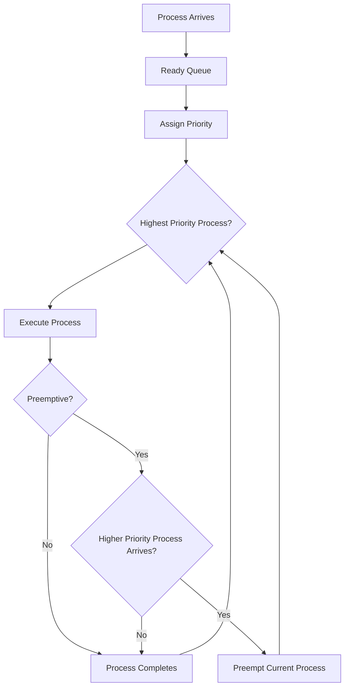

# 🎯 Priority Scheduling

## 📖 Definition

**Priority Scheduling** is a CPU Scheduling algorithm in which each process is assigned a **priority value**. The CPU is allocated to the process having the **highest priority** among all the processes present in the Ready Queue.

The priority of a process may be determined based on factors such as:

- Memory requirements
- CPU Burst Time
- I/O requirements
- Resource requirements
- Importance of the process

If two or more processes have the same priority, they are scheduled according to **First Come First Serve (FCFS)**.

> **One-Line Interview Definition**
>
> **Priority Scheduling is a CPU scheduling algorithm that selects the process with the highest priority for execution.**

---

# 🎯 Key Characteristics

- Processes are executed based on their priority.
- Higher-priority processes are executed before lower-priority processes.
- Can be **Preemptive** or **Non-Preemptive**.
- Equal priority processes are scheduled using **FCFS**.
- May lead to **Starvation** of low-priority processes.
- **Aging** is used to prevent starvation.

---

# 📌 Types of Priority Scheduling

Priority Scheduling is classified into two types:

## 1. Non-Preemptive Priority Scheduling

Once a process gets the CPU, it continues executing until it completes.

Even if another process with a higher priority arrives, the currently running process is **not interrupted**.

---

## 2. Preemptive Priority Scheduling

If a process with a higher priority arrives while another process is executing, the CPU is immediately taken away from the running process and assigned to the higher-priority process.

---

# ⚙️ How Priority Scheduling Works

1. All processes enter the Ready Queue.
2. Each process is assigned a priority.
3. The scheduler selects the process with the highest priority.
4. If two processes have the same priority, FCFS is used.
5. Depending on the implementation:
   - **Non-Preemptive:** Process executes until completion.
   - **Preemptive:** Running process may be interrupted if a higher-priority process arrives.
6. Repeat until all processes finish execution.

---

# 🔄 Working of Priority Scheduling



---

# 🔹 Non-Preemptive Priority Scheduling

## 📖 Definition

In **Non-Preemptive Priority Scheduling**, once a process starts executing, the CPU cannot be taken away until the process finishes execution.

Even if another process with a higher priority arrives, it must wait until the currently running process completes.

---

## Example

### Process Table

> **Note:** Lower Priority Number = Higher Priority

| Process | Arrival Time (AT) | Burst Time (BT) | Priority |
|----------|------------------:|----------------:|---------:|
| P1 | 0 | 4 | 2 |
| P2 | 1 | 2 | 1 |
| P3 | 2 | 6 | 3 |

---

## Step-by-Step Execution

### Time 0

Only **P1** has arrived.

Execute **P1**.

Since this is **Non-Preemptive**, P1 continues execution until completion.

---

### Time 4

P1 finishes.

Available processes:

- P2 (Priority = 1)
- P3 (Priority = 3)

P2 has the highest priority.

Execute **P2**.

---

### Time 6

P2 completes.

Only P3 remains.

Execute **P3**.

---

### Time 12

P3 completes.

All processes have finished execution.

---

## Gantt Chart

```text
0              4          6                    12
|--------------|----------|--------------------|
      P1            P2             P3
```

---

## Formula

```text
Turnaround Time = Completion Time − Arrival Time

Waiting Time = Turnaround Time − Burst Time
```

---

## Scheduling Table

| Process | AT | BT | CT | TAT | WT |
|----------|---:|---:|---:|----:|---:|
| P1 | 0 | 4 | 4 | 4 | 0 |
| P2 | 1 | 2 | 6 | 5 | 3 |
| P3 | 2 | 6 | 12 | 10 | 4 |

---

## Average Turnaround Time

```text
(4 + 5 + 10) / 3

= 19 / 3

= 6.33
```

---

## Average Waiting Time

```text
(0 + 3 + 4) / 3

= 7 / 3

= 2.33
```

---

# 🔹 Preemptive Priority Scheduling

## 📖 Definition

In **Preemptive Priority Scheduling**, the CPU can be taken away from the currently executing process if another process with a **higher priority** arrives.

The higher-priority process immediately starts execution, while the interrupted process returns to the Ready Queue.

---

## Example 1 (Same Arrival Time)

### Process Table

> **Note:** Higher Priority Number = Higher Priority

| Process | Arrival Time (AT) | Burst Time (BT) | Priority |
|----------|------------------:|----------------:|---------:|
| P1 | 0 | 7 | 2 |
| P2 | 0 | 4 | 1 |
| P3 | 0 | 6 | 3 |

---

## Step-by-Step Execution

### Time 0

All processes arrive together.

P3 has the highest priority.

Execute **P3**.

---

### Time 6

P3 completes.

Remaining processes:

- P1 (Priority 2)
- P2 (Priority 1)

Execute **P1**.

---

### Time 13

P1 completes.

Execute **P2**.

---

### Time 17

P2 completes.

All processes finish.

## Gantt Chart

```text
0                  6                    13                17
|------------------|--------------------|-----------------|
        P3                  P1                 P2
```

---

## Formula

```text
Turnaround Time = Completion Time − Arrival Time

Waiting Time = Turnaround Time − Burst Time
```

---

## Scheduling Table

| Process | AT | BT | Priority | CT | TAT | WT |
|----------|---:|---:|---------:|---:|----:|---:|
| P1 | 0 | 7 | 2 | 13 | 13 | 6 |
| P2 | 0 | 4 | 1 | 17 | 17 | 13 |
| P3 | 0 | 6 | 3 | 6 | 6 | 0 |

---

## Average Turnaround Time

```text
(13 + 17 + 6) / 3

= 36 / 3

= 12
```

---

## Average Waiting Time

```text
(6 + 13 + 0) / 3

= 19 / 3

= 6.33
```

---

# 📊 Example 2 (Different Arrival Time)

## Process Table

| Process | Arrival Time (AT) | Burst Time (BT) | Priority |
|----------|------------------:|----------------:|---------:|
| P1 | 0 | 6 | 2 |
| P2 | 1 | 4 | 3 |
| P3 | 2 | 5 | 1 |

> **Note:** Higher Priority Number = Higher Priority

---

## Step-by-Step Execution

### Time 0

Only **P1** has arrived.

Execute **P1**.

---

### Time 1

P2 arrives with a **higher priority** than P1.

Since this is **Preemptive Priority Scheduling**, P1 is immediately preempted.

Execute **P2**.

---

### Time 5

P2 completes execution.

Available processes:

- P1 (Priority = 2)
- P3 (Priority = 1)

P1 has the higher priority.

Execute **P1**.

---

### Time 10

P1 completes.

Execute **P3**.

---

### Time 15

P3 completes.

All processes finish execution.

---

## Gantt Chart

```text
0      1              5                  10                 15
|------|--------------|------------------|------------------|
   P1         P2               P1                P3
```

---

## Scheduling Table

| Process | AT | BT | Priority | CT | TAT | WT |
|----------|---:|---:|---------:|---:|----:|---:|
| P1 | 0 | 6 | 2 | 10 | 10 | 4 |
| P2 | 1 | 4 | 3 | 5 | 4 | 0 |
| P3 | 2 | 5 | 1 | 15 | 13 | 8 |

---

## Average Turnaround Time

```text
(10 + 4 + 13) / 3

= 27 / 3

= 9
```

---

## Average Waiting Time

```text
(4 + 0 + 8) / 3

= 12 / 3

= 4
```

---

# ⏱️ Time Complexity

| Implementation | Time Complexity |
|---------------|-----------------|
| Naive Implementation | O(n²) |
| Priority Queue (Heap) | O(n log n) |

---

# ✅ Advantages of Priority Scheduling

- High-priority processes receive CPU time first.
- Suitable for real-time and critical applications.
- Supports both **Preemptive** and **Non-Preemptive** scheduling.
- Important system processes can be completed quickly.
- Flexible because priorities can be assigned dynamically or statically.

---

# ❌ Disadvantages of Priority Scheduling

- Low-priority processes may suffer from **Starvation**.
- Priority assignment may be difficult.
- Frequent preemption increases Context Switching overhead.
- Fairness is reduced if priorities are not managed properly.
- Requires additional mechanisms like **Aging** to avoid starvation.

---

# 🚫 Starvation

In Priority Scheduling, low-priority processes may remain in the Ready Queue indefinitely if higher-priority processes continue arriving.

As a result, low-priority processes may never get CPU time.

This problem is known as **Starvation**.

---

# 🌱 Aging

**Aging** is a technique used to prevent starvation.

The priority of a process waiting in the Ready Queue is gradually increased over time.

Eventually, every process gets a sufficiently high priority and is scheduled for execution.

---

# 🔄 Context Switching

In **Preemptive Priority Scheduling**, the scheduler immediately switches the CPU whenever a higher-priority process arrives.

Frequent preemption results in:

- Increased Context Switching
- Higher scheduling overhead
- Lower CPU efficiency

---

# 📊 Non-Preemptive vs Preemptive Priority Scheduling

| Feature | Non-Preemptive | Preemptive |
|----------|----------------|------------|
| CPU Taken Away | No | Yes |
| Response Time | Higher | Lower |
| Context Switching | Less | More |
| Complexity | Lower | Higher |
| Suitable For | Batch Systems | Real-Time Systems |

---

# 📊 Priority Scheduling vs FCFS vs SJF

| Feature | FCFS | SJF | Priority |
|----------|------|-----|----------|
| Basis | Arrival Time | Burst Time | Priority |
| Preemptive Version | No | SRTF | Yes |
| Starvation | No | Yes | Yes |
| Context Switching | Low | Medium | Medium to High |
| Average Waiting Time | High | Lowest | Depends on Priority |

---

# 💻 C++ Simulation

> **Note:** The complete C++ implementation can be added later after understanding the scheduling algorithm.

---

# 🎯 Interview Questions

### Q1. What is Priority Scheduling?

Priority Scheduling is a CPU scheduling algorithm that executes the process having the highest priority first.

---

### Q2. What are the two types of Priority Scheduling?

- Non-Preemptive Priority Scheduling
- Preemptive Priority Scheduling

---

### Q3. What is the difference between Preemptive and Non-Preemptive Priority Scheduling?

In Non-Preemptive scheduling, a running process cannot be interrupted.

In Preemptive scheduling, the running process is interrupted whenever a higher-priority process arrives.

---

### Q4. What is Starvation?

Starvation occurs when low-priority processes wait indefinitely because higher-priority processes continuously get the CPU.

---

### Q5. What is Aging?

Aging is a technique that gradually increases the priority of waiting processes to prevent starvation.

---

### Q6. Where is Priority Scheduling used?

Priority Scheduling is commonly used in:

- Real-Time Operating Systems
- Embedded Systems
- Interrupt Handling
- Critical System Processes

---

# 📝 30-Second Revision

- ✅ Processes are scheduled based on **Priority**.
- ✅ Higher-priority processes execute before lower-priority processes.
- ✅ Equal priorities are resolved using **FCFS**.
- ✅ Two types:
  - Non-Preemptive Priority Scheduling
  - Preemptive Priority Scheduling
- ✅ Preemptive version allows higher-priority processes to interrupt running processes.
- ✅ Can suffer from **Starvation**.
- ✅ **Aging** is used to eliminate starvation.
- ✅ Widely used in **Real-Time Operating Systems**.