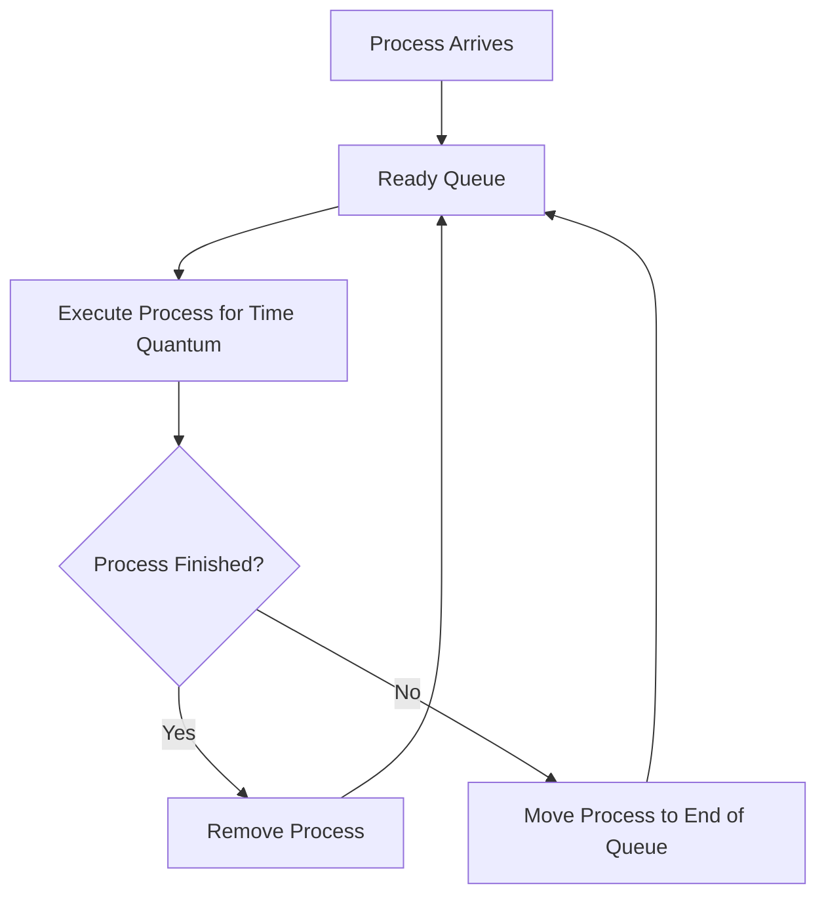

# 🔄 Round Robin (RR) Scheduling

## 📖 Definition

**Round Robin (RR)** is a **preemptive CPU Scheduling algorithm** in which each process is assigned a fixed amount of CPU time called the **Time Quantum (Time Slice)**.

The CPU executes a process for one Time Quantum. If the process completes within that time, it leaves the system. Otherwise, it is **preempted** and placed at the **end of the Ready Queue**, allowing the next process to execute.

The scheduler continues cycling through the Ready Queue until all processes complete execution.

> **One-Line Interview Definition**
>
> **Round Robin is a preemptive CPU scheduling algorithm that allocates a fixed Time Quantum to each process in a cyclic order.**

---

# 🎯 Key Characteristics

- Preemptive scheduling algorithm.
- Every process gets an equal share of CPU time.
- Uses a fixed **Time Quantum (Time Slice)**.
- Processes are executed in **First Come First Serve (FCFS)** order.
- If a process is not completed within its Time Quantum, it is moved to the end of the Ready Queue.
- Commonly used in **Time-Sharing Operating Systems**.
- Provides fairness among all processes.

---

# ⚙️ How Round Robin Works

1. All processes enter the Ready Queue.
2. The scheduler selects the first process in the queue.
3. The process executes for one **Time Quantum**.
4. If the process finishes, it leaves the system.
5. Otherwise, it is preempted and moved to the end of the Ready Queue.
6. The scheduler repeats the same process until all processes complete execution.

---

# ⏳ Time Quantum

The **Time Quantum** (also called **Time Slice**) is the maximum amount of CPU time allocated to a process before it is preempted.

Choosing an appropriate Time Quantum is very important.

- If the Time Quantum is **too small**, Context Switching increases.
- If the Time Quantum is **too large**, Round Robin behaves like **FCFS**.

---

# 🔄 Working of Round Robin



---

# 📊 Example 1 (Same Arrival Time)

### Time Quantum = 2 ms

## Process Table

| Process | Arrival Time (AT) | Burst Time (BT) |
|----------|------------------:|----------------:|
| P1 | 0 | 4 |
| P2 | 0 | 5 |
| P3 | 0 | 3 |

---

## Step-by-Step Execution

### Time 0 – 2

Execute **P1**.

Remaining Burst Time:

```text
P1 = 2 ms
```

Ready Queue:

```text
P2 → P3 → P1
```

---

### Time 2 – 4

Execute **P2**.

Remaining Burst Time:

```text
P2 = 3 ms
```

Ready Queue:

```text
P3 → P1 → P2
```

---

### Time 4 – 6

Execute **P3**.

Remaining Burst Time:

```text
P3 = 1 ms
```

Ready Queue:

```text
P1 → P2 → P3
```

---

### Time 6 – 8

Execute **P1**.

P1 completes execution.

Ready Queue:

```text
P2 → P3
```

---

### Time 8 – 10

Execute **P2**.

Remaining Burst Time:

```text
P2 = 1 ms
```

Ready Queue:

```text
P3 → P2
```

---

### Time 10 – 11

Execute **P3**.

P3 completes execution.

Ready Queue:

```text
P2
```

---

### Time 11 – 12

Execute **P2**.

P2 completes execution.

---

## Gantt Chart

```text
0      2      4      6      8      10     11     12
|------|------|------|------|------|------|------|
   P1      P2      P3      P1      P2      P3     P2
```

---

## Formula

```text
Turnaround Time = Completion Time − Arrival Time

Waiting Time = Turnaround Time − Burst Time
```

---

## Scheduling Table

| Process | AT | BT | CT | TAT | WT |
|----------|---:|---:|---:|----:|---:|
| P1 | 0 | 4 | 8 | 8 | 4 |
| P2 | 0 | 5 | 12 | 12 | 7 |
| P3 | 0 | 3 | 11 | 11 | 8 |

---

## Average Turnaround Time

```text
(8 + 12 + 11) / 3

= 31 / 3

= 10.33 ms
```

---

## Average Waiting Time

```text
(4 + 7 + 8) / 3

= 19 / 3

= 6.33 ms
```

---

# 📊 Example 2 (Different Arrival Time)

### Time Quantum = 2 ms

## Process Table

| Process | Arrival Time (AT) | Burst Time (BT) |
|----------|------------------:|----------------:|
| P1 | 0 | 5 |
| P2 | 4 | 2 |
| P3 | 5 | 4 |

---

## Step-by-Step Execution

### Time 0 – 2

Only **P1** has arrived.

Execute **P1**.

Remaining Burst Time:

```text
P1 = 3 ms
```

Ready Queue:

```text
P1
```

---

### Time 2 – 4

Execute **P1** again since no other process has arrived.

Remaining Burst Time:

```text
P1 = 1 ms
```

At **Time = 4 ms**, **P2** arrives.

Ready Queue:

```text
P2 → P1
```

---

### Time 4 – 6

Execute **P2**.

P2 completes execution.

At **Time = 5 ms**, **P3** arrives.

Ready Queue:

```text
P1 → P3
```

---

### Time 6 – 7

Execute **P1**.

P1 completes execution.

Ready Queue:

```text
P3
```

---

### Time 7 – 9

Execute **P3**.

Remaining Burst Time:

```text
P3 = 2 ms
```

Ready Queue:

```text
P3
```

---

### Time 9 – 11

Execute **P3** again.

P3 completes execution.

---

## Gantt Chart

```text
0      2      4      6      7      9      11
|------|------|------|------|------|-------|
   P1      P1      P2      P1      P3      P3
```

---

## Formula

```text
Turnaround Time = Completion Time − Arrival Time

Waiting Time = Turnaround Time − Burst Time
```

---

## Scheduling Table

| Process | AT | BT | CT | TAT | WT |
|----------|---:|---:|---:|----:|---:|
| P1 | 0 | 5 | 7 | 7 | 2 |
| P2 | 4 | 2 | 6 | 2 | 0 |
| P3 | 5 | 4 | 11 | 6 | 2 |

---

## Average Turnaround Time

```text
(7 + 2 + 6) / 3

= 15 / 3

= 5 ms
```

---

## Average Waiting Time

```text
(2 + 0 + 2) / 3

= 4 / 3

= 1.33 ms
```

---

# ⏱️ Time Complexity

| Implementation | Time Complexity |
|---------------|-----------------|
| Basic Queue Implementation | O(n × m) |
| Efficient Queue Implementation | O(n) (excluding context switching overhead) |

> **Note:** The actual running time depends on the number of Context Switches and the selected Time Quantum.

---

# ⚖️ Choosing the Time Quantum

The performance of Round Robin largely depends on the value of the **Time Quantum**.

### 📌 Time Quantum Too Small

- Very frequent Context Switching.
- Higher scheduling overhead.
- Lower CPU efficiency.
- Better response time for interactive processes.

---

### 📌 Time Quantum Too Large

- Very few Context Switches.
- Lower scheduling overhead.
- Behaves similarly to **FCFS Scheduling**.
- Poor response time for interactive users.

---

### 📌 Ideal Time Quantum

An ideal Time Quantum should:

- Minimize Context Switching.
- Provide good response time.
- Maintain fairness among processes.
- Maximize CPU utilization.

---

# ✅ Advantages of Round Robin Scheduling

- Every process gets an equal share of CPU time.
- Fair scheduling for all processes.
- Simple and easy to implement.
- Provides good response time.
- Suitable for **Time-Sharing Operating Systems**.
- Prevents starvation since every process eventually gets CPU time.

---

# ❌ Disadvantages of Round Robin Scheduling

- Frequent Context Switching increases CPU overhead.
- Performance depends heavily on the chosen Time Quantum.
- Large Time Quantum makes it behave like FCFS.
- Small Time Quantum reduces CPU efficiency.
- Average Waiting Time is usually higher than SJF.

---

# 🚫 Starvation

Unlike Priority Scheduling or SJF, **Round Robin does not suffer from starvation**.

Every process eventually receives CPU time because all processes are executed in a cyclic order.

---

# 🔄 Context Switching

Round Robin is a **preemptive scheduling algorithm**.

Whenever a process exhausts its Time Quantum without completing, it is preempted and moved to the end of the Ready Queue.

As a result, Context Switching occurs frequently.

More Context Switching means:

- Increased CPU overhead.
- Reduced CPU efficiency.
- Lower throughput if the Time Quantum is too small.

---

# 📊 Round Robin vs FCFS

| Feature | FCFS | Round Robin |
|----------|------|-------------|
| Type | Non-Preemptive | Preemptive |
| Scheduling Basis | Arrival Time | Time Quantum |
| Fairness | Low | High |
| Context Switching | Low | High |
| Response Time | Poor | Good |
| Starvation | No | No |

---

# 📊 Round Robin vs SJF

| Feature | SJF | Round Robin |
|----------|-----|-------------|
| Basis | Burst Time | Time Quantum |
| Type | Non-Preemptive (SRTF is Preemptive) | Preemptive |
| Average Waiting Time | Lowest | Higher |
| Fairness | Low | High |
| Starvation | Yes | No |
| Suitable For | Batch Systems | Time-Sharing Systems |

---

# 📊 Round Robin vs Priority Scheduling

| Feature | Priority | Round Robin |
|----------|----------|-------------|
| Scheduling Basis | Priority | Time Quantum |
| Fairness | Depends on Priority | Equal for all |
| Starvation | Possible | Not Possible |
| Context Switching | Medium | High |
| Suitable For | Real-Time Systems | Time-Sharing Systems |

---

# 💻 C++ Simulation

> **Note:** The complete C++ implementation can be added later after understanding the algorithm thoroughly.

---

# 🎯 Interview Questions

### Q1. What is Round Robin Scheduling?

Round Robin is a **preemptive CPU scheduling algorithm** in which every process gets a fixed amount of CPU time called the **Time Quantum**.

---

### Q2. What is Time Quantum?

Time Quantum (Time Slice) is the maximum amount of CPU time allocated to a process before it is preempted.

---

### Q3. What happens if a process does not finish within its Time Quantum?

The process is preempted and moved to the **end of the Ready Queue**.

---

### Q4. What happens if the Time Quantum is too small?

- Frequent Context Switching
- Higher CPU overhead
- Lower CPU efficiency

---

### Q5. What happens if the Time Quantum is too large?

Round Robin behaves similarly to **FCFS Scheduling**.

---

### Q6. Does Round Robin suffer from starvation?

No.

Every process eventually gets CPU time because processes are executed in a cyclic order.

---

### Q7. Where is Round Robin commonly used?

Round Robin is commonly used in:

- Time-Sharing Operating Systems
- Interactive Systems
- Multi-user Systems

---

# 📝 30-Second Revision

- ✅ Round Robin is a **Preemptive CPU Scheduling Algorithm**.
- ✅ Uses a fixed **Time Quantum (Time Slice)**.
- ✅ Each process gets an equal opportunity to execute.
- ✅ Incomplete processes move to the end of the Ready Queue.
- ✅ Does **not** suffer from Starvation.
- ✅ Frequent Context Switching is its major drawback.
- ✅ Choosing an appropriate Time Quantum is crucial for good performance.
- ✅ Widely used in **Time-Sharing Operating Systems**.