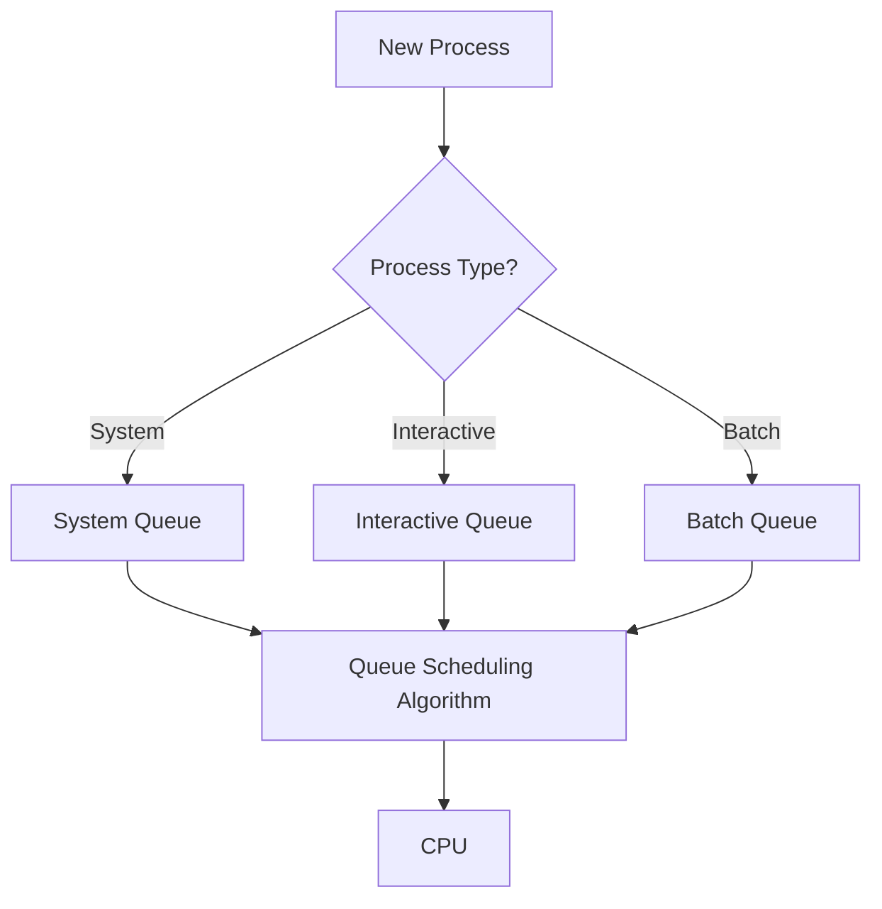

# 🏢 Multilevel Queue (MLQ) Scheduling

## 📖 Definition

**Multilevel Queue (MLQ) Scheduling** is a CPU scheduling algorithm in which the **Ready Queue is divided into multiple separate queues** based on the type or priority of processes.

Each queue contains processes of a particular category, and every queue has its own scheduling algorithm.

Once a process is assigned to a queue, **it remains in that queue permanently** throughout its execution.

> **One-Line Interview Definition**
>
> **Multilevel Queue Scheduling divides the Ready Queue into multiple fixed queues, where each queue uses its own scheduling algorithm and priority level.**

---

# 🎯 Key Characteristics

- Ready Queue is divided into multiple queues.
- Each queue has its own scheduling algorithm.
- Processes are permanently assigned to a queue.
- Queues are arranged in a priority hierarchy.
- Higher-priority queues execute before lower-priority queues.
- Different scheduling policies can be used for different queues.
- Suitable for systems having different types of processes.

---

# 📌 Why is MLQ Needed?

Different types of processes have different requirements.

For example:

- **System Processes** require immediate CPU access.
- **Interactive Processes** require fast response time.
- **Batch Processes** focus on throughput rather than quick response.

Instead of scheduling all processes together, MLQ separates them into different queues so each category can be managed more efficiently.

---

# ⚙️ Process Classification

Processes are divided into queues based on characteristics such as:

- Priority
- Process Type
- Memory Requirements
- Resource Requirements
- CPU or I/O Behavior

Once assigned, a process **cannot move** to another queue.

---

# 🏗️ Queue Hierarchy

A typical MLQ system consists of multiple queues.

```text
Highest Priority

Queue 1 → System Processes

Queue 2 → Interactive Processes

Queue 3 → Batch Processes

Lowest Priority
```

Each queue serves a different purpose.

---

# 🔄 Working of MLQ Scheduling



---

# 📋 Types of Queues

## 1️⃣ System Queue

Contains operating system processes.

Examples:

- Kernel Processes
- Device Drivers
- Interrupt Handlers

Characteristics:

- Highest Priority
- Small Response Time
- Critical for system operation

---

## 2️⃣ Interactive Queue

Contains user-interactive programs.

Examples:

- Web Browser
- Text Editor
- Terminal
- IDE

Characteristics:

- Fast Response Time
- Usually uses Round Robin Scheduling

---

## 3️⃣ Batch Queue

Contains background jobs.

Examples:

- Data Processing
- Report Generation
- Backup Programs
- File Compression

Characteristics:

- Lower Priority
- Throughput is more important than response time

---

# ⚙️ Scheduling Inside Each Queue

Each queue may use a different scheduling algorithm.

Example:

| Queue | Process Type | Scheduling Algorithm |
|--------|--------------|----------------------|
| Queue 1 | System | Round Robin |
| Queue 2 | Interactive | Round Robin |
| Queue 3 | Batch | FCFS |

Different operating systems may choose different algorithms depending on system requirements.

---

# 🔄 Scheduling Between Queues

A scheduling policy is also required to determine **which queue gets the CPU**.

There are two common approaches.

---

# 1️⃣ Fixed Priority Scheduling

Every queue is assigned a fixed priority.

Example:

```text
Queue 1 > Queue 2 > Queue 3
```

The CPU always serves the highest-priority non-empty queue.

If Queue 1 contains processes,

- Queue 2 must wait.
- Queue 3 must wait.

If Queue 1 becomes empty,

the CPU starts executing Queue 2.

Only when Queue 2 is empty,

Queue 3 receives CPU time.

---

## Preemption

Suppose Queue 3 is executing.

Suddenly,

a System Process enters Queue 1.

The scheduler immediately preempts Queue 3.

CPU is given to Queue 1.

```text
Queue 1 (Highest)

↓

Queue 2

↓

Queue 3 (Lowest)
```

---

## Advantages

- Very fast response for high-priority processes.
- Simple scheduling policy.
- Easy to implement.

---

## Disadvantages

- Lower-priority queues may suffer from starvation.
- CPU may spend very little time executing lower queues.

---

# 2️⃣ Time Slicing Between Queues

Instead of absolute priority,

the operating system allocates a fixed percentage of CPU time to each queue.

Example:

| Queue | CPU Time Allocation |
|--------|--------------------:|
| Queue 1 | 50% |
| Queue 2 | 30% |
| Queue 3 | 20% |

Each queue uses its allocated CPU time to schedule its own processes.

Example:

```text
100 ms CPU Cycle

Queue 1 → 50 ms

Queue 2 → 30 ms

Queue 3 → 20 ms
```

After one cycle,

the scheduler repeats the same allocation.

---

## Advantages

- Every queue receives CPU time.
- Prevents complete starvation.
- Better CPU utilization.

---

## Disadvantages

- High-priority processes may experience slight delays.
- More difficult to implement than Fixed Priority Scheduling.

---

# 📊 Example

Suppose the operating system has three queues.

| Queue | Process | Scheduling Algorithm |
|--------|----------|----------------------|
| Queue 1 | P1 | Round Robin |
| Queue 2 | P2 | FCFS |
| Queue 3 | P3 | SJF |

Execution order:

1. Execute Queue 1 using Round Robin.
2. When Queue 1 becomes empty, execute Queue 2 using FCFS.
3. Finally, execute Queue 3 using SJF.

If a new process enters Queue 1 while Queue 3 is executing,

Queue 3 is preempted,

and Queue 1 immediately gets the CPU.

---

# 📝 Key Points

- Ready Queue is divided into multiple queues.
- Every queue has its own scheduling algorithm.
- Processes remain permanently assigned to one queue.
- Higher-priority queues execute before lower-priority queues.
- Scheduling among queues can be done using:
  - Fixed Priority
  - Time Slicing
- Different queues are designed for different process types.

---

# ⏱️ Time Complexity

The time complexity of MLQ Scheduling depends on the scheduling algorithm used inside each queue.

| Scheduling Algorithm Used | Time Complexity |
|---------------------------|-----------------|
| FCFS | O(n) |
| Round Robin | O(n) |
| SJF | O(n²) (Naive) / O(n log n) (Optimized) |
| Priority Scheduling | O(n²) (Naive) / O(n log n) (Optimized) |

Overall, the complexity of MLQ depends on:

- Number of queues
- Scheduling algorithm used in each queue
- Scheduling policy between queues

---

# ✅ Advantages of MLQ Scheduling

- Processes are organized into separate queues based on their type.
- Different scheduling algorithms can be used for different types of processes.
- Interactive and system processes receive faster response time.
- Critical system processes are not delayed by background jobs.
- Scheduling becomes more organized and predictable.
- Suitable for systems handling multiple categories of workloads.

---

# ❌ Disadvantages of MLQ Scheduling

- Processes cannot move between queues once assigned.
- Lower-priority queues may suffer from starvation.
- Managing multiple queues increases scheduling complexity.
- Poor flexibility when process behavior changes.
- CPU utilization may decrease if higher-priority queues are empty while lower queues wait.

---

# 🚫 Starvation

One major drawback of **Fixed Priority MLQ Scheduling** is **Starvation**.

Suppose the queues are:

```text
Queue 1 → Highest Priority

Queue 2 → Medium Priority

Queue 3 → Lowest Priority
```

If Queue 1 continuously receives new processes,

Queue 2 and Queue 3 may never get CPU time.

As a result,

the processes in lower-priority queues may wait indefinitely.

---

# 🌱 How to Reduce Starvation

The operating system can reduce starvation using:

- Aging
- Time Slicing between queues

Instead of giving absolute priority to higher queues, CPU time can be shared among all queues.

Example:

| Queue | CPU Allocation |
|--------|---------------:|
| Queue 1 | 50% |
| Queue 2 | 30% |
| Queue 3 | 20% |

This ensures every queue eventually gets CPU time.

---

# 🔄 Context Switching

Context Switching in MLQ depends on:

- Scheduling algorithm inside each queue.
- Scheduling policy between queues.

For example:

- **Round Robin Queue** → Frequent Context Switching.
- **FCFS Queue** → Very few Context Switches.
- **Preemptive Fixed Priority** → Context Switching whenever a higher-priority queue becomes non-empty.

---

# 📊 MLQ vs MLFQ

| Feature | MLQ | MLFQ |
|----------|-----|------|
| Full Form | Multilevel Queue | Multilevel Feedback Queue |
| Queue Assignment | Fixed | Dynamic |
| Process Movement | Not Allowed | Allowed |
| Priority | Fixed | Changes Dynamically |
| Aging Support | Limited | Yes |
| Starvation | Possible | Reduced |
| Complexity | Lower | Higher |
| Flexibility | Less | More |

---

# 📊 MLQ vs Priority Scheduling

| Feature | MLQ | Priority Scheduling |
|----------|-----|---------------------|
| Ready Queue | Multiple Queues | Single Queue |
| Scheduling Basis | Process Type / Priority | Priority Only |
| Queue Movement | Not Allowed | Not Applicable |
| Scheduling Algorithm | Different for each Queue | Single Algorithm |
| Flexibility | Moderate | High |

---

# 📊 MLQ vs Round Robin

| Feature | MLQ | Round Robin |
|----------|-----|-------------|
| Number of Queues | Multiple | Single |
| Scheduling Basis | Process Type | Time Quantum |
| Time Quantum | Depends on Queue | Fixed |
| Fairness | Depends on Queue Priority | High |
| Starvation | Possible | No |

---

# 📊 MLQ vs FCFS

| Feature | MLQ | FCFS |
|----------|-----|------|
| Number of Queues | Multiple | Single |
| Scheduling Basis | Queue + Scheduling Algorithm | Arrival Time |
| Preemption | Possible | No |
| Flexibility | High | Low |
| Starvation | Possible | No |

---

# 💻 C++ Simulation

> **Note:** A complete C++ implementation can be added later after understanding the scheduling algorithm thoroughly.

---

# 🎯 Interview Questions

### Q1. What is Multilevel Queue Scheduling?

Multilevel Queue Scheduling divides the Ready Queue into multiple queues, where each queue contains a specific type of process and uses its own scheduling algorithm.

---

### Q2. Can a process move from one queue to another in MLQ?

No.

Once a process is assigned to a queue, it remains in that queue until it completes execution.

---

### Q3. Which scheduling algorithms can be used inside MLQ?

Any scheduling algorithm can be used.

Common choices include:

- FCFS
- Round Robin
- SJF
- Priority Scheduling

---

### Q4. How is scheduling performed between queues?

There are two methods:

- Fixed Priority Scheduling
- Time Slicing

---

### Q5. What is the biggest drawback of MLQ?

Starvation of lower-priority queues when Fixed Priority Scheduling is used.

---

### Q6. How is MLQ different from MLFQ?

In MLQ, processes **cannot move** between queues.

In MLFQ, processes **can move** between queues based on their behavior.

---

### Q7. Where is MLQ commonly used?

MLQ is commonly used in systems that handle different categories of processes, such as:

- Operating System Processes
- Interactive Applications
- Batch Jobs
- Real-Time Systems

---

# 📝 30-Second Revision

- ✅ Ready Queue is divided into multiple queues.
- ✅ Each queue has its own scheduling algorithm.
- ✅ Processes are permanently assigned to a queue.
- ✅ Higher-priority queues execute before lower-priority queues.
- ✅ Scheduling between queues can use:
  - Fixed Priority
  - Time Slicing
- ✅ Different queues are designed for different process types.
- ✅ Lower-priority queues may suffer from starvation.
- ✅ MLQ is less flexible than MLFQ because processes cannot change queues.