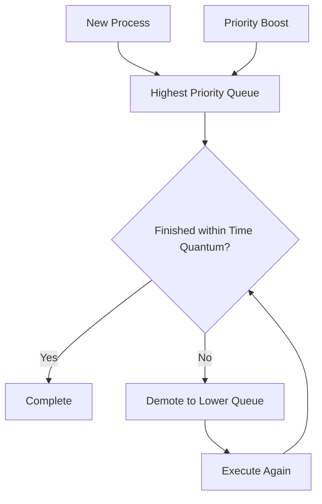

# 🔄 Multilevel Feedback Queue (MLFQ) Scheduling

## 📖 Definition

**Multilevel Feedback Queue (MLFQ) Scheduling** is a **preemptive CPU scheduling algorithm** in which the Ready Queue is divided into multiple priority queues, similar to Multilevel Queue (MLQ) Scheduling.

Unlike MLQ, however, **processes are allowed to move between queues** depending on their CPU usage and behavior.

The scheduler continuously observes how a process behaves and dynamically adjusts its priority.

> **One-Line Interview Definition**
>
> **Multilevel Feedback Queue Scheduling is a preemptive scheduling algorithm where processes can move between multiple priority queues based on their execution behavior.**

---

# 🎯 Key Characteristics

- Multiple priority queues.
- Dynamic priorities.
- Processes can move between queues.
- Preemptive scheduling.
- Different queues may use different scheduling algorithms.
- Short and interactive processes receive higher priority.
- CPU-bound processes gradually move to lower-priority queues.
- Prevents starvation using **Priority Boosting (Aging)**.

---

# 📌 Why is MLFQ Needed?

Traditional scheduling algorithms have several drawbacks.

- FCFS gives poor response time.
- SJF requires burst time in advance.
- Priority Scheduling suffers from starvation.
- Round Robin gives equal CPU time even to CPU-intensive jobs.

MLFQ overcomes these problems by **learning from the behavior of processes** instead of relying on predefined information.

---

# ⚙️ Basic Idea

Instead of permanently assigning a process to one queue,

MLFQ continuously monitors the process.

Depending on its behavior, the scheduler:

- Promotes the process.
- Demotes the process.
- Keeps it in the same queue.

This makes scheduling much more flexible.

---

# 🏗️ Queue Structure

A typical MLFQ consists of multiple queues.

```text
Highest Priority

Queue 1

↓

Queue 2

↓

Queue 3

↓

Queue 4

↓

Lowest Priority
```

Higher queues have:

- Higher Priority
- Smaller Time Quantum

Lower queues have:

- Lower Priority
- Larger Time Quantum

---

# 🔄 Working of MLFQ



---

# ⚙️ Process Assignment

When a new process enters the system,

the operating system decides which queue it should enter.

Usually,

- Interactive Processes start in higher queues.
- Background Processes may start in lower queues.

The assignment policy depends on the operating system.

---

# 🎯 Dynamic Priority

Unlike MLQ,

priority is **not fixed**.

It changes continuously depending on process behavior.

Examples:

- CPU-bound process → Lower Priority
- Interactive process → Higher Priority
- I/O-bound process → Higher Priority

---

# 📌 Dynamic Priority Example

Suppose there are three queues.

```text
Queue 1

↓

Queue 2

↓

Queue 3
```

Initially,

Process P enters Queue 1.

If P continuously uses its entire Time Quantum,

it is considered CPU-intensive.

Therefore,

```text
Queue 1

↓

Queue 2
```

If it again consumes the entire Time Quantum,

```text
Queue 2

↓

Queue 3
```

Eventually,

long-running CPU-bound processes reach lower queues.

---

# ⏳ Time Quantum

Each queue has its own Time Quantum.

Example:

| Queue | Time Quantum |
|--------|-------------:|
| Queue 1 | 4 ms |
| Queue 2 | 8 ms |
| Queue 3 | FCFS (No Quantum) |

Higher-priority queues use smaller Time Quantum because they serve interactive processes.

Lower queues usually use larger Time Quantum or FCFS.

---

# 🔄 Feedback Mechanism

The most important feature of MLFQ is its **Feedback Mechanism**.

The scheduler observes how a process behaves.

Based on this behavior,

it changes the process priority.

For example,

### CPU-bound Process

Consumes entire Time Quantum repeatedly.

Result:

```text
Queue 1

↓

Queue 2

↓

Queue 3
```

Priority decreases.

---

### I/O-bound Process

Uses CPU briefly,

then requests I/O.

Result:

It remains in the higher queue.

Priority remains high.

---

### Interactive Process

Needs very small CPU bursts.

Result:

It stays in higher queues,

giving users faster response.

---

# ⬇️ Process Demotion

A process is **demoted** when it continuously consumes its complete Time Quantum.

Example:

```text
Queue 1

↓

Queue 2

↓

Queue 3
```

Reason:

The scheduler assumes

the process is CPU-bound.

Therefore,

it receives lower priority.

---

# ⬆️ Process Promotion

A process can also be promoted.

Reasons include:

- Waiting too long.
- Frequent I/O operations.
- Priority Boosting.

Example:

```text
Queue 3

↓

Queue 2

↓

Queue 1
```

Promotion prevents starvation.

---

# ⚡ Preemption

MLFQ is a **Preemptive Scheduling Algorithm**.

Suppose:

Queue 3 is currently executing.

Suddenly,

a process arrives in Queue 1.

Immediately,

the scheduler interrupts Queue 3,

and Queue 1 gets the CPU.

```text
Queue 1

↓

Queue 2

↓

Queue 3
```

Higher-priority queues always execute first.

---

# 🚫 Starvation

Without any additional mechanism,

lower-priority processes may wait indefinitely.

Example:

Queue 1 continuously receives interactive processes.

Queue 3 never gets CPU time.

This leads to **Starvation**.

---

# 🌱 Priority Boosting (Aging)

MLFQ solves starvation using **Priority Boosting**.

After regular intervals,

the operating system moves all processes back to the highest-priority queue.

```text
Queue 3

↓

Queue 2

↓

Queue 1
```

This guarantees that every process eventually gets CPU time.

---

# 📝 Key Points

- Processes are **not permanently assigned** to a queue.
- Priorities change dynamically.
- CPU-bound processes move downward.
- Interactive and I/O-bound processes stay at higher priorities.
- Different queues may use different scheduling algorithms.
- Starvation is prevented using **Priority Boosting**.
- MLFQ is more flexible and efficient than MLQ.

---

# ⚙️ Detailed Working of MLFQ

Consider the following queue configuration:

| Queue | Scheduling Algorithm | Time Quantum |
|--------|----------------------|-------------:|
| Queue 1 | Round Robin | 4 ms |
| Queue 2 | Round Robin | 8 ms |
| Queue 3 | FCFS | No Time Quantum |

Initially, every new interactive process enters **Queue 1**, which has the highest priority.

The scheduler follows these rules.

---

## Rule 1: New Process

When a new process arrives,

it is inserted into the highest-priority queue.

```text
New Process

↓

Queue 1
```

---

## Rule 2: Process Finishes Within Time Quantum

Suppose a process requires only **3 ms** of CPU time.

Queue 1 provides **4 ms**.

```text
Required CPU = 3 ms

Time Quantum = 4 ms
```

Since the process completes before exhausting its Time Quantum,

- It finishes execution.
- Its priority remains unchanged.
- No demotion occurs.

---

## Rule 3: Process Performs I/O

Suppose a process executes for only **2 ms** and then requests an I/O operation.

```text
CPU

↓

I/O Request
```

The process voluntarily releases the CPU.

Since it did not consume the entire Time Quantum,

the scheduler assumes that it is an **interactive or I/O-bound process**.

Therefore,

its priority remains high.

When the I/O operation completes,

the process returns to the same high-priority queue.

---

## Rule 4: Process Uses Entire Time Quantum

Suppose a process continuously consumes the entire Time Quantum.

Example:

```text
Queue 1

Time Quantum = 4 ms

Process executes all 4 ms
```

The scheduler assumes that the process is CPU-intensive.

Therefore,

the process is moved to Queue 2.

```text
Queue 1

↓

Queue 2
```

---

## Rule 5: Process Again Uses Entire Quantum

Suppose the process now executes in Queue 2.

Queue 2 has:

```text
Time Quantum = 8 ms
```

If the process again consumes all 8 ms,

it is demoted once more.

```text
Queue 2

↓

Queue 3
```

---

## Rule 6: Lowest Priority Queue

Once a process reaches the last queue,

it usually remains there.

Most operating systems schedule the last queue using:

- FCFS
- Round Robin with a large Time Quantum

The process continues executing until completion.

---

# 📊 Numerical Example

Consider the following queue structure.

| Queue | Time Quantum |
|--------|-------------:|
| Q1 | 2 sec |
| Q2 | 7 sec |
| Q3 | 12 sec |
| Q4 | 17 sec |
| Q5 | 22 sec |

A CPU-bound process requires **40 seconds** to complete.

---

## Step 1

The process enters **Queue 1**.

Time Quantum:

```text
2 seconds
```

Execution:

```text
Remaining Time

40 − 2 = 38 seconds
```

The process used the entire Time Quantum,

so it is interrupted and moved to Queue 2.

---

## Step 2

Queue 2 Time Quantum:

```text
7 seconds
```

Execution:

```text
38 − 7 = 31 seconds
```

Again,

the process consumes the full Time Quantum.

It is demoted to Queue 3.

---

## Step 3

Queue 3 Time Quantum:

```text
12 seconds
```

Execution:

```text
31 − 12 = 19 seconds
```

The process again consumes the full Time Quantum.

Move to Queue 4.

---

## Step 4

Queue 4 Time Quantum:

```text
17 seconds
```

Execution:

```text
19 − 17 = 2 seconds
```

Again,

the process uses the complete Time Quantum.

Move to Queue 5.

---

## Step 5

Queue 5 Time Quantum:

```text
22 seconds
```

Remaining Burst Time:

```text
2 seconds
```

The process completes execution.

---

## Summary

| Queue | Time Used | Remaining Time |
|--------|----------:|---------------:|
| Q1 | 2 sec | 38 sec |
| Q2 | 7 sec | 31 sec |
| Q3 | 12 sec | 19 sec |
| Q4 | 17 sec | 2 sec |
| Q5 | 2 sec | 0 sec |

---

## Number of Interruptions

The process was interrupted after completing execution in:

- Queue 1
- Queue 2
- Queue 3
- Queue 4

Total Interruptions:

```text
4
```

The process finally completed in **Queue 5**.

---

# ⏱️ Time Complexity

The complexity depends on:

- Number of queues
- Scheduling algorithm used in each queue
- Number of Context Switches

Approximate complexity:

| Operation | Complexity |
|-----------|------------|
| Queue Selection | O(1) |
| Process Scheduling | Depends on queue algorithm |
| Overall Scheduling | O(n) (excluding context-switch overhead) |

---

# ✅ Advantages

- More flexible than Multilevel Queue Scheduling.
- Dynamically adjusts process priorities.
- Provides excellent response time for interactive applications.
- Gives preference to short processes.
- Learns process behavior over time.
- Reduces average turnaround time.
- Supports different scheduling algorithms in different queues.
- Prevents starvation using Priority Boosting.

---

# ❌ Disadvantages

- Most complex CPU scheduling algorithm.
- Difficult to choose the ideal number of queues.
- Selecting appropriate Time Quantum is challenging.
- High Context Switching overhead.
- Performance depends heavily on queue configuration.
- Requires assumptions about process behavior that may not always be accurate.

---

# 📊 MLFQ vs MLQ

| Feature | MLQ | MLFQ |
|----------|-----|------|
| Queue Assignment | Fixed | Dynamic |
| Process Movement | Not Allowed | Allowed |
| Priority | Fixed | Dynamic |
| Feedback Mechanism | No | Yes |
| Aging | Optional | Built-in (Priority Boosting) |
| Flexibility | Low | High |
| Starvation | Possible | Greatly Reduced |
| Complexity | Lower | Higher |

---

# 📊 MLFQ vs Round Robin

| Feature | Round Robin | MLFQ |
|----------|-------------|------|
| Queues | Single | Multiple |
| Time Quantum | Same for all | Different for each queue |
| Priority | Fixed | Dynamic |
| Process Movement | No | Yes |
| Interactive Performance | Good | Excellent |

---

# 📊 MLFQ vs Priority Scheduling

| Feature | Priority Scheduling | MLFQ |
|----------|---------------------|------|
| Priority | Fixed | Dynamic |
| Queue Structure | Single Queue | Multiple Queues |
| Starvation | High | Reduced |
| Feedback | No | Yes |
| Adaptability | Low | High |

---

# 💻 C++ Simulation

> **Note:** A complete C++ implementation can be added later after understanding the algorithm thoroughly.

---

# 🎯 Interview Questions

### Q1. What is MLFQ Scheduling?

MLFQ is a preemptive CPU scheduling algorithm in which processes move between multiple priority queues based on their execution behavior.

---

### Q2. What is the main difference between MLQ and MLFQ?

In MLQ, processes remain permanently in one queue.

In MLFQ, processes can move between queues.

---

### Q3. Why are CPU-bound processes moved to lower queues?

Because they consume their entire Time Quantum repeatedly, indicating they require long CPU bursts.

---

### Q4. Why do I/O-bound processes remain in higher queues?

They frequently release the CPU for I/O operations, so they require quick response rather than long CPU execution.

---

### Q5. How does MLFQ prevent starvation?

By periodically boosting the priority of waiting processes and moving them back to the highest-priority queue.

---

### Q6. Why is MLFQ considered adaptive?

Because it continuously changes process priorities based on observed execution behavior instead of fixed priorities.

---

### Q7. Where is MLFQ commonly used?

MLFQ is widely used in modern time-sharing and general-purpose operating systems because it provides good response time, fairness, and efficient CPU utilization.

---

# 📝 30-Second Revision

- ✅ MLFQ uses multiple priority queues.
- ✅ Processes can move between queues.
- ✅ Priorities change dynamically.
- ✅ CPU-bound processes move downward.
- ✅ I/O-bound and interactive processes stay in higher queues.
- ✅ Each queue can have a different scheduling algorithm and Time Quantum.
- ✅ Higher-priority queues can preempt lower-priority queues.
- ✅ Starvation is prevented using **Priority Boosting (Aging)**.
- ✅ MLFQ is more flexible and efficient than MLQ but is also the most complex CPU scheduling algorithm.