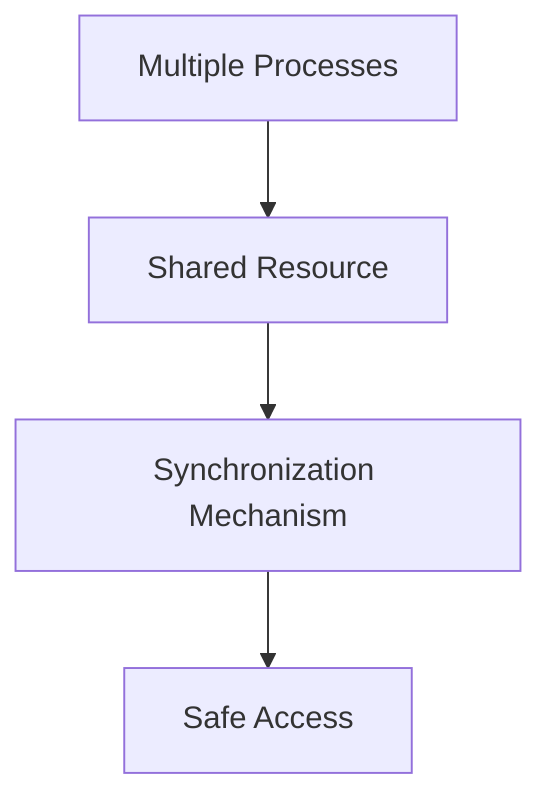
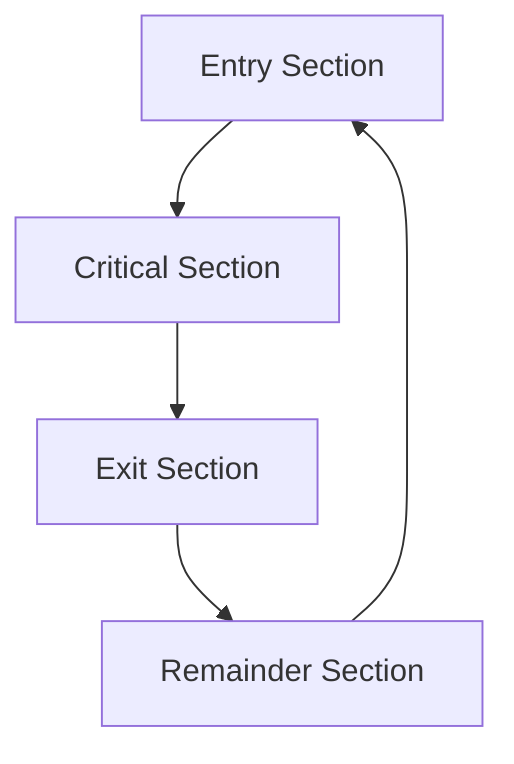
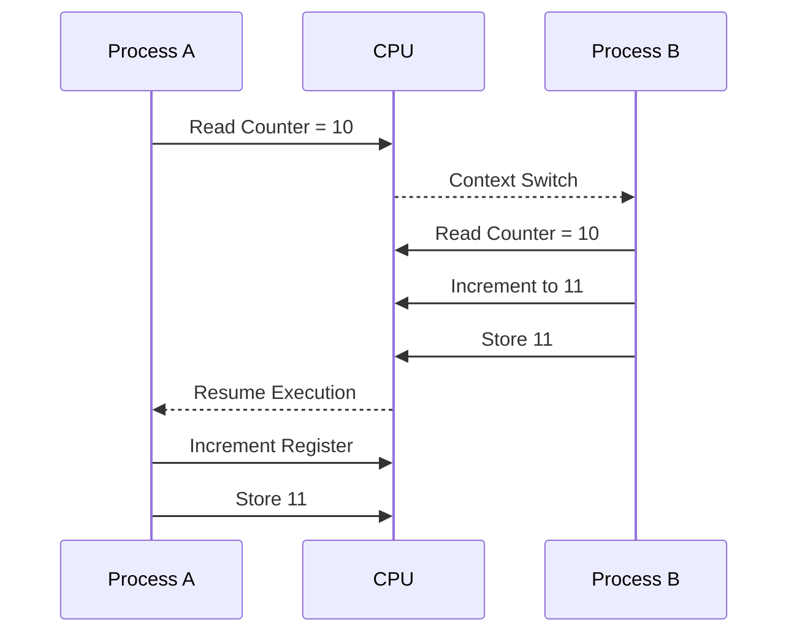

# 🔒 Introduction to Process Synchronization

## 📖 Definition

**Process Synchronization** is an operating system mechanism that coordinates the execution of multiple processes so that they can safely access **shared resources** without causing data inconsistency, race conditions, or deadlocks.

When multiple processes execute concurrently and access shared data, synchronization ensures that the shared data remains correct and consistent.

> **One-Line Interview Definition**
>
> **Process Synchronization is the coordination of concurrent processes to ensure safe and controlled access to shared resources.**

---

# 🎯 Why is Process Synchronization Needed?

Modern operating systems execute multiple processes concurrently.

Many of these processes need to:

- Access shared memory
- Access files
- Access printers
- Access databases
- Communicate through IPC

If multiple processes access these shared resources simultaneously without coordination, unexpected results may occur.

Process Synchronization prevents these problems.

---

# 🏗️ Process Synchronization



---

# 🎯 Objectives of Process Synchronization

The main objectives are:

- Maintain data consistency.
- Prevent race conditions.
- Prevent data loss.
- Avoid deadlocks.
- Coordinate cooperating processes.
- Ensure mutual exclusion.
- Improve system reliability.
- Provide fair access to shared resources.

---

# 📂 Types of Processes

Processes are broadly classified into two categories.

---

# 1️⃣ Independent Process

## 📖 Definition

An **Independent Process** is a process whose execution does **not affect** any other process.

Similarly,

its execution is **not affected** by other running processes.

Such processes have:

- Their own memory
- Their own resources
- No shared data

---

## Example

```text
Calculator

Music Player

Calendar
```

Each program works independently.

---

## Characteristics

- No shared resources.
- No synchronization required.
- No communication required.
- Easier to execute.

---

# 2️⃣ Cooperative Process

## 📖 Definition

A **Cooperative Process** is a process that **can affect or be affected by other processes**.

These processes usually communicate through IPC mechanisms.

---

## Example

```text
Web Browser

↓

Downloads File

↓

File Manager

↓

Virus Scanner
```

All these processes cooperate with one another.

---

## Characteristics

- Shared resources.
- Requires synchronization.
- Uses IPC.
- More efficient but more complex.

---

# 📊 Independent vs Cooperative Processes

| Feature | Independent Process | Cooperative Process |
|----------|---------------------|---------------------|
| Shared Resources | No | Yes |
| IPC Required | No | Yes |
| Synchronization Required | No | Yes |
| Can Affect Other Processes | No | Yes |
| Complexity | Low | High |

---

# ⚠️ Problems Without Synchronization

Improper synchronization causes several problems.

---

# 1️⃣ Data Inconsistency

When two or more processes modify the same data simultaneously,

the final result may become incorrect.

Example:

```text
Initial Balance = 1000

Process A deposits 100

Process B withdraws 50

Incorrect synchronization

↓

Final Balance becomes incorrect
```

---

# 2️⃣ Data Loss

Suppose two processes write to the same file simultaneously.

```text
Process A

↓

Write File

↑

Process B
```

One process may overwrite the changes made by the other.

Important information may be lost.

---

# 3️⃣ Deadlock

Two or more processes wait forever for resources held by each other.

```text
Process A

Waiting for Resource B

↓

Process B

Waiting for Resource A
```

Neither process proceeds.

---

# 4️⃣ Race Condition

Multiple processes execute concurrently,

and the final output depends upon the **order of execution**.

Different execution orders produce different results.

This results in unpredictable behavior.

---

# 🎯 Role of Synchronization in IPC

Process Synchronization plays an important role in Inter-Process Communication.

---

## Preventing Race Conditions

Synchronization ensures that multiple processes do not modify shared data simultaneously.

---

## Mutual Exclusion

Only one process is allowed to execute inside the **Critical Section** at any given time.

---

## Process Coordination

Synchronization allows processes to wait for specific events.

Example:

```text
Producer waits

↓

Buffer becomes empty

↓

Producer resumes
```

---

## Deadlock Prevention

Synchronization techniques help prevent:

- Circular Wait
- Resource Conflicts
- Infinite Waiting

---

## Safe Communication

Processes exchange information safely without corrupting shared data.

---

## Fairness

Synchronization ensures that every process eventually gets an opportunity to access shared resources.

This prevents starvation.

---

# 📂 Types of Process Synchronization

There are two major types.

---

# 1️⃣ Competitive Synchronization

## 📖 Definition

Competitive Synchronization occurs when multiple processes compete for the same shared resource.

```text
Process A

↓

Shared Resource

↑

Process B
```

Only one process should access the resource at a time.

---

## Problems

Without synchronization,

Competitive Processes may cause:

- Race Condition
- Data Loss
- Data Inconsistency

---

## Examples

- Printer Access
- Database Access
- Shared Memory
- File Writing

---

# 2️⃣ Cooperative Synchronization

## 📖 Definition

Cooperative Synchronization occurs when multiple processes work together to accomplish a task.

One process depends on another.

---

## Example

```text
Producer

↓

Buffer

↓

Consumer
```

The Producer creates data.

The Consumer consumes it.

Both processes must remain synchronized.

---

## Problems

Without synchronization,

Cooperative Processes may cause:

- Deadlock
- Starvation
- Incorrect Communication

---

# 📊 Competitive vs Cooperative Synchronization

| Feature | Competitive | Cooperative |
|----------|-------------|-------------|
| Purpose | Compete for Resources | Work Together |
| Shared Resource | Yes | Usually Yes |
| Main Problem | Race Condition | Deadlock |
| Examples | Printer, Database | Producer–Consumer |

---

# 💻 Linux Example

Consider the Linux command:

```bash
ps | grep "chrome" | wc
```

Three processes are created.

```text
ps

↓

grep

↓

wc
```

### ps

Produces the list of running processes.

### grep

Filters the processes containing "chrome".

### wc

Counts the number of matching lines.

Each process depends on the output of the previous process.

This is an example of **Cooperative Processes**.

---

# 🔒 Critical Section

## 📖 Definition

A **Critical Section** is a portion of a program where a process accesses shared resources.

Only **one process** should execute inside the Critical Section at a time.

---

# 🏗️ Structure of a Process

Every synchronized process is divided into four sections.

```text
Entry Section

↓

Critical Section

↓

Exit Section

↓

Remainder Section
```

---

# 🔄 Critical Section Structure



---

## Entry Section

The process requests permission to enter the Critical Section.

---

## Critical Section

The process accesses shared resources.

Examples:

- Shared Variables
- Files
- Printers
- Shared Memory

Only one process should execute here.

---

## Exit Section

The process releases the shared resource.

Other waiting processes are allowed to enter.

---

## Remainder Section

The process performs normal execution.

No shared resources are accessed.

---

# 🎯 Critical Section Problem

The **Critical Section Problem** is the problem of designing a protocol that ensures multiple cooperating processes can safely share resources without causing:

- Race Conditions
- Data Inconsistency
- Deadlocks
- Starvation

The solution must guarantee that only one process executes inside the Critical Section at any given time.

---

# 📝 Key Points

- Process Synchronization coordinates concurrent processes.
- It ensures safe access to shared resources.
- Independent Processes do not require synchronization.
- Cooperative Processes require synchronization.
- Synchronization prevents:
  - Race Conditions
  - Data Loss
  - Data Inconsistency
  - Deadlocks
- Two synchronization types:
  - Competitive
  - Cooperative
- A Critical Section is the part of a program that accesses shared resources.
- Only one process should execute inside the Critical Section at a time.

# ⚡ Race Condition

## 📖 Definition

A **Race Condition** occurs when two or more processes (or threads) access and modify the same shared resource concurrently, and the **final output depends on the order in which the processes execute**.

Since the execution order is unpredictable, different executions of the same program may produce different results.

> **One-Line Interview Definition**
>
> **A Race Condition occurs when the outcome of concurrent execution depends on the timing or order of process execution.**

---

# 🏗️ Why Does a Race Condition Occur?

A race condition occurs because:

- Multiple processes access shared data.
- Operations are **not atomic**.
- Context switching or preemption occurs while updating shared data.
- Another process reads or modifies incomplete data.

---

# 📝 Simple Example

Suppose two processes share a variable.

```text
Counter = 10
```

Process A:

```text
Counter++
```

Process B:

```text
Counter--
```

If both execute simultaneously without synchronization,

the final value may become:

```text
9

or

10

or

11
```

depending on the execution order.

---

# ⚙️ Atomic vs Non-Atomic Operations

Many programmers think that:

```cpp
count++;
```

is a single instruction.

It is **not**.

Internally it is executed as multiple CPU instructions.

Example:

```text
Load count into Register

↓

Increment Register

↓

Store Register back into count
```

```text
Register = count

↓

Register = Register + 1

↓

count = Register
```

Since these are multiple instructions,

the operating system may preempt the process between them.

---

# 🔄 Race Condition Illustration



Final Counter:

```text
11
```

Expected:

```text
12
```

One update is lost.

This is called a **Lost Update Problem**.

---

# 🏭 Producer–Consumer Race Condition

Consider the Producer–Consumer problem.

The Producer inserts items into a shared buffer.

The Consumer removes items from the same buffer.

Both maintain a shared variable:

```text
count
```

which stores the number of items in the buffer.

---

## Initial State

```text
count = 8
```

---

### Producer

```cpp
count++;
```

---

### Consumer

```cpp
count--;
```

---

## Internal Execution

Producer executes:

```text
Load count

↓

Increment Register

↓

Store count
```

Consumer executes:

```text
Load count

↓

Decrement Register

↓

Store count
```

Suppose:

Producer is preempted after loading the value.

```text
Producer

Load count = 8

↓

Preempted
```

Consumer now runs.

```text
Load count = 8

↓

Decrement

↓

Store 7
```

Producer resumes.

Its register still contains:

```text
8
```

It increments:

```text
9
```

and stores it.

Final value:

```text
9
```

Expected value:

```text
8
```

The shared variable becomes inconsistent.

This is a **Race Condition**.

---

# ⚡ Why Preemption Causes Problems

Suppose a process is updating shared data.

Before completing,

the operating system performs a **Context Switch**.

Another process starts executing.

It reads partially updated data.

This leads to:

- Incorrect output
- Data inconsistency
- Lost updates

---

# 🛑 Critical Section Solution Requirements

A correct solution to the Critical Section Problem must satisfy **three conditions**.

---

# 1️⃣ Mutual Exclusion

Only **one process** should execute inside the Critical Section at a time.

```text
Process A

↓

Critical Section

↓

Process B waits
```

This prevents simultaneous modification of shared resources.

---

# 2️⃣ Progress

If no process is inside the Critical Section,

the decision about who enters next should be made **only by the waiting processes**.

The operating system should not unnecessarily delay execution.

```text
Critical Section Empty

↓

Waiting Process

↓

Immediately Allowed
```

No unnecessary waiting should occur.

---

# 3️⃣ Bounded Waiting

After a process requests entry into the Critical Section,

there should be a limit on the number of times other processes may enter before it gets its turn.

This guarantees fairness.

```text
P1 Waiting

↓

P2 Executes

↓

P3 Executes

↓

P1 Must Execute
```

A process should never wait forever.

---

# 📊 Three Conditions Summary

| Condition | Meaning |
|-----------|---------|
| Mutual Exclusion | Only one process in Critical Section |
| Progress | Waiting processes should not be delayed unnecessarily |
| Bounded Waiting | Every waiting process eventually gets access |

---

# 🌍 Real-World Examples

### Bank Account

Two ATMs update the same account simultaneously.

Without synchronization,

the balance becomes incorrect.

---

### Railway Reservation

Two passengers book the last available seat simultaneously.

Without synchronization,

both tickets may be confirmed.

---

### Online Shopping

Only one product remains in stock.

Two users purchase it at the same time.

Both orders succeed incorrectly.

---

### Printer

Two applications send print jobs simultaneously.

Without synchronization,

pages become mixed together.

---

# 🎯 Interview Questions

### Q1. What is Process Synchronization?

Process Synchronization coordinates concurrent processes to safely access shared resources.

---

### Q2. What is a Race Condition?

A Race Condition occurs when the final result depends on the order of concurrent execution.

---

### Q3. Why does a Race Condition occur?

Because multiple processes access shared data without proper synchronization.

---

### Q4. What is a Critical Section?

A Critical Section is the part of a program that accesses shared resources.

---

### Q5. What are the three requirements of a Critical Section solution?

- Mutual Exclusion
- Progress
- Bounded Waiting

---

### Q6. What is Mutual Exclusion?

It ensures that only one process executes inside the Critical Section at any given time.

---

### Q7. What causes data inconsistency?

Concurrent modification of shared data without synchronization.

---

# 📝 30-Second Revision

- ✅ Process Synchronization prevents race conditions and data inconsistency.
- ✅ Race Condition occurs when output depends on execution order.
- ✅ Shared data must be protected inside a **Critical Section**.
- ✅ A Critical Section solution must satisfy:
  - Mutual Exclusion
  - Progress
  - Bounded Waiting
- ✅ Preemption and Context Switching can cause race conditions if operations are not atomic.
- ✅ Proper synchronization ensures correctness, fairness, and safe resource sharing.