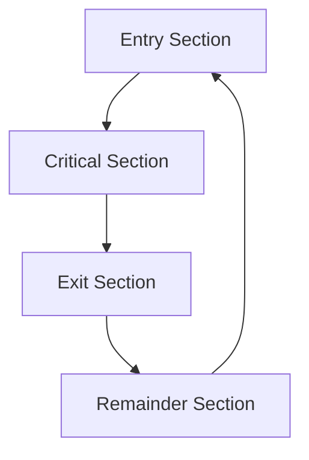

# 🔒 Critical Section

## 📖 Definition

A **Critical Section** is a portion of a program where one or more processes or threads access **shared resources**, such as shared variables, files, memory, databases, or hardware devices.

Since multiple processes may execute concurrently, only **one process (or thread)** should execute the Critical Section at a time. This prevents race conditions, data inconsistency, and other synchronization problems.

> **One-Line Interview Definition**
>
> **A Critical Section is the part of a program that accesses shared resources and must be executed by only one process or thread at a time.**

---

# 🎯 Why Do We Need a Critical Section?

Modern operating systems execute multiple processes concurrently.

Many of these processes access common resources.

Examples include:

- Shared Variables
- Shared Memory
- Files
- Databases
- Printer Queue
- Network Resources

If multiple processes access these resources simultaneously, unexpected behavior may occur.

The Critical Section ensures safe access to these shared resources.

---

# 🏗️ Shared Resource Example

```text
                Shared Variable

                     Balance

               /                 \

        Process A            Process B
```

If both processes modify `Balance` simultaneously,

the final value may become incorrect.

---

# ⚠️ Problems Without a Critical Section

Without proper synchronization, the following problems may occur.

## 1. Race Condition

The final output depends on the order in which processes execute.

---

## 2. Data Inconsistency

Shared data becomes incorrect due to concurrent modifications.

---

## 3. Data Loss

One process may overwrite another process's updates.

---

## 4. Deadlock

Processes may wait indefinitely for shared resources.

---

## 5. Starvation

A process may never get an opportunity to execute.

---

# 🧠 What Belongs to the Critical Section?

Every statement that **reads or modifies a shared resource** belongs to the Critical Section.

Example:

```cpp
balance = balance + amount;
```

Since `balance` is shared,

this statement is part of the Critical Section.

Similarly,

```cpp
balance -= amount;
```

also belongs to the Critical Section.

---

# ❌ What Does NOT Belong?

Operations that do not access shared resources belong to the **Remainder Section**.

Example:

```cpp
cout << "Transaction Successful";

calculateInterest();

displayMenu();
```

These statements do not modify shared data.

Hence,

they are **not** part of the Critical Section.

---

# 🏗️ Structure of a Critical Section

Every synchronized process is divided into four sections.

```text
Entry Section

↓

Critical Section

↓

Exit Section

↓

Remainder Section
```

---

# 🔄 Critical Section Structure



---

# 1️⃣ Entry Section

## 📖 Definition

The **Entry Section** contains the code that requests permission to enter the Critical Section.

Only after obtaining permission can the process proceed.

Typical synchronization mechanisms include:

- Mutex
- Semaphore
- Spin Lock
- Monitor

---

# 2️⃣ Critical Section

## 📖 Definition

The Critical Section contains the actual code that accesses or modifies shared resources.

Examples include:

- Updating a bank balance
- Writing to a shared file
- Reserving a ticket
- Updating a database
- Accessing shared memory

Only one process should execute this section at a time.

---

# 3️⃣ Exit Section

## 📖 Definition

The Exit Section releases the synchronization mechanism after the Critical Section completes.

This allows another waiting process to enter.

Examples:

- Unlock a mutex
- Signal a semaphore
- Release a spin lock

---

# 4️⃣ Remainder Section

## 📖 Definition

The Remainder Section contains all code that does not access shared resources.

No synchronization is required here.

Examples include:

- Printing messages
- Performing calculations on local variables
- Reading user input
- Logging information

---

# 🔐 General Solution to the Critical Section Problem

The basic approach is:

```text
Acquire Lock

↓

Execute Critical Section

↓

Release Lock

↓

Execute Remainder Section
```

---

## Generic Pseudocode

```text
acquireLock();

/* Critical Section */

releaseLock();

/* Remainder Section */
```

The lock guarantees that only one process can execute the Critical Section at a time.

---

# 🎯 Critical Section Problem

The **Critical Section Problem** is the problem of designing a protocol that allows multiple cooperating processes to safely access shared resources without causing:

- Race Conditions
- Data Inconsistency
- Deadlocks
- Starvation

The protocol must ensure that only one process executes inside the Critical Section at any given time.

---

# 📝 Simple Banking Example

Suppose two processes access the same account.

```
Initial Balance = 100
```

Process A (Deposit ₹10)

```text
balance = balance + 10
```

Process B (Withdraw ₹10)

```text
balance = balance - 10
```

Suppose Process A computes:

```text
100 + 10 = 110
```

Before storing 110,

the operating system preempts Process A.

Now Process B executes:

```text
100 - 10 = 90
```

Balance becomes:

```text
90
```

Process A resumes and stores:

```text
110
```

Final Balance:

```text
110
```

Expected Balance:

```text
100
```

This incorrect result occurs because both processes entered the Critical Section simultaneously.

---

# 🔄 Visualization

```text
Initial Balance = 100

Process A
Read 100
Compute 110

        Context Switch

Process B
Read 100
Compute 90
Store 90

        Context Switch

Process A
Store 110

Final Balance = 110 ❌
Expected = 100 ✅
```

---

# 📌 Key Points

- A Critical Section is the portion of code that accesses shared resources.
- Only one process should execute the Critical Section at a time.
- Critical Sections prevent race conditions and data inconsistency.
- Every synchronized process consists of:
  - Entry Section
  - Critical Section
  - Exit Section
  - Remainder Section
- Locks are commonly used to protect Critical Sections.  

---

# ✅ Requirements of a Correct Critical Section Solution

A correct solution to the **Critical Section Problem** must satisfy certain conditions to ensure that multiple processes can safely share resources without causing synchronization issues.

The three **mandatory requirements** are:

1. Mutual Exclusion
2. Progress
3. Bounded Waiting

In addition, a good synchronization mechanism should also provide:

4. Performance (Desirable Property)

---

# 1️⃣ Mutual Exclusion

## 📖 Definition

**Mutual Exclusion** means that **at most one process** can execute inside the Critical Section at any given time.

If one process is currently accessing a shared resource, every other process requesting the same resource must wait.

---

## Why is it Needed?

Suppose two processes simultaneously update a shared bank balance.

```text
Balance = 100

Process A : Deposit 10

Process B : Withdraw 10
```

If both execute simultaneously,

both may read the same old balance.

This leads to inconsistent results.

Mutual Exclusion prevents this by allowing only one process to update the balance at a time.

---

## Illustration

```text
Process A

↓

Critical Section

↓

Process B waits
```

Only after Process A exits can Process B enter.

---

## Real-Life Analogy

Imagine a restroom with only one cabin.

Only one person can use it at a time.

Everyone else waits outside.

```text
Person A

↓

Restroom

↓

Person B waits
```

---

# 2️⃣ Progress

## 📖 Definition

**Progress** means that if no process is currently inside the Critical Section and one or more processes wish to enter, the selection of the next process **must not be postponed indefinitely**.

Only the processes that actually want to enter the Critical Section should participate in the decision.

Processes that are not interested should not block others.

---

## Why is it Needed?

Suppose the Critical Section is empty.

Process A wants to enter.

Process B is doing unrelated work.

If Process B somehow prevents Process A from entering,

the system makes no progress.

This should never happen.

---

## Illustration

```text
Critical Section Empty

↓

Process A Waiting

↓

Immediately Allowed
```

---

## Incorrect Situation

```text
Critical Section Empty

↓

Process A wants to enter

↓

Process B is not interested

↓

Process A still waits ❌
```

This violates the Progress requirement.

---

## Real-Life Analogy

Consider a restroom.

Nobody is using it.

A person wants to use it.

Someone who does **not** want to use the restroom locks the door and walks away.

Everyone else waits unnecessarily.

This is exactly what the Progress requirement prevents.

---

# 3️⃣ Bounded Waiting

## 📖 Definition

**Bounded Waiting** means that after a process requests entry into the Critical Section, there must be a limit on the number of times other processes are allowed to enter before it gets its turn.

This guarantees fairness.

---

## Why is it Needed?

Without bounded waiting,

one process may keep waiting forever while other processes repeatedly enter the Critical Section.

This situation is called **Starvation**.

---

## Illustration

```text
P1 Waiting

↓

P2 Executes

↓

P3 Executes

↓

P2 Executes Again

↓

P3 Executes Again

↓

P1 Still Waiting ❌
```

This is unfair.

---

## Correct Situation

```text
P1 Waiting

↓

P2 Executes

↓

P3 Executes

↓

P1 Executes ✅
```

Eventually,

every waiting process must get a chance.

---

## Real-Life Analogy

Suppose people are waiting in a queue for movie tickets.

If newcomers are continuously allowed before someone already waiting,

that person may never reach the counter.

A proper queue ensures everyone eventually gets served.

---

# 4️⃣ Performance (Desirable Property)

Although not one of the three classical requirements,

a synchronization mechanism should also be efficient.

The synchronization mechanism itself should consume very little CPU time.

It should:

- Minimize waiting
- Reduce overhead
- Avoid unnecessary context switches
- Scale well with multiple processes

Modern operating systems therefore prefer **hardware-supported synchronization instructions** because they are much faster than purely software-based techniques.

---

# 📊 Requirements Summary

| Requirement | Purpose |
|-------------|---------|
| Mutual Exclusion | Only one process enters the Critical Section |
| Progress | Waiting processes should not be delayed unnecessarily |
| Bounded Waiting | Every waiting process eventually gets its turn |
| Performance | Synchronization should introduce minimal overhead |

---

# 📖 Read Operations vs Write Operations

Not every shared resource access requires the same level of synchronization.

---

## Multiple Readers

If multiple processes only **read** shared data,

they usually do not interfere with each other.

```text
Reader A

↓

Shared Data

↑

Reader B
```

Since no process modifies the data,

multiple readers may execute simultaneously.

---

## Writer Present

If even one process performs a **write** operation,

synchronization becomes necessary.

```text
Reader

↓

Shared Variable

↑

Writer
```

Without synchronization,

the reader may observe partially updated or inconsistent data.

Therefore,

whenever writing is possible,

both readers and writers must be synchronized.

This concept forms the basis of the **Readers–Writers Problem**.

---

# 🌍 Real-World Examples of Critical Sections

## 🏦 Banking System

Critical Section:

Updating an account balance.

Without synchronization,

simultaneous deposits and withdrawals may produce incorrect balances.

---

## 🎫 Ticket Booking System

Critical Section:

Booking the last available seat.

Without synchronization,

multiple users may reserve the same seat.

---

## 🖨️ Printer Spooler

Critical Section:

Adding print jobs to the printer queue.

Without synchronization,

print jobs may become mixed or lost.

---

## 📄 Shared Document Editing

Critical Section:

Saving changes to a shared document.

Without synchronization,

simultaneous writes may overwrite each other.

---

## 🗄️ Database Management System

Critical Section:

Updating the same database record.

Without synchronization,

transactions may become inconsistent.

---

# 🎯 Interview Questions

### Q1. What is a Critical Section?

A Critical Section is the part of a program where shared resources are accessed and therefore must be executed by only one process or thread at a time.

---

### Q2. Why is Mutual Exclusion necessary?

It prevents multiple processes from simultaneously modifying shared resources, thereby avoiding race conditions.

---

### Q3. What is Progress?

If the Critical Section is empty and processes want to enter, one of them must be allowed to enter without unnecessary delay.

---

### Q4. What is Bounded Waiting?

It guarantees that every waiting process eventually gets a chance to execute its Critical Section, preventing starvation.

---

### Q5. Can multiple readers access shared data simultaneously?

Yes, if no process is modifying the shared data.

---

### Q6. Why do write operations require synchronization?

Because concurrent writes or simultaneous reads during writes can lead to inconsistent or corrupted data.

---

### Q7. Is Performance one of the classical Critical Section requirements?

No.

The three classical requirements are:

- Mutual Exclusion
- Progress
- Bounded Waiting

Performance is considered a desirable property of synchronization mechanisms.

---

# 📝 30-Second Revision

- ✅ Critical Section is the part of a program that accesses shared resources.
- ✅ A correct Critical Section solution must satisfy:
  - Mutual Exclusion
  - Progress
  - Bounded Waiting
- ✅ Mutual Exclusion allows only one process inside the Critical Section at a time.
- ✅ Progress ensures waiting processes are not delayed unnecessarily.
- ✅ Bounded Waiting guarantees fairness and prevents starvation.
- ✅ Multiple readers can usually read simultaneously.
- ✅ If a writer exists, synchronization is required for both readers and writers.
- ✅ Locks, semaphores, monitors, and other synchronization primitives are used to protect Critical Sections.
