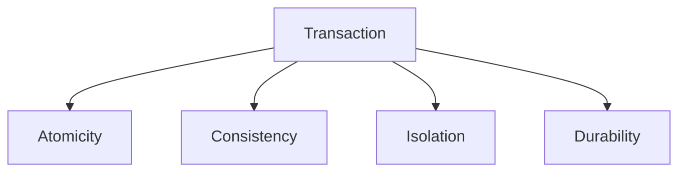
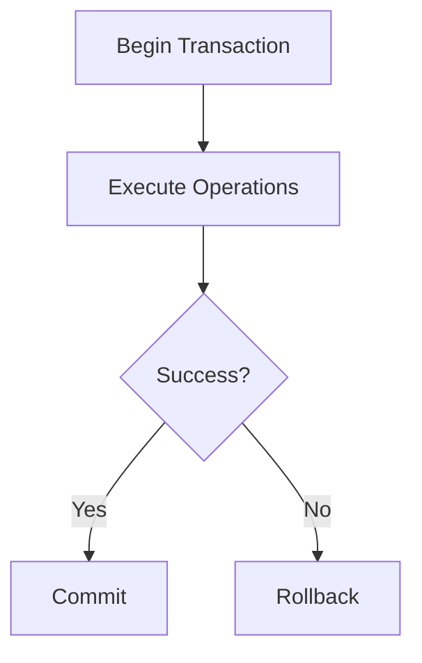
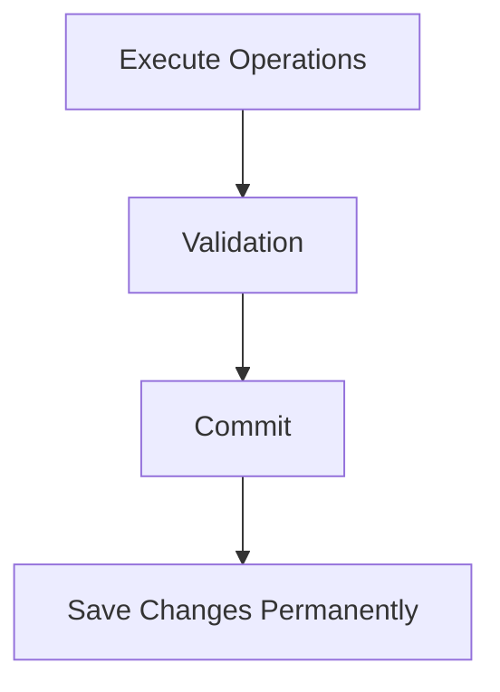
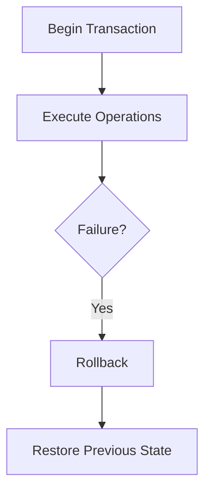
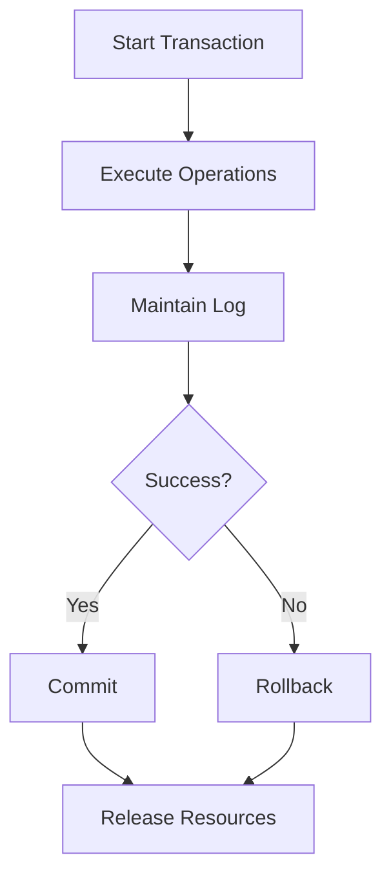

# ⚛️ Atomic Transactions in Operating Systems

## 📖 Definition

An **Atomic Transaction** is a group of one or more operations that are treated as a **single indivisible unit of work**.

The transaction either:

- **Completes successfully in its entirety**, or
- **Does not execute at all.**

There is **no partial completion** of a transaction.

This guarantees that the system always remains in a **consistent and reliable state**, even if failures occur during execution.

> **One-Line Interview Definition**
>
> **An Atomic Transaction is a sequence of operations that either executes completely or has no effect at all.**

---

# 🎯 Why Do We Need Atomic Transactions?

Modern operating systems execute thousands of operations simultaneously.

Some operations involve multiple steps that must all succeed together.

Examples include:

- Bank money transfer
- Database updates
- File movement
- User profile updates
- Online shopping orders

If a failure occurs in the middle of these operations,

the system may become inconsistent.

Atomic transactions prevent such partial updates.

---

# 🏦 Example Without Atomic Transactions

Suppose you transfer **$100** from Account A to Account B.

Operations:

```text
1. Deduct $100 from Account A

2. Add $100 to Account B
```

Suppose the system crashes after step 1.

```text
Account A = $900

Account B = $500
```

The money has disappeared.

The system becomes inconsistent.

---

# ✅ Example With Atomic Transactions

The transaction behaves like one single operation.

```text
Transfer Money

↓

Deduct from Account A

↓

Add to Account B

↓

Commit
```

If any step fails,

the entire transaction is rolled back.

Final result:

```text
Account A = Original Balance

Account B = Original Balance
```

No money is lost.

---

# 🎯 Objectives of Atomic Transactions

Atomic transactions are designed to:

- Maintain data consistency
- Prevent partial updates
- Recover from failures
- Ensure reliable execution
- Support concurrent transactions
- Improve system reliability

---

# 🧠 Primary Terminologies

Before understanding atomic transactions,

let us understand the important terms.

---

# 1️⃣ Atomic Transaction

A collection of operations executed as one indivisible unit.

```text
Either

All Operations Execute

OR

None Execute
```

---

# 2️⃣ Atomicity

## 📖 Definition

Atomicity guarantees that **every operation in a transaction succeeds**, or **all completed operations are undone**.

There is no intermediate state.

---

### Example

```text
Withdraw Money

↓

Deposit Money
```

Possible outcomes:

```text
Withdraw ✔

Deposit ✔
```

or

```text
Withdraw ❌

Deposit ❌
```

Never:

```text
Withdraw ✔

Deposit ❌
```

---

# 3️⃣ Consistency

## 📖 Definition

Consistency guarantees that every completed transaction moves the system from **one valid state to another valid state**.

All integrity rules remain satisfied.

---

### Example

Before Transaction

```text
Total Money

Account A = $1000

Account B = $500

Total = $1500
```

After Transaction

```text
Account A = $900

Account B = $600

Total = $1500
```

The total amount remains unchanged.

---

# 4️⃣ Isolation

## 📖 Definition

Isolation ensures that multiple transactions execute independently.

A transaction cannot see the intermediate results of another transaction until it is committed.

---

### Example

Suppose two users transfer money simultaneously.

```text
Transaction A

↓

Commit

↓

Visible to Others
```

During execution,

other transactions cannot observe incomplete changes.

---

# 5️⃣ Durability

## 📖 Definition

Durability guarantees that once a transaction is committed,

its changes become permanent,

even if the system crashes immediately afterward.

---

### Example

```text
Commit Transaction

↓

Power Failure

↓

Restart System

↓

Changes Still Exist
```

Committed data is never lost.

---

# 📊 ACID Properties

Atomic transactions follow the famous **ACID Properties**.

| Property | Meaning |
|----------|---------|
| **Atomicity** | Execute everything or nothing |
| **Consistency** | Preserve valid system state |
| **Isolation** | Transactions execute independently |
| **Durability** | Committed data survives failures |

---

# 🏗️ ACID Overview



---

# 🧑‍💼 Transaction Manager

## 📖 Definition

A **Transaction Manager** is the component responsible for controlling the execution of transactions.

It ensures that every transaction satisfies the ACID properties.

---

## Responsibilities

The Transaction Manager:

- Starts transactions
- Coordinates execution
- Maintains logs
- Handles commits
- Performs rollbacks
- Manages concurrency
- Recovers after failures

---

# 📝 Logging

## 📖 Definition

**Logging** is the process of recording every important operation performed during a transaction.

Logs help recover the system after failures.

---

### Example

```text
Start Transaction

↓

Deduct $100

↓

Add $100

↓

Commit
```

Every step is recorded in the transaction log.

If the system crashes,

the log is used to recover the correct state.

---

# 🗂️ Why is Logging Needed?

Logging helps in:

- Crash Recovery
- Rollback
- Data Recovery
- Failure Detection
- Maintaining Durability

---

# 🔄 Lifecycle of an Atomic Transaction

Every transaction follows a sequence of steps.

```text
Begin Transaction

↓

Execute Operations

↓

Commit

OR

Rollback
```

---

# 🏗️ Transaction Lifecycle



---

# 📌 Transaction States

A transaction usually passes through the following states.

```text
Active

↓

Partially Committed

↓

Committed
```

or

```text
Active

↓

Failed

↓

Rolled Back

↓

Terminated
```

---

# 📝 Active State

The transaction is currently executing.

Example:

```text
Transfer Money

↓

Updating Account A

↓

Updating Account B
```

---

# 📝 Partially Committed State

All operations have executed,

but the system has not yet permanently saved the changes.

---

# 📝 Committed State

The transaction completes successfully.

Its changes become permanent.

---

# 📝 Failed State

An error occurs before completion.

Examples:

- Power failure
- System crash
- Network failure
- Disk error

---

# 📝 Rollback State

The operating system undoes every completed operation.

The system returns to its previous consistent state.

---

# 📌 Key Points

- Atomic Transactions execute completely or not at all.
- Partial execution is never allowed.
- Atomic Transactions follow the ACID properties:
  - Atomicity
  - Consistency
  - Isolation
  - Durability
- The Transaction Manager coordinates transaction execution.
- Logging enables recovery after failures.
- Transactions end with either:
  - Commit
  - Rollback
- Atomic Transactions improve reliability, consistency, and fault tolerance.  

---

# ⚙️ Working of an Atomic Transaction

An atomic transaction follows a well-defined sequence of steps to ensure that the system remains consistent, even if failures occur during execution.

The lifecycle of a transaction consists of the following stages:

1. Transaction Initialization
2. Atomicity Assurance
3. Consistency Management
4. Isolation Handling
5. Durability Mechanism
6. Transaction Commitment
7. Rollback Handling
8. Transaction Manager Coordination

---

# 🏁 Step 1: Transaction Initialization

## 📖 Definition

A transaction begins when the operating system or database groups a set of related operations into a **single logical unit**.

These operations will either execute completely or not execute at all.

---

## Example

Money Transfer

```text
Transfer $100

↓

Deduct $100 from Account A

↓

Add $100 to Account B
```

These two operations together form **one transaction**.

---

## Purpose

During initialization, the system determines:

- Which resources are involved
- Which data will be modified
- The beginning of the transaction
- Recovery information

---

# ⚛️ Step 2: Atomicity Assurance

## 📖 Definition

The operating system guarantees that all operations inside the transaction behave as one indivisible unit.

Either:

```text
All Operations Execute
```

or

```text
None Execute
```

Partial execution is never allowed.

---

## Example

```text
Withdraw Money ✔

Deposit Money ✖
```

Since one operation failed,

the withdrawal is also undone.

Final Result

```text
Withdraw ✖

Deposit ✖
```

---

## Why is it Important?

Without atomicity,

systems could lose data or enter inconsistent states.

---

# ✅ Step 3: Consistency Management

## 📖 Definition

Consistency ensures that every successful transaction transforms the system from one valid state into another valid state.

No integrity rules are violated.

---

## Example

Before Transaction

```text
Inventory = 25
```

Customer purchases one item.

After Transaction

```text
Inventory = 24
```

The inventory count remains valid.

Suppose updating inventory succeeds,

but creating the order fails.

The transaction rolls back.

Inventory becomes

```text
25
```

Again,

the system remains consistent.

---

## Goal

Consistency preserves:

- Valid data
- Business rules
- Constraints
- Integrity

---

# 🔒 Step 4: Isolation Handling

## 📖 Definition

Isolation ensures that multiple transactions execute independently without interfering with each other.

Other transactions cannot observe partially completed work.

---

## Example

Two users transfer money simultaneously.

```text
Transaction A

↓

Running

↓

Commit

↓

Visible
```

```text
Transaction B

↓

Running

↓

Commit

↓

Visible
```

Neither transaction can see incomplete updates made by the other.

---

## Why Isolation is Needed?

Without isolation,

one transaction may read incomplete or temporary data produced by another transaction.

This problem is called a **Dirty Read**.

---

# 💾 Step 5: Durability Mechanism

## 📖 Definition

Once a transaction is committed,

its changes become permanent.

Even if the system crashes,

the committed data can be recovered.

---

## How is this Achieved?

Using:

- Transaction Logs
- Write-Ahead Logging (WAL)
- Checkpoints
- Recovery Algorithms

---

## Example

```text
Commit Transaction

↓

Power Failure

↓

Restart

↓

Transaction Still Exists
```

The committed changes are recovered from the transaction log.

---

# ✅ Step 6: Transaction Commitment

## 📖 Definition

A **Commit** permanently saves every successful operation performed by the transaction.

After committing,

the transaction cannot be undone under normal circumstances.

---

## Commit Flow



---

## Example

Money Transfer

```text
Deduct $100 ✔

↓

Add $100 ✔

↓

Commit ✔
```

The new balances become permanent.

---

# 🔄 Step 7: Rollback Handling

## 📖 Definition

If any operation inside a transaction fails,

the operating system performs a **Rollback**.

Rollback reverses every completed operation.

The system returns to its previous consistent state.

---

## Rollback Flow



---

## Example

Money Transfer

```text
Withdraw $100 ✔

↓

Deposit Failed ✖
```

Rollback

```text
Restore Sender Balance

↓

Cancel Withdrawal
```

Final State

```text
Account A = Original Balance

Account B = Original Balance
```

---

## Why Rollback is Necessary?

Rollback prevents:

- Partial updates
- Corrupted data
- Data inconsistency
- System failures

---

# 🧑‍💼 Step 8: Transaction Manager Coordination

## 📖 Definition

The **Transaction Manager** supervises the complete execution of every transaction.

It ensures that all ACID properties are satisfied.

---

## Responsibilities

The Transaction Manager performs the following tasks:

- Starts transactions
- Allocates resources
- Coordinates concurrent transactions
- Maintains logs
- Performs commits
- Performs rollbacks
- Handles recovery
- Releases resources

---

## Transaction Manager Workflow



---

# 🗂️ Atomic Transactions in File Systems

Modern file systems use atomic transactions to prevent file corruption.

Example:

Moving a file.

Operations:

```text
Copy File

↓

Delete Original File
```

If the system crashes after deleting the original but before copying,

the file would be lost.

Atomic transactions ensure that either:

```text
Copy ✔

Delete ✔
```

or

```text
Copy ✖

Delete ✖
```

No partial move occurs.

---

# 🗄️ Atomic Transactions in Databases

Databases execute every query inside transactions.

Example

```sql
UPDATE Accounts
SET Balance = Balance - 100
WHERE ID = 1;

UPDATE Accounts
SET Balance = Balance + 100
WHERE ID = 2;
```

Both statements belong to one transaction.

If either fails,

the database rolls back both statements.

---

# 🌍 Real-World Examples

## 🏦 Banking System

Transaction:

- Withdraw money
- Deposit money

Either both operations succeed,

or neither executes.

---

## 🛒 Online Shopping

Transaction:

- Reduce inventory
- Create order
- Process payment

If payment fails,

inventory and order creation are rolled back.

---

## 📁 File Move Operation

Transaction:

- Copy file
- Delete original

If copying fails,

the original file remains intact.

---

## 👤 User Profile Update

Transaction:

- Update email
- Update profile picture
- Update contact number

If any update fails,

all changes are rolled back.

---

# ✅ Advantages of Atomic Transactions

- Ensures complete execution of operations
- Prevents partial updates
- Maintains data consistency
- Simplifies error recovery
- Supports concurrent execution safely
- Improves reliability
- Guarantees fault tolerance

---

# ❌ Disadvantages of Atomic Transactions

- Additional logging overhead
- Increased storage requirements
- Performance overhead during recovery
- Complex implementation
- Lock contention in highly concurrent systems

---

# 📊 Commit vs Rollback

| Feature | Commit | Rollback |
|---------|---------|----------|
| Purpose | Save changes permanently | Undo all changes |
| Trigger | Successful execution | Failure or error |
| Data | Permanent | Restored to previous state |
| Recovery Needed | No | Yes |
| Final State | Updated | Original |

---

# 🎯 Interview Questions

### Q1. What is an Atomic Transaction?

An Atomic Transaction is a sequence of operations that either executes completely or not at all.

---

### Q2. What happens if a transaction fails?

The operating system performs a rollback, restoring the previous consistent state.

---

### Q3. What is the difference between Commit and Rollback?

Commit permanently saves the transaction, whereas Rollback undoes every change made during the transaction.

---

### Q4. Why is logging necessary?

Logging records every important operation, enabling recovery after crashes and ensuring durability.

---

### Q5. What component manages atomic transactions?

The Transaction Manager coordinates transaction execution, maintains logs, performs commits, rollbacks, and recovery.

---

### Q6. Where are atomic transactions commonly used?

They are widely used in:

- Databases
- File Systems
- Banking Systems
- E-commerce Applications
- Distributed Systems

---

# 📝 30-Second Revision

- ✅ Atomic Transactions execute completely or not at all.
- ✅ A transaction follows these stages:
  - Initialization
  - Atomicity
  - Consistency
  - Isolation
  - Durability
  - Commit/Rollback
- ✅ Commit permanently saves changes.
- ✅ Rollback restores the previous consistent state.
- ✅ Transaction Managers coordinate execution and maintain ACID properties.
- ✅ Logging enables crash recovery and durability.
- ✅ Atomic transactions are extensively used in databases, file systems, banking systems, and distributed applications.
