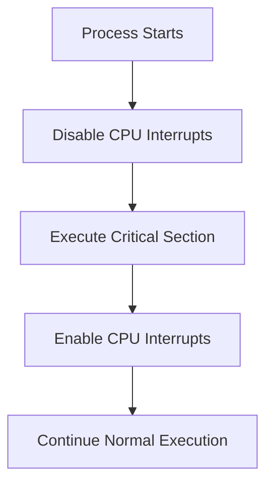

# 🚫 Disable Interrupts

## 📖 Definition

**Disabling Interrupts** is one of the earliest synchronization techniques used by operating systems to protect a **Critical Section**.

Before entering the Critical Section, the operating system temporarily **disables CPU interrupts**, ensuring that the currently running process cannot be preempted by the scheduler.

After leaving the Critical Section, interrupts are re-enabled.

> **One-Line Interview Definition**
>
> **Disabling interrupts is a synchronization technique where the CPU temporarily ignores interrupts so that the currently running process can execute its Critical Section without interruption.**

---

# 🎯 Why Do We Need to Disable Interrupts?

Consider two processes sharing the same variable.

```text
Shared Counter = 100
```

Process A

```cpp
counter++;
```

Process B

```cpp
counter--;
```

Suppose Process A is interrupted after reading the value but before writing it back.

The CPU switches to Process B.

Both processes now operate on stale data, resulting in a **Race Condition**.

To prevent this, the operating system temporarily disables interrupts while executing the Critical Section.

---

# 🧠 Basic Idea

The CPU executes the Critical Section without allowing any interrupt to occur.

```text
Disable Interrupts

↓

Execute Critical Section

↓

Enable Interrupts
```

Since no interrupt occurs,

the operating system cannot perform a context switch.

Therefore,

only one process executes the Critical Section.

---

# ⚙️ Working

The execution flow is as follows.



---

# 📝 Pseudocode

```cpp
disableInterrupts();

/* Critical Section */

enableInterrupts();
```

The operating system disables interrupts before entering the Critical Section and restores them afterward.

---

# 💻 What Happens Internally?

Normally,

the CPU periodically receives interrupts such as:

- Timer Interrupt
- Keyboard Interrupt
- Mouse Interrupt
- Disk Interrupt
- Network Interrupt

These interrupts allow the operating system to:

- Perform context switching
- Schedule processes
- Handle I/O devices
- Respond to hardware events

When interrupts are disabled,

the CPU ignores these interrupt requests until they are enabled again.

```text
Interrupt Request

↓

CPU

↓

Ignored
```

As a result,

the current process continues executing uninterrupted.

---

# 📊 Before and After Disabling Interrupts

## Without Disabling Interrupts

```text
Process A

↓

Reads Shared Variable

↓

Timer Interrupt

↓

Context Switch

↓

Process B Executes

↓

Shared Data Changes

↓

Process A Resumes
```

Race Condition may occur.

---

## With Disabling Interrupts

```text
Process A

↓

Disable Interrupts

↓

Critical Section

↓

Enable Interrupts

↓

Context Switch Allowed
```

The Critical Section completes safely.

---

# 🌍 Real-Life Analogy

Imagine a teacher checking exam papers.

While grading,

students constantly interrupt with questions.

The teacher cannot finish accurately.

Instead,

the teacher announces:

> "No interruptions until I finish grading."

Only after finishing are questions allowed again.

Disabling interrupts works in a similar way.

---

# 📍 Where is it Used?

Disabling interrupts is primarily used inside the **Operating System Kernel**.

Examples include:

- Updating scheduler data structures
- Interrupt handlers
- Device driver code
- Very small Critical Sections
- Processor initialization

---

# ❌ Why Can't User Programs Disable Interrupts?

Allowing ordinary programs to disable interrupts would be dangerous.

Example:

```cpp
disableInterrupts();

while(true)
{
}
```

Since interrupts never occur,

the operating system cannot perform context switching.

The entire computer becomes unresponsive.

Therefore,

only the operating system running in **Kernel Mode** is allowed to disable interrupts.

---

# 🔐 Kernel Mode vs User Mode

| Feature | User Mode | Kernel Mode |
|----------|-----------|-------------|
| Disable Interrupts | ❌ No | ✅ Yes |
| Access Hardware | Limited | Full |
| Execute Privileged Instructions | No | Yes |
| Used By | Applications | Operating System |

---

# ❌ Problems with Disable Interrupts

Although simple,

this technique has several serious limitations.

---

## 1️⃣ Not Suitable for Multiprocessor Systems

Consider two CPUs.

```text
CPU 1

Interrupts Disabled

↓

Critical Section
```

At the same time,

```text
CPU 2

Interrupts Enabled

↓

Critical Section
```

Both CPUs execute simultaneously.

Race conditions still occur.

Disabling interrupts only affects the current CPU.

It does **not** stop other processors.

---

## 2️⃣ Reduces System Responsiveness

While interrupts remain disabled,

the operating system cannot respond to:

- Keyboard input
- Mouse input
- Disk operations
- Network packets
- Timer interrupts

The entire system becomes less responsive.

---

## 3️⃣ Delays Important Hardware Events

Suppose a disk finishes reading data.

Normally,

it sends an interrupt.

If interrupts are disabled,

the CPU ignores the notification until later.

This increases I/O latency.

---

## 4️⃣ Prevents Process Scheduling

The scheduler usually runs using timer interrupts.

If timer interrupts are disabled,

no context switching occurs.

One process may monopolize the CPU.

---

## 5️⃣ Can Freeze the Entire System

If interrupts are disabled accidentally and never re-enabled,

the operating system may hang permanently.

---

# 📊 Advantages

- Very simple to implement
- Eliminates preemption on a single processor
- No lock management required
- Very fast
- Useful for extremely short kernel operations

---

# 📊 Disadvantages

- Only works correctly on single-processor systems
- Cannot synchronize multiple CPUs
- Blocks interrupt handling
- Reduces responsiveness
- Dangerous if interrupts remain disabled
- Not suitable for user applications

---

# 📋 Advantages vs Disadvantages

| Advantages | Disadvantages |
|------------|---------------|
| Simple implementation | Works only on single CPU systems |
| Prevents context switches | Ineffective on multiprocessors |
| Very fast | Blocks all interrupts |
| Useful in kernel | Cannot be used by applications |
| No additional synchronization objects | Can freeze the operating system |

---

# 🔄 Disable Interrupts vs Mutex

| Feature | Disable Interrupts | Mutex |
|----------|-------------------|-------|
| Prevents Context Switch | ✅ Yes | ❌ No |
| Busy Waiting | ❌ No | ❌ No |
| User Applications | ❌ No | ✅ Yes |
| Multiprocessor Support | ❌ Poor | ✅ Yes |
| Used In | Kernel | User Programs & Kernel |
| Blocks Interrupts | ✅ Yes | ❌ No |

---

# 🔄 Disable Interrupts vs Spinlock

| Feature | Disable Interrupts | Spinlock |
|----------|-------------------|-----------|
| Busy Waiting | ❌ No | ✅ Yes |
| Multiprocessor Support | ❌ No | ✅ Yes |
| Blocks Interrupts | ✅ Yes | ❌ No (unless explicitly combined in kernel) |
| User Space | ❌ No | Rarely |
| Kernel Usage | ✅ Yes | ✅ Yes |

---

# 🎯 When Should It Be Used?

Use Disable Interrupts only when:

- Working inside the operating system kernel.
- Protecting a very short Critical Section.
- Running on a single processor.
- Implementing low-level kernel functionality.

Avoid it for:

- User applications
- Long-running operations
- Multiprocessor synchronization

---

# 🎯 Interview Questions

### Q1. What is Disable Interrupts?

It is a synchronization technique where the operating system temporarily disables CPU interrupts to prevent context switching while executing a Critical Section.

---

### Q2. Why does disabling interrupts prevent race conditions?

Without interrupts, the currently running process cannot be preempted, so no other process can execute on that CPU until the Critical Section finishes.

---

### Q3. Why is Disable Interrupts only used in Kernel Mode?

Because allowing user programs to disable interrupts could prevent the operating system from scheduling processes or handling hardware events, potentially freezing the system.

---

### Q4. Why does Disable Interrupts fail on multiprocessor systems?

Disabling interrupts affects only the current CPU. Other CPUs continue executing and can still access the same shared resource concurrently.

---

### Q5. Is Disable Interrupts still commonly used today?

Yes, but only for very short, low-level kernel operations. Modern operating systems primarily rely on synchronization primitives such as mutexes, spinlocks, semaphores, and monitors for general synchronization.

---

# 📝 30-Second Revision

- ✅ Disable Interrupts temporarily prevents CPU interrupts before entering a Critical Section.
- ✅ Prevents context switching on the current CPU.
- ✅ Simple and fast synchronization technique.
- ✅ Used only by the operating system kernel.
- ✅ Not suitable for user applications.
- ✅ Ineffective for multiprocessor synchronization.
- ✅ Mainly used for very short kernel Critical Sections.
- ✅ Modern operating systems prefer mutexes, spinlocks, and semaphores for most synchronization tasks.