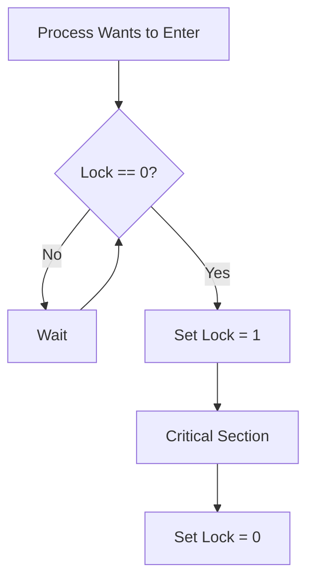
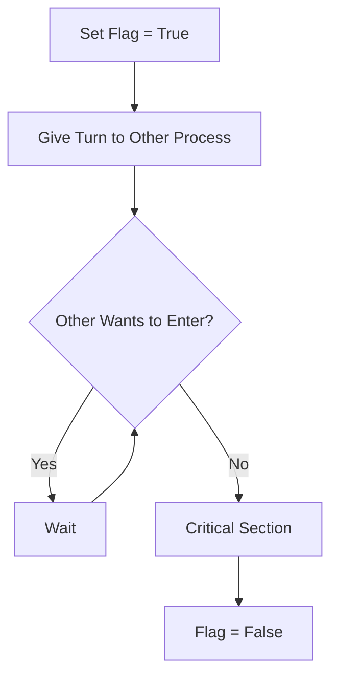
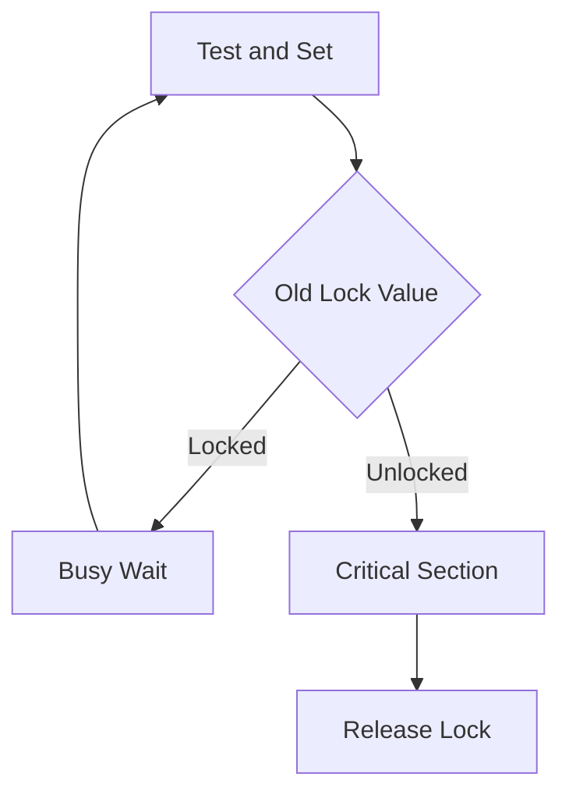

# 🔐 Lock Variable Synchronization Mechanism

## 📖 Definition

A **Lock Variable** is one of the simplest software-based synchronization mechanisms used to protect a **Critical Section**.

A shared variable called **Lock** is used to indicate whether the Critical Section is currently occupied.

Before entering the Critical Section, a process checks the value of the lock.

- If the lock is free (`0`), the process sets it to `1` and enters the Critical Section.
- If the lock is already `1`, the process continuously waits until it becomes `0`.

> **One-Line Interview Definition**
>
> **A Lock Variable is a shared software variable used to indicate whether a Critical Section is free or occupied.**

---

# 🎯 Why Do We Need a Lock Variable?

Suppose multiple processes share the same resource.

```text
Shared Variable

↓

Process A

↓

Process B

↓

Process C
```

If all processes enter the Critical Section simultaneously,

the shared data becomes inconsistent.

A lock variable attempts to solve this problem by allowing only one process to enter the Critical Section.

---

# 🧠 Basic Idea

The lock has only two possible values.

| Lock Value | Meaning |
|------------|---------|
| **0** | Critical Section is free |
| **1** | Critical Section is occupied |

Initially,

```text
Lock = 0
```

meaning the Critical Section is available.

---

# ⚙️ Working

The execution flow is straightforward.

```text
Check Lock

↓

Lock == 0 ?

↓

Yes

↓

Set Lock = 1

↓

Enter Critical Section

↓

Finish Work

↓

Set Lock = 0
```

If the lock is already `1`,

the process repeatedly checks until it becomes `0`.

---

# 🔄 Flow Diagram



---

# 📝 Pseudocode

```cpp
// Entry Section

while(lock != 0);

/* Acquire Lock */

lock = 1;

/* Critical Section */

/* Exit Section */

lock = 0;
```

The semicolon after the `while` loop indicates **busy waiting**.

The process repeatedly checks the value of the lock until it becomes available.

---

# 🔄 Busy Waiting

The Lock Variable mechanism is a **Busy Waiting** solution.

Instead of sleeping,

the process continuously executes:

```cpp
while(lock != 0);
```

This repeatedly consumes CPU time even though no useful work is being done.

```text
Check Lock

↓

Still Locked

↓

Check Again

↓

Still Locked

↓

Check Again

↓

...
```

---

# 🌍 Real-Life Analogy

Imagine a meeting room with a simple "Occupied" sign.

```text
Occupied = No

↓

Person Enters

↓

Changes Sign to "Yes"

↓

Meeting

↓

Changes Sign to "No"

↓

Next Person Enters
```

The idea is simple.

However,

if two people check the sign at exactly the same time,

both may see "Available" and enter together.

This is exactly the problem with Lock Variables.

---

# ⚠️ Why Does the Lock Variable Fail?

At first glance,

the algorithm appears correct.

Unfortunately,

the following two operations are **not atomic**.

```cpp
if(lock == 0)

lock = 1;
```

The CPU may switch to another process **between** these two statements.

This creates a race condition.

---

# 💻 Assembly-Level Execution

The compiler roughly converts the algorithm into the following instructions.

```text
1. Load Lock → Register

2. Compare Register with 0

3. If Lock ≠ 0, Repeat

4. Store 1 into Lock

5. Enter Critical Section

6. Store 0 into Lock
```

Notice that **reading** the lock and **writing** the lock are two different machine instructions.

A context switch may occur between them.

---

# 🚨 Race Condition Example

Assume:

```text
Lock = 0
```

Two processes,

**P1** and **P2**,

attempt to enter the Critical Section.

---

## Step 1

Process P1 executes

```text
Read Lock

↓

Lock = 0
```

Before executing

```text
Lock = 1
```

the operating system performs a context switch.

---

## Step 2

Process P2 executes.

It also reads

```text
Lock = 0
```

because P1 has not yet updated it.

P2 sets

```text
Lock = 1
```

and enters the Critical Section.

---

## Step 3

The operating system switches back to P1.

P1 still believes the lock was free because it previously read

```text
Lock = 0
```

It now executes

```text
Lock = 1
```

and also enters the Critical Section.

---

# 🔄 Timeline

```text
Initial

Lock = 0

↓

P1 reads Lock = 0

↓

Context Switch

↓

P2 reads Lock = 0

↓

P2 sets Lock = 1

↓

P2 enters Critical Section

↓

Context Switch

↓

P1 sets Lock = 1

↓

P1 also enters Critical Section ❌
```

Both processes execute simultaneously,

violating Mutual Exclusion.

---

# ❌ Why Does This Happen?

The statement

```cpp
lock = 1;
```

is **not executed immediately after reading the lock**.

Between

```cpp
Read Lock
```

and

```cpp
Write Lock
```

another process may execute.

Since these two operations are not atomic,

multiple processes can enter the Critical Section.

---

# 📊 Evaluation of Lock Variable

A synchronization algorithm is usually evaluated using three properties.

- Mutual Exclusion
- Progress
- Bounded Waiting

---

## 1️⃣ Mutual Exclusion

❌ **Not Guaranteed**

Two processes may enter the Critical Section simultaneously because checking and updating the lock are separate operations.

---

## 2️⃣ Progress

✅ **Satisfied**

If the Critical Section is empty,

a waiting process can eventually enter.

---

## 3️⃣ Bounded Waiting

❌ **Not Guaranteed**

A process may repeatedly lose the race to acquire the lock and wait indefinitely.

Starvation is possible.

---

# 📊 Evaluation Summary

| Property | Status | Reason |
|----------|--------|--------|
| Mutual Exclusion | ❌ No | Check and update are not atomic |
| Progress | ✅ Yes | Free lock can eventually be acquired |
| Bounded Waiting | ❌ No | Starvation is possible |

---

# ✅ Advantages

- Very simple to understand.
- Easy to implement.
- Requires only one shared variable.
- No operating system support is required.
- Works completely in user space.

---

# ❌ Disadvantages

- Does not guarantee Mutual Exclusion.
- Suffers from race conditions.
- Uses busy waiting.
- Wastes CPU cycles.
- May lead to starvation.
- Not suitable for modern operating systems.

---

# 📊 Advantages vs Disadvantages

| Advantages | Disadvantages |
|------------|---------------|
| Simple algorithm | Race conditions possible |
| Easy implementation | No guaranteed Mutual Exclusion |
| User-level solution | Busy waiting wastes CPU |
| No OS support required | Starvation possible |
| Suitable for learning | Not used in modern systems |

---

# 🔄 Lock Variable vs Disable Interrupts

| Feature | Lock Variable | Disable Interrupts |
|---------|---------------|--------------------|
| Type | Software Solution | Hardware/Kernel Solution |
| Busy Waiting | ✅ Yes | ❌ No |
| User Mode | ✅ Yes | ❌ No |
| OS Support | Not Required | Required |
| Multiprocessor Safe | ❌ No | ❌ No |
| Mutual Exclusion | ❌ Not Guaranteed | ✅ On a single CPU |

---

# 💡 Why Study Lock Variables?

Although Lock Variables are **not used in modern operating systems**, they are important because they demonstrate **why simple software solutions fail**.

This motivates the development of better synchronization mechanisms such as:

- Peterson's Algorithm
- Test-and-Set Lock (TSL)
- Compare-and-Swap (CAS)
- Mutex Locks
- Semaphores
- Monitors

---

# 🎯 Interview Questions

### Q1. What is a Lock Variable?

A Lock Variable is a shared software variable used to indicate whether a Critical Section is free or occupied.

---

### Q2. Why is the Lock Variable called a busy waiting solution?

Because a waiting process continuously checks the lock value in a loop instead of sleeping.

---

### Q3. Why does the Lock Variable fail?

The operations of checking the lock and updating it are not atomic. A context switch between these operations allows multiple processes to enter the Critical Section simultaneously.

---

### Q4. Does the Lock Variable satisfy Mutual Exclusion?

No. It can fail because of race conditions during lock acquisition.

---

### Q5. Why is the Lock Variable still studied?

It is historically important and illustrates the shortcomings of naive synchronization approaches, leading to more robust algorithms like Peterson's Algorithm and hardware atomic instructions.

---

# 📝 30-Second Revision

- ✅ Lock Variable is the simplest software synchronization mechanism.
- ✅ `Lock = 0` means the Critical Section is free; `Lock = 1` means it is occupied.
- ✅ Uses busy waiting (`while(lock != 0);`).
- ✅ Checking and setting the lock are separate, non-atomic operations.
- ✅ A context switch between these operations can lead to a race condition.
- ✅ Does **not** guarantee Mutual Exclusion or Bounded Waiting.
- ✅ Mainly studied as a foundation for understanding more advanced synchronization mechanisms.  

---

# 🛡️ Better Solutions to the Lock Variable Problem

The Lock Variable mechanism fails because **checking** and **updating** the lock are performed as **two separate operations**.

Modern synchronization algorithms solve this problem by making lock acquisition **atomic**.

Some important solutions are:

- Peterson's Algorithm (Software Solution)
- Test-and-Set Lock (TSL)
- Compare-and-Swap (CAS)
- Swap Instruction
- Fetch-and-Add

---

# 1️⃣ Peterson's Algorithm

## 📖 Definition

**Peterson's Algorithm** is a **software-based synchronization algorithm** that guarantees **Mutual Exclusion, Progress, and Bounded Waiting** for **two processes**.

Unlike the Lock Variable approach, Peterson's Algorithm carefully coordinates the execution of two processes using two shared variables.

---

## Shared Variables

Peterson's Algorithm uses:

### 1. Flag Array

```cpp
bool flag[2];
```

Each process sets its flag to indicate its intention to enter the Critical Section.

Example

```text
flag[0] = true
```

means

```text
Process P0 wants to enter.
```

---

### 2. Turn Variable

```cpp
int turn;
```

If both processes want to enter simultaneously,

the `turn` variable decides whose turn it is.

---

## Working

Suppose Process P0 wants to enter.

It performs:

```cpp
flag[0] = true;

turn = 1;

while(flag[1] && turn == 1);
```

Meaning:

- I want to enter.
- I give priority to Process 1.
- If Process 1 also wants to enter and it is its turn, then I wait.

---

## Pseudocode

### Process P0

```cpp
flag[0] = true;

turn = 1;

while(flag[1] && turn == 1);

/* Critical Section */

flag[0] = false;
```

---

### Process P1

```cpp
flag[1] = true;

turn = 0;

while(flag[0] && turn == 0);

/* Critical Section */

flag[1] = false;
```

---

## Flow Diagram



---

## Advantages

- Guarantees Mutual Exclusion.
- Guarantees Progress.
- Guarantees Bounded Waiting.
- Pure software solution.
- No hardware support required.

---

## Disadvantages

- Works only for **two processes**.
- Uses busy waiting.
- Difficult to extend for multiple processes.
- Rarely used in real operating systems.

---

# 📊 Lock Variable vs Peterson's Algorithm

| Feature | Lock Variable | Peterson's Algorithm |
|---------|---------------|----------------------|
| Mutual Exclusion | ❌ No | ✅ Yes |
| Progress | ✅ Yes | ✅ Yes |
| Bounded Waiting | ❌ No | ✅ Yes |
| Busy Waiting | Yes | Yes |
| Number of Processes | Multiple | Only Two |
| Used Today | No | Mostly Educational |

---

# 2️⃣ Test-and-Set Lock (TSL)

## 📖 Definition

**Test-and-Set** is a hardware-supported atomic instruction used to implement synchronization.

Unlike the Lock Variable,

checking and setting the lock happen in **one indivisible CPU instruction**.

---

## Atomic Operation

```cpp
bool TestAndSet(bool &lock)
{
    bool old = lock;

    lock = true;

    return old;
}
```

The processor guarantees that no other CPU can interrupt this operation.

---

## Working

```cpp
while(TestAndSet(lock));

/* Critical Section */

lock = false;
```

If the lock is already occupied,

the process keeps trying until it becomes free.

---

## Flow



---

## Advantages

- Atomic instruction.
- Guarantees Mutual Exclusion.
- Used in modern processors.
- Very fast.

---

## Disadvantages

- Busy waiting.
- Starvation is possible.
- Wastes CPU if the Critical Section is long.

---

# 3️⃣ Compare-and-Swap (CAS)

## 📖 Definition

**Compare-and-Swap (CAS)** is another hardware atomic instruction.

It updates a memory location **only if** its current value matches an expected value.

---

## Operation

```text
If

Memory == Expected

↓

Replace Memory

Else

Do Nothing
```

---

## Example

Memory

```text
Lock = 0
```

Expected

```text
0
```

New Value

```text
1
```

CAS succeeds.

If Lock is already `1`,

CAS fails.

---

## Advantages

- Atomic.
- Lock-free synchronization possible.
- Used in modern concurrent programming.
- High performance.

---

## Disadvantages

- Busy retry loops.
- More complex than mutexes.
- Can suffer from the ABA problem.

---

# 4️⃣ Swap Instruction

## 📖 Definition

The **Swap Instruction** atomically exchanges the values of a register and a memory location.

Example

Before

```text
Register = 1

Lock = 0
```

After Swap

```text
Register = 0

Lock = 1
```

The exchange happens atomically.

---

## Advantages

- Simple hardware instruction.
- Guarantees atomic exchange.
- Used for implementing spinlocks.

---

## Disadvantages

- Busy waiting.
- Rarely exposed directly in modern programming languages.

---

# 5️⃣ Fetch-and-Add

## 📖 Definition

**Fetch-and-Add** atomically reads a value and increments it.

Example

```text
Counter = 5
```

Thread executes

```text
FetchAndAdd(counter)
```

Returns

```text
5
```

Counter becomes

```text
6
```

No race condition occurs.

---

## Applications

- Ticket Locks
- Reference Counters
- Thread Scheduling
- Work Queues

---

# 📊 Comparison of Synchronization Solutions

| Mechanism | Type | Atomic | Busy Waiting | Processes Supported | Used Today |
|-----------|------|--------|--------------|---------------------|------------|
| Lock Variable | Software | ❌ No | ✅ Yes | Multiple | ❌ No |
| Peterson's Algorithm | Software | Logical | ✅ Yes | Two | Educational |
| Test-and-Set | Hardware | ✅ Yes | ✅ Yes | Multiple | Yes |
| Compare-and-Swap | Hardware | ✅ Yes | Optional | Multiple | Yes |
| Swap Instruction | Hardware | ✅ Yes | ✅ Yes | Multiple | Limited |
| Fetch-and-Add | Hardware | ✅ Yes | Optional | Multiple | Yes |

---

# 🌍 Where Are These Used?

| Mechanism | Typical Usage |
|------------|---------------|
| Lock Variable | Educational only |
| Peterson's Algorithm | Operating Systems courses |
| Test-and-Set | Spinlocks, Kernel Synchronization |
| Compare-and-Swap | Java, C++, Rust, Go Atomic Libraries |
| Swap Instruction | Older Processor Architectures |
| Fetch-and-Add | Ticket Locks, Reference Counting |

---

# 🎯 Which Solution is Better?

There is no single "best" synchronization mechanism.

The choice depends on the problem.

| Situation | Preferred Solution |
|------------|--------------------|
| Learning synchronization concepts | Peterson's Algorithm |
| Very short Critical Sections | Test-and-Set / Spinlock |
| Lock-free programming | Compare-and-Swap |
| Atomic counters | Fetch-and-Add |
| General application programming | Mutex |
| Resource management | Semaphore |

---

# 🎯 Interview Questions

### Q1. Why does Peterson's Algorithm succeed where the Lock Variable fails?

Because Peterson's Algorithm coordinates access using the `flag` and `turn` variables, ensuring Mutual Exclusion, Progress, and Bounded Waiting for two processes.

---

### Q2. What is the major drawback of Peterson's Algorithm?

It works only for two processes and relies on busy waiting.

---

### Q3. What is Test-and-Set?

It is a hardware-supported atomic instruction that checks and sets a lock in a single indivisible operation.

---

### Q4. What is the difference between Test-and-Set and Compare-and-Swap?

Test-and-Set always sets the lock and returns the old value, whereas Compare-and-Swap updates the value only if it matches an expected value.

---

### Q5. Which synchronization primitive is commonly used by modern processors?

Modern processors provide hardware atomic instructions such as Test-and-Set, Compare-and-Swap, and Fetch-and-Add, which form the basis of efficient synchronization primitives.

---

# 📝 30-Second Revision

- ✅ Lock Variable fails because checking and updating the lock are separate, non-atomic operations.
- ✅ Peterson's Algorithm solves this for two processes using `flag[]` and `turn`.
- ✅ Test-and-Set provides atomic lock acquisition in hardware.
- ✅ Compare-and-Swap enables efficient lock-free synchronization.
- ✅ Swap Instruction atomically exchanges values between memory and a register.
- ✅ Fetch-and-Add atomically increments shared counters.
- ✅ Modern operating systems build synchronization primitives like mutexes and spinlocks on top of these hardware atomic instructions.