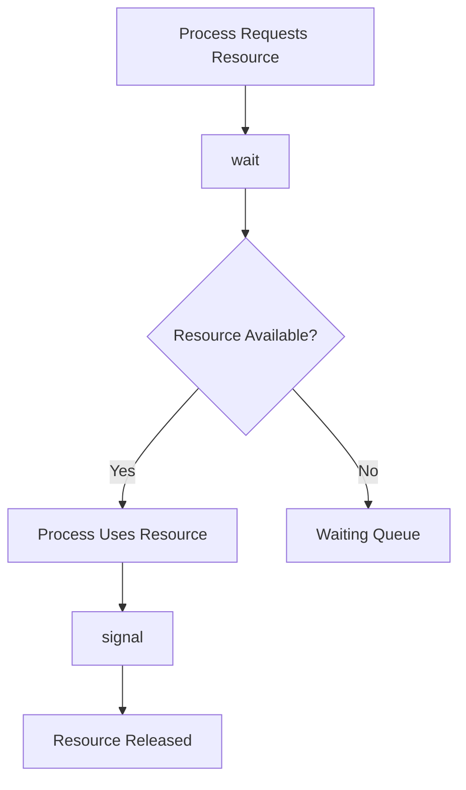
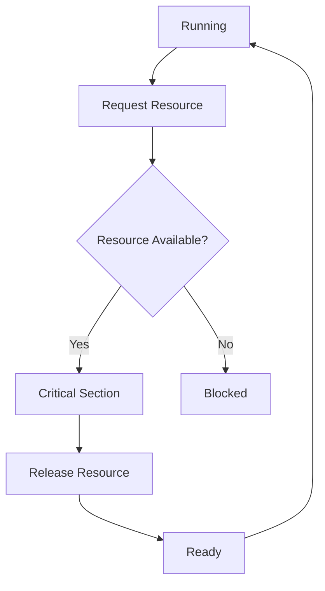
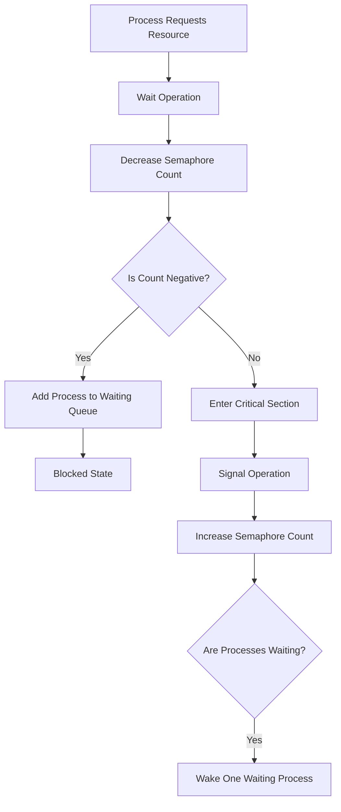
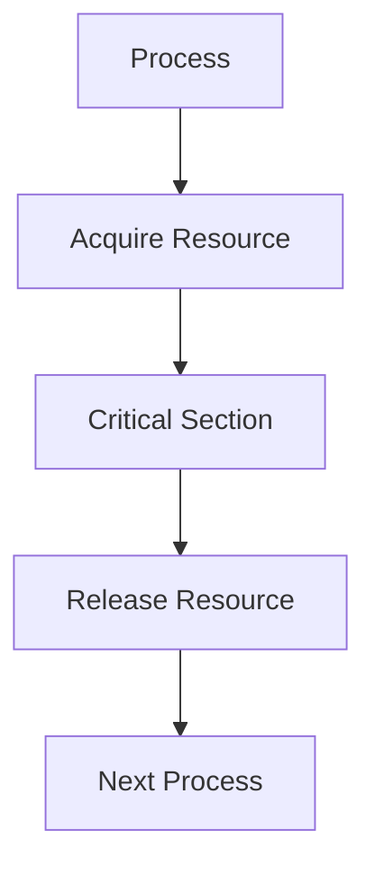
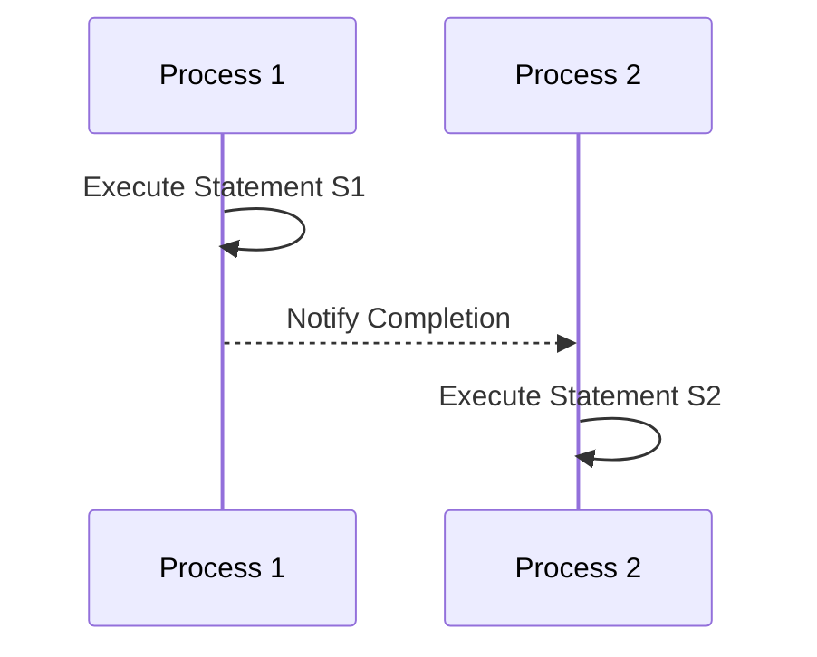

# 🚦 Semaphores

## 📖 Definition

A **Semaphore** is a synchronization primitive used to coordinate access to **shared resources** among multiple processes or threads.

It is a **protected integer variable** maintained by the **Operating System** and can only be modified using two special atomic operations:

- **wait()** (also called **P**, **down()**, or **acquire()**)
- **signal()** (also called **V**, **up()**, or **release()**)

Unlike simple lock variables, semaphores can **block waiting processes** instead of forcing them to continuously check whether a resource is available.

> **One-Line Interview Definition**
>
> **A semaphore is an OS-managed synchronization primitive that controls access to shared resources using an integer count and two atomic operations: wait() and signal().**

---

# 🎯 Why Do We Need Semaphores?

Before semaphores, several synchronization techniques existed:

- Lock Variable
- Disable Interrupts
- Peterson's Algorithm
- Test-and-Set Lock

Each solved some problems but introduced new ones.

For example, a simple lock variable allows only one process to enter the Critical Section, but waiting processes repeatedly check whether the lock has become free.

```text
while(lock == 1);
```

This wastes valuable CPU time.

Similarly, some synchronization techniques:

- Do not guarantee bounded waiting.
- Are difficult to extend for multiple resources.
- Work only for two processes.
- Require hardware support.

Semaphores were introduced to overcome these limitations by providing a more general synchronization mechanism.

---

# 🚨 Motivation

Semaphores were primarily introduced to solve two major problems.

## 1️⃣ Busy Waiting

Consider a process waiting for a resource.

Using a simple lock,

```text
Process

↓

Check Lock

↓

Busy

↓

Check Again

↓

Busy

↓

Check Again

↓

...
```

The process keeps running even though it is doing no useful work.

This continuous checking is called **Busy Waiting** (or **Spinning**).

### Problems with Busy Waiting

- Wastes CPU cycles.
- Reduces overall system performance.
- Inefficient when the waiting time is long.

---

## 2️⃣ Bounded Waiting

Suppose three processes are waiting.

```text
P1

P2

P3
```

Without proper synchronization,

it is possible that:

```text
P1 waits forever

↓

P2 enters

↓

P3 enters

↓

New Process enters

↓

P1 still waiting
```

This situation is called **Starvation**.

A good synchronization mechanism should ensure that every waiting process eventually gets its turn.

This property is called **Bounded Waiting**.

---

# 🛁 Restroom Analogy (Motivation)

Imagine a shopping mall with **three restrooms**.

Without any management,

people keep walking to each restroom checking whether it is free.

```text
🚻

Occupied?

↓

No

↓

Check Next

↓

Occupied?

↓

No

↓

Check Again
```

Everyone wastes time continuously checking.

Now imagine a **security guard** standing outside.

Instead of checking every restroom,

people simply ask the guard.

The guard keeps track of available restrooms and tells people when they can enter.

This is the basic idea behind a semaphore.

---

# 💡 What is a Semaphore?

Think of a semaphore as a **resource manager**.

Instead of each process checking resources individually,

all processes communicate with the semaphore.

```text
          Processes

      P1   P2   P3   P4

           │
           ▼

      +-------------+
      | Semaphore   |
      +-------------+

           │
           ▼

     Shared Resources
```

The semaphore keeps track of:

- How many resources are available.
- Which processes are waiting.
- Which process should proceed next.

---

# 🏗️ Components of a Semaphore

A semaphore consists of two main components.

```text
Semaphore

├── Count Variable

└── Waiting Queue
```

---

# 1️⃣ Count Variable

The **count variable** stores information about the availability of shared resources.

Example:

Suppose there are

```text
3 Printers
```

Initially,

```text
Semaphore Count = 3
```

Meaning,

```text
3 Resources Available
```

Whenever a process acquires one printer,

the count decreases.

Whenever it releases the printer,

the count increases.

---

## Example

Initially

```text
Count = 3
```

One process acquires a printer.

```text
Count = 2
```

Another process acquires one.

```text
Count = 1
```

Eventually,

```text
Count = 0
```

No free printers remain.

---

# 2️⃣ Waiting Queue

When no resources are available,

new processes are **not allowed to keep checking continuously**.

Instead,

they are placed into a waiting queue.

```text
Waiting Queue

+------+
|  P4  |
+------+

+------+
|  P5  |
+------+

+------+
|  P6  |
+------+
```

Whenever a resource becomes available,

one waiting process is removed from the queue and allowed to continue.

The queue helps ensure orderly access to resources and prevents starvation.

---

# 📊 Meaning of Semaphore Count

The semaphore value tells us the current status of the shared resources.

| Semaphore Count | Meaning |
|-----------------|---------|
| Positive | Number of available resources |
| Zero | No resources are currently available |
| Negative | Number of processes waiting in the queue |

---

## Positive Count

Suppose

```text
Count = 4
```

This means

```text
4 Resources

Available
```

Processes can immediately acquire a resource.

---

## Zero Count

Suppose

```text
Count = 0
```

This means

```text
No Resources Available
```

The next arriving process cannot proceed immediately.

---

## Negative Count

Suppose

```text
Count = -3
```

This means

```text
3 Processes

Waiting in Queue
```

Notice that a negative value **does not** indicate negative resources.

Instead,

it represents the number of waiting processes.

---

# 🔄 High-Level View of wait() and signal()

A semaphore provides only **two operations**.

| Operation | Purpose |
|-----------|---------|
| **wait()** | Request or acquire a resource |
| **signal()** | Release a resource |

At a high level:

```text
Need Resource

↓

wait()

↓

Use Resource

↓

signal()

↓

Resource Released
```

---

# 🔄 Semaphore Lifecycle

The life cycle of a resource request looks like this.



---

# 🌍 Real-Life Analogy

Imagine a parking lot with **five parking spaces**.

Initially,

```text
Available Spaces = 5
```

Cars enter.

```text
5

↓

4

↓

3

↓

2

↓

1

↓

0
```

Once the parking lot becomes full,

new cars simply wait.

Whenever a car leaves,

another waiting car is allowed to enter.

This is exactly how a semaphore manages shared resources.

---

# ⭐ Characteristics of Semaphores

- Managed by the Operating System.
- Used for process and thread synchronization.
- Maintains a count of available resources.
- Maintains a waiting queue.
- Supports synchronization of one or multiple resources.
- Prevents unnecessary busy waiting by blocking waiting processes.

---

# 📌 Applications of Semaphores

Semaphores are widely used in:

- Critical Section synchronization
- Producer–Consumer Problem
- Readers–Writers Problem
- Dining Philosophers Problem
- Printer Pools
- Database Connection Pools
- Thread Synchronization
- Resource Allocation

---

# 🎯 Interview Questions

### Q1. What is a semaphore?

A semaphore is an OS-managed synchronization primitive that controls access to shared resources using an integer count and two operations: `wait()` and `signal()`.

---

### Q2. Why were semaphores introduced?

Semaphores were introduced to overcome the limitations of simpler synchronization mechanisms, such as busy waiting, lack of bounded waiting, and poor management of multiple shared resources.

---

### Q3. What are the two main components of a semaphore?

A semaphore consists of:

- A **count variable**
- A **waiting queue**

---

### Q4. What does a negative semaphore value indicate?

A negative semaphore value indicates the number of processes waiting in the semaphore's queue.

---

### Q5. What are the two operations supported by a semaphore?

- `wait()` – Requests or acquires a resource.
- `signal()` – Releases a resource.

---

# 📝 30-Second Revision

- ✅ A semaphore is an OS-managed synchronization primitive.
- ✅ It controls access to shared resources.
- ✅ It maintains a **count variable** and a **waiting queue**.
- ✅ Positive count → available resources.
- ✅ Zero count → no free resources.
- ✅ Negative count → waiting processes.
- ✅ It provides two operations: **wait()** and **signal()**.
- ✅ The detailed working of these operations is covered next.  

---  

# ⚙️ Semaphore Working

In the previous section, we learned that a semaphore provides two operations:

- **wait()** → Request a resource
- **signal()** → Release a resource

Now let's understand **how these operations actually work internally**.

---

# 🎯 Semaphore Operations

A semaphore can **only** be modified through two operations.

```text
Semaphore

├── wait()   (Acquire Resource)

└── signal() (Release Resource)
```

These operations are performed by the **Operating System** and are **atomic**, meaning they execute completely without interruption.

---

# 📥 wait() Operation

## 📖 Definition

The **wait()** operation is executed **before entering the Critical Section** or **before using a shared resource**.

Its job is to:

- Request a resource.
- Decrease the semaphore count.
- If no resource is available, block the process.

---

# 🔄 High-Level Working

```text
Process Requests Resource

↓

wait()

↓

Decrease Semaphore Count

↓

Resource Available?

↓

Yes → Continue

↓

No → Block Process
```

---

# 📝 Pseudocode

```text
wait(S)
{
    S.count--;

    if(S.count < 0)
    {
        Add current process to waiting queue;

        Sleep();
    }
}
```

---

# 💡 Step-by-Step Example

Suppose there are **3 printers**.

Initially,

```text
Count = 3
```

---

## Process P1

P1 calls

```text
wait()
```

The semaphore decreases the count.

```text
3

↓

2
```

Since the count is still positive,

P1 immediately starts using a printer.

---

## Process P2

```text
2

↓

1
```

P2 also gets a printer.

---

## Process P3

```text
1

↓

0
```

P3 receives the last available printer.

---

## Process P4

P4 now requests a printer.

```text
0

↓

-1
```

The count becomes negative.

This means

```text
No printer is available.
```

Therefore,

```text
P4

↓

Waiting Queue

↓

Blocked
```

---

## Process P5

```text
-1

↓

-2
```

Now,

```text
P4

↓

P5
```

are waiting.

---

# 📊 Meaning of wait()

| Count After wait() | Meaning |
|--------------------|---------|
| Positive | Resources still available |
| Zero | Last available resource allocated |
| Negative | Process must wait |

---

# 📤 signal() Operation

## 📖 Definition

The **signal()** operation is executed **after leaving the Critical Section** or **after releasing a resource**.

Its job is to:

- Return the resource.
- Increase the semaphore count.
- Wake one waiting process if necessary.

---

# 🔄 High-Level Working

```text
Process Finishes

↓

signal()

↓

Increase Count

↓

Waiting Process Exists?

↓

Yes → Wake One Process

↓

No → Finish
```

---

# 📝 Pseudocode

```text
signal(S)
{
    S.count++;

    if(S.count <= 0)
    {
        Remove one process from queue;

        Wakeup(process);
    }
}
```

---

# 💡 Example

Suppose

```text
Count = -2
```

Meaning

```text
P4

↓

P5

Waiting
```

Now,

P2 finishes.

```text
signal()

↓

Count = -1
```

Since

```text
Count <= 0
```

one waiting process is awakened.

```text
Wake P4
```

---

Later,

another process releases a printer.

```text
Count = -1

↓

signal()

↓

Count = 0
```

Again,

```text
Wake P5
```

Eventually,

all waiting processes receive a printer.

---

# 🤔 Why Does signal() Check `count <= 0`?

This is one of the most commonly asked interview questions.

Suppose

```text
Count = -1
```

meaning

```text
One process is waiting.
```

After

```text
signal()
```

the count becomes

```text
0
```

Even though the count is now zero,

there is **still one waiting process** that should be awakened.

Therefore,

the condition is

```text
count <= 0
```

instead of

```text
count < 0
```

---

# 💤 Sleep and Wakeup

Unlike lock variables,

waiting processes do **not** continuously execute.

Instead,

they move to the **Blocked State**.

```text
Running

↓

wait()

↓

Resource Not Available

↓

Blocked

↓

signal()

↓

Ready

↓

Running
```

This eliminates **Busy Waiting** and saves CPU cycles.

---

# 🔄 Process State Transition



---

# 🎯 Why Must wait() and signal() Be Atomic?

Suppose

```text
Process P1

↓

Decreases Count

↓

Context Switch

↓

Process P2 Also Modifies Count
```

Now,

multiple processes may think they own the same resource.

This leads to race conditions.

Therefore,

both

```text
wait()

signal()
```

must execute as **one indivisible operation**.

---

# ⚙️ Kernel Implementation

Semaphores are implemented inside the **Operating System Kernel**.

Why?

Because the kernel can:

- Block processes.
- Wake sleeping processes.
- Maintain waiting queues.
- Perform context switching.
- Guarantee atomic execution.

Internally,

the kernel uses hardware-supported atomic instructions such as:

- Test-and-Set (TSL)
- Compare-and-Swap (CAS)
- Atomic Exchange

These instructions ensure that two CPUs cannot modify the semaphore simultaneously.

---

# 🏗️ Internal Structure

```text
Semaphore

├── Count Variable

├── Waiting Queue

├── wait()

└── signal()
```

The Operating System scheduler works together with the semaphore to:

- Block processes.
- Wake processes.
- Schedule execution.
- Maintain fairness.

---

# 📜 Dijkstra's Original P() and V()

Semaphores were introduced by **Edsger W. Dijkstra**.

Originally,

he used the names:

| Modern Name | Original Name |
|--------------|---------------|
| wait() | P() |
| signal() | V() |

Meaning:

- **P (Proberen)** → "To Test" or "To Try"
- **V (Verhogen)** → "To Increase"

Modern operating systems usually use the names

```text
wait()

signal()
```

because they are easier to understand.

---

# 🔵 Binary Semaphore

## 📖 Definition

A **Binary Semaphore** is a semaphore whose value can only be:

```text
0

or

1
```

It behaves similarly to a mutex and is commonly used for **mutual exclusion**.

### Example

```text
Value = 1

↓

wait()

↓

Value = 0

↓

Critical Section

↓

signal()

↓

Value = 1
```

Only one process can enter the Critical Section at a time.

---

# 🔢 Counting Semaphore

## 📖 Definition

A **Counting Semaphore** can take **any non-negative integer value**.

Its initial value represents the number of available instances of a resource.

### Example

Suppose

```text
5 Printers
```

Initially,

```text
Semaphore = 5
```

Five different processes can use five different printers simultaneously.

When all printers become occupied,

additional processes wait in the queue.

---

# 📊 Binary Semaphore vs Counting Semaphore

| Feature | Binary Semaphore | Counting Semaphore |
|----------|------------------|--------------------|
| Values | 0 or 1 | 0, 1, 2, 3...N |
| Resources Managed | Single | Multiple |
| Used For | Mutual Exclusion | Resource Management |
| Similar To | Mutex | Resource Counter |

---

# 📈 Complete Working Flow



---

# 🎯 Interview Questions

### Q1. When is `wait()` called?

Before entering the Critical Section or acquiring a shared resource.

---

### Q2. When is `signal()` called?

After leaving the Critical Section or releasing a shared resource.

---

### Q3. Why are `wait()` and `signal()` atomic?

To prevent race conditions while updating the semaphore count and waiting queue.

---

### Q4. Why does `signal()` use `count <= 0`?

Because when the count becomes `0`, it indicates that there was exactly one waiting process before the increment, so that process must be awakened.

---

### Q5. What is the difference between a Binary Semaphore and a Counting Semaphore?

A Binary Semaphore manages a single resource with values `0` or `1`, whereas a Counting Semaphore manages multiple identical resources using a count greater than `1`.

---

# 📝 30-Second Revision

- ✅ `wait()` acquires a resource by decrementing the semaphore count.
- ✅ If the count becomes negative, the process is blocked and placed in the waiting queue.
- ✅ `signal()` releases a resource by incrementing the count.
- ✅ If the updated count is less than or equal to zero, one waiting process is awakened.
- ✅ `wait()` and `signal()` must be atomic.
- ✅ Semaphores are implemented inside the operating system kernel.
- ✅ Dijkstra originally called these operations **P()** and **V()**.
- ✅ Binary Semaphores manage one resource, while Counting Semaphores manage multiple resources.  

---  

# 💻 Semaphore Applications and Examples

In the previous section, we learned how semaphores work internally using the **wait()** and **signal()** operations.

Now let's see how semaphores are used to solve real synchronization problems in Operating Systems.

---

# 🎯 Applications of Semaphores

Semaphores are commonly used for:

- Critical Section Protection
- Producer–Consumer Problem
- Printer Pool Management
- Resource Allocation
- Process Synchronization
- Statement Sequencing
- Readers-Writers Problem
- Dining Philosophers Problem

---

# 1️⃣ Critical Section Problem

## 📖 Problem Statement

Suppose multiple processes need to access the same shared variable.

```text
Shared Variable

↓

P1

P2

P3

P4
```

If all processes enter simultaneously,

race conditions occur.

---

## Solution Using Semaphore

Initialize

```text
Semaphore = 1
```

Before entering the Critical Section

```text
wait(semaphore);
```

After leaving

```text
signal(semaphore);
```

---

## Flow

```text
wait()

↓

Enter Critical Section

↓

Execute

↓

signal()

↓

Next Process
```

---

## Mermaid Diagram



---

## Example

Suppose

```text
Bank Account Balance
```

is shared among multiple ATM machines.

Only one ATM should update the balance at a time.

Semaphore guarantees that only one ATM enters the Critical Section.

---

# 2️⃣ Producer-Consumer Problem

## 📖 Problem Statement

A producer generates data.

A consumer processes that data.

Both share a common buffer.

```text
Producer

↓

Buffer

↓

Consumer
```

Problems:

- Producer should not write into a full buffer.
- Consumer should not read from an empty buffer.
- Both should not modify the same buffer location simultaneously.

---

## Semaphore Solution

Typically three semaphores are used.

```text
Mutex = 1

Empty = Buffer Size

Full = 0
```

---

### Producer

```text
wait(empty)

↓

wait(mutex)

↓

Insert Item

↓

signal(mutex)

↓

signal(full)
```

---

### Consumer

```text
wait(full)

↓

wait(mutex)

↓

Remove Item

↓

signal(mutex)

↓

signal(empty)
```

---

## Mermaid Diagram


---

## Real-Life Example

Imagine a restaurant.

```text
Chef

↓

Food Counter

↓

Waiter
```

The chef cannot place food if the counter is full.

The waiter cannot pick food if the counter is empty.

Semaphores coordinate both activities.

---

# 3️⃣ Printer Pool Example

## 📖 Problem Statement

Suppose an office has

```text
3 Printers
```

and

```text
10 Employees
```

All employees want to print documents.

---

## Without Semaphore

Employees continuously check every printer.

```text
Printer 1?

↓

Busy

↓

Printer 2?

↓

Busy

↓

Printer 3?
```

Busy waiting wastes CPU.

---

## With Semaphore

Initialize

```text
Semaphore = 3
```

Meaning

```text
3 Printers Available
```

Whenever someone prints

```text
wait()
```

Printer allocated.

When printing finishes

```text
signal()
```

Printer released.

---

## Example Timeline

Initially

```text
Count = 3
```

Employee 1

```text
↓

Count = 2
```

Employee 2

```text
↓

Count = 1
```

Employee 3

```text
↓

Count = 0
```

Employee 4

```text
↓

Count = -1

↓

Waiting Queue
```

When Employee 2 finishes

```text
signal()

↓

Employee 4 wakes up
```

---

# 4️⃣ Restroom Analogy (Complete Walkthrough)

Suppose a shopping mall has

```text
3 Restrooms
```

Initially

```text
Count = 3
```

---

### Person P1

Arrives.

```text
wait()

↓

Count = 2

↓

Uses Restroom
```

---

### Person P2

```text
wait()

↓

Count = 1
```

---

### Person P3

```text
wait()

↓

Count = 0
```

Now,

all restrooms are occupied.

---

### Person P4

Arrives.

```text
wait()

↓

Count = -1

↓

Added to Queue

↓

Sleeps
```

---

### Person P5

```text
wait()

↓

Count = -2

↓

Queue
```

---

### Person P2 Leaves

```text
signal()

↓

Count = -1

↓

Wake P4
```

P4 immediately enters the restroom.

---

### Person P1 Leaves

```text
signal()

↓

Count = 0

↓

Wake P5
```

---

## Visualization

```text
Restrooms

🚻 🚻 🚻

Occupied

↓

Waiting Queue

P4

↓

P5
```

As soon as a restroom becomes free,

the next waiting person is allowed inside.

Nobody keeps checking repeatedly.

---

# 5️⃣ Resource Allocation

Semaphores are excellent for managing a fixed number of identical resources.

Examples:

- Database Connections
- Network Ports
- USB Devices
- Memory Buffers
- GPU Resources
- Worker Threads

---

## Example

Suppose a database server allows only

```text
20 Connections
```

Initialize

```text
Semaphore = 20
```

Whenever a client connects

```text
wait()
```

Whenever a client disconnects

```text
signal()
```

No more than 20 clients can access the database simultaneously.

---

# 6️⃣ Process Synchronization

Sometimes,

we don't want to protect a Critical Section.

Instead,

we want to synchronize two independent processes.

Example

```text
P1

↓

Generate File

↓

P2

↓

Read File
```

P2 must wait until P1 finishes.

Semaphore provides this synchronization.

---

## Example

Initially

```text
Semaphore = 0
```

Process P2 executes

```text
wait()
```

Since

```text
Semaphore = 0
```

P2 blocks.

After P1 finishes,

it executes

```text
signal()
```

P2 wakes up and continues.

---

## Mermaid Diagram


---

# 7️⃣ Statement Sequencing

Sometimes,

two statements belonging to different processes must execute in a specific order.

Example

```text
Process P1

Statement S1
```

```text
Process P2

Statement S2
```

Requirement

```text
S1

↓

S2
```

---

## Without Semaphore

The scheduler may execute

```text
S2

↓

S1
```

which is incorrect.

---

## Using Semaphore

Initialize

```text
Semaphore = 0
```

Process P1

```text
S1

↓

signal()
```

Process P2

```text
wait()

↓

S2
```

Now,

S2 always executes after S1.

---

## Mermaid Diagram



---

# 📊 Summary of Applications

| Application | Semaphore Purpose |
|-------------|-------------------|
| Critical Section | Mutual Exclusion |
| Producer-Consumer | Synchronize Producer and Consumer |
| Printer Pool | Manage Multiple Resources |
| Restroom Analogy | Resource Allocation |
| Database Connections | Connection Management |
| Process Synchronization | Coordinate Independent Processes |
| Statement Sequencing | Enforce Execution Order |

---

# 🎯 Interview Questions

### Q1. Why is a semaphore used in the Producer–Consumer problem?

To prevent the producer from writing into a full buffer, the consumer from reading an empty buffer, and to ensure mutual exclusion while accessing the shared buffer.

---

### Q2. Why is a counting semaphore used for printer pools?

Because multiple identical printers are available, and the semaphore count tracks how many printers are free.

---

### Q3. Can semaphores be used for process synchronization without protecting a Critical Section?

Yes. A semaphore initialized to `0` can be used to make one process wait until another signals that it has completed a task.

---

### Q4. How do semaphores help in statement sequencing?

A process executes `signal()` after completing one statement, and another process performs `wait()` before executing the dependent statement, ensuring the correct order.

---

### Q5. Why is the restroom analogy useful for understanding semaphores?

It illustrates that waiting entities do not continuously check for availability. Instead, they join a queue, sleep, and are awakened when a resource becomes available, just like blocked processes managed by a semaphore.

---

# 📝 30-Second Revision

- ✅ Semaphores protect Critical Sections.
- ✅ They solve the Producer–Consumer problem.
- ✅ They efficiently manage multiple identical resources such as printers or database connections.
- ✅ They synchronize independent processes and enforce execution order.
- ✅ Waiting processes are blocked and awakened instead of busy waiting.
- ✅ Counting semaphores are ideal for resource pools, while binary semaphores are commonly used for mutual exclusion.  

# 🚀 Advanced Concepts of Semaphores

By now, we have learned:

- What a semaphore is.
- How `wait()` and `signal()` work.
- Applications of semaphores.

Now let's discuss the practical aspects of semaphores, their advantages, limitations, and how they compare with other synchronization mechanisms.

---

# ✅ Advantages of Semaphores

Semaphores are one of the most flexible synchronization mechanisms in an operating system.

---

## 1️⃣ Prevents Race Conditions

Semaphores ensure that multiple processes do not access shared resources simultaneously when mutual exclusion is required.

```text
Without Semaphore

P1 ───────┐
          ├── Critical Section ❌
P2 ───────┘

Race Condition
```

```text
With Semaphore

P1

↓

Critical Section

↓

P2

↓

Critical Section
```

---

## 2️⃣ Supports Multiple Resources

Unlike a mutex,

a counting semaphore can manage multiple identical resources.

Example

```text
5 Printers

↓

Semaphore = 5
```

Five users can print simultaneously.

---

## 3️⃣ Eliminates Busy Waiting

Modern semaphores block waiting processes.

Instead of

```text
Check

↓

Check

↓

Check
```

the process sleeps.

```text
Blocked

↓

Wake Up Later
```

This significantly improves CPU utilization.

---

## 4️⃣ Synchronizes Independent Processes

Semaphores are not limited to protecting Critical Sections.

They can also synchronize completely different processes.

Example

```text
Compiler

↓

Creates Object File

↓

Linker

↓

Creates Executable
```

The linker waits until the compiler finishes.

---

## 5️⃣ Works for Threads and Processes

Semaphores can synchronize:

- Threads
- Processes
- Shared Resources
- Devices
- Buffers

---

## 6️⃣ Machine Independent

Semaphores are an Operating System abstraction.

Applications use the same API regardless of the underlying processor architecture.

---

# ❌ Disadvantages of Semaphores

Despite being powerful,

semaphores also have several drawbacks.

---

## 1️⃣ Programming Complexity

Using semaphores correctly is difficult.

A single mistake can introduce serious synchronization bugs.

Example

```text
wait()

↓

Critical Section

↓

Forgot signal()
```

Every other process waits forever.

---

## 2️⃣ Deadlock

Improper ordering of semaphores may create deadlocks.

Example

```text
P1

↓

wait(S1)

↓

wait(S2)
```

```text
P2

↓

wait(S2)

↓

wait(S1)
```

Both processes wait forever.

---

## 3️⃣ Starvation

A process may wait indefinitely if the scheduler repeatedly wakes other waiting processes first.

Although modern semaphore implementations often use FIFO queues,

starvation is still possible depending on the scheduling policy.

---

## 4️⃣ Priority Inversion

Sometimes,

a low-priority process holds a semaphore.

A high-priority process waits for it.

Meanwhile,

medium-priority processes continue executing.

```text
High Priority

↓

Waiting

↓

Low Priority Holds Semaphore

↓

Medium Priority Runs
```

The high-priority process is indirectly delayed.

This phenomenon is called **Priority Inversion**.

---

## 5️⃣ Difficult to Debug

Synchronization bugs are often:

- Rare
- Timing dependent
- Difficult to reproduce

A program may run correctly thousands of times before failing once.

---

# ⚠️ Priority Inversion

## 📖 Definition

**Priority Inversion** occurs when a **high-priority process** is forced to wait because a **low-priority process** is holding a shared resource, while **medium-priority processes** continue to execute.

---

## Example

Suppose

```text
High Priority

H
```

```text
Medium Priority

M
```

```text
Low Priority

L
```

Sequence

```text
L acquires Semaphore

↓

H requests Semaphore

↓

H blocks

↓

M becomes Ready

↓

Scheduler runs M

↓

L still waiting for CPU

↓

H still blocked
```

Although H has the highest priority,

it cannot proceed because L has not released the semaphore.

---

## Diagram

```text
Time →

L : Lock -------------------- Unlock

H :        Waiting ---------------- Run

M :              Running
```

---

## Solution

Modern operating systems often use

**Priority Inheritance**.

The low-priority process temporarily inherits the higher priority until it releases the resource.

```text
Low Priority

↓

Temporarily becomes

↓

High Priority

↓

Releases Semaphore

↓

Original Priority Restored
```

---

# 🌟 Starvation

## 📖 Definition

**Starvation** occurs when a process waits indefinitely because other processes repeatedly obtain the resource before it.

---

## Example

```text
P1 Waiting

↓

P2 Gets Resource

↓

P3 Gets Resource

↓

P4 Gets Resource

↓

P1 Still Waiting
```

---

## Prevention

Modern semaphore implementations usually maintain a **FIFO waiting queue**.

Processes are awakened in arrival order.

---

# 🔄 Busy Waiting vs Blocking

One of the biggest advantages of semaphores is that they support **blocking**.

| Busy Waiting | Blocking |
|--------------|----------|
| Process continuously checks resource | Process sleeps |
| CPU cycles wasted | CPU cycles saved |
| High CPU usage | Low CPU usage |
| Used by spinlocks | Used by semaphores |

---

## Busy Waiting

```text
Check

↓

Busy

↓

Check

↓

Busy

↓

Check
```

---

## Blocking

```text
Resource Busy

↓

Blocked

↓

Scheduler Runs Other Process

↓

Wake Up

↓

Continue
```

---

# 🔐 Semaphore vs Mutex

| Feature | Semaphore | Mutex |
|----------|-----------|-------|
| Purpose | Synchronization and resource management | Mutual Exclusion |
| Data Type | Integer | Lock Object |
| Ownership | No ownership | Owner must unlock |
| Resources | One or Many | Only One |
| Operations | wait(), signal() | lock(), unlock() |
| Used For | Resource counting and signaling | Protecting Critical Sections |

---

# 🏛️ Semaphore vs Monitor

| Feature | Semaphore | Monitor |
|----------|-----------|----------|
| Type | Low-level synchronization primitive | High-level language construct |
| Programmer Responsibility | Explicit wait/signal | Compiler/runtime managed |
| Error Prone | More | Less |
| Mutual Exclusion | Manual | Automatic |
| Used In | Operating Systems | Java, C#, Concurrent Programming |

---

# ⚠️ Common Mistakes

---

## Forgetting signal()

```text
wait()

↓

Critical Section

↓

Program Ends ❌
```

Waiting processes never wake up.

---

## Incorrect Initialization

Suppose

```text
3 Printers
```

Incorrect

```text
Semaphore = 1
```

Correct

```text
Semaphore = 3
```

---

## Acquiring Without Releasing

```text
wait()

↓

wait()

↓

wait()
```

without matching

```text
signal()
```

can exhaust resources.

---

## Releasing Too Early

```text
wait()

↓

signal()

↓

Still Using Resource ❌
```

Another process may enter while the resource is still in use.

---

## Using Binary Semaphore for Multiple Resources

Binary semaphores only manage a single resource.

For multiple identical resources,

a counting semaphore should be used.

---

# 📊 Summary Table

| Feature | Semaphore |
|----------|-----------|
| Managed By | Operating System |
| Supports Multiple Resources | ✅ Yes |
| Supports Synchronization | ✅ Yes |
| Prevents Busy Waiting | ✅ Modern implementations |
| Can Cause Deadlock | ✅ If used incorrectly |
| Can Cause Starvation | Possible |
| Supports Blocking | ✅ Yes |

---

# 🎯 Interview Questions

### Q1. What are the major advantages of semaphores?

Semaphores provide mutual exclusion, resource management, process synchronization, support multiple resources, and eliminate busy waiting in modern implementations.

---

### Q2. What is priority inversion?

Priority inversion occurs when a high-priority process waits for a resource held by a low-priority process while medium-priority processes continue executing.

---

### Q3. What is starvation?

Starvation is the indefinite postponement of a process because other processes repeatedly acquire the required resource first.

---

### Q4. What is the difference between busy waiting and blocking?

Busy waiting repeatedly checks for a resource and wastes CPU cycles, whereas blocking suspends the process until the resource becomes available.

---

### Q5. Why are semaphores considered error-prone?

Because forgetting `signal()`, acquiring semaphores in different orders, or initializing them incorrectly can lead to deadlocks, starvation, or incorrect synchronization.

---

### Q6. When should you use a semaphore instead of a mutex?

Use a semaphore when managing multiple identical resources or when synchronization/signaling between processes or threads is required. Use a mutex when protecting a single critical section with ownership semantics.

---

# 📝 30-Second Revision

- ✅ Semaphores prevent race conditions and synchronize processes.
- ✅ Counting semaphores manage multiple resources.
- ✅ Modern semaphores block waiting processes instead of busy waiting.
- ✅ Incorrect usage can cause deadlock, starvation, and priority inversion.
- ✅ Priority inheritance helps reduce priority inversion.
- ✅ Semaphores support resource management and process synchronization, whereas mutexes are primarily for mutual exclusion.
- ✅ Monitors provide higher-level synchronization with automatic mutual exclusion.