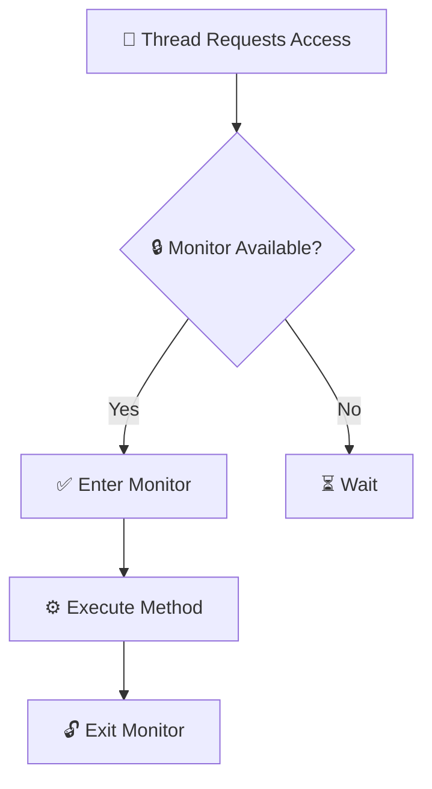

# 📌 Monitors

> 💡 **Quick Definition**
>
> A **Monitor** is a **high-level synchronization mechanism** built on top of locks. It combines **shared data**, the **operations on that data**, and **automatic synchronization** into a single unit, ensuring that **only one thread can execute inside the monitor at a time**.

---

# 🤔 Why Do We Need Monitors?

Earlier synchronization mechanisms like **locks** and **semaphores** require programmers to explicitly manage synchronization.

For example:

- Acquire a lock before entering the critical section.
- Release the lock after completing the work.
- Correctly invoke `wait()` and `signal()` whenever required.

Managing these operations manually becomes difficult as programs grow larger. Forgetting a single lock or unlock operation can introduce race conditions, deadlocks, or inconsistent data.

Monitors solve this problem by **handling synchronization automatically**, allowing programmers to focus on the logic rather than the synchronization mechanism.

> 🎯 **Key Idea**
>
> A monitor automatically protects the shared resource, so the programmer only writes the operations that should be performed on it.

---

# 📈 Evolution of Synchronization Mechanisms

Synchronization has evolved from low-level hardware instructions to high-level programming constructs.

```text
Hardware Instructions
(Test-and-Set, CAS)
        │
        ▼
      Locks
        │
        ▼
   Semaphores
        │
        ▼
    🏆 Monitors
```

| Mechanism | Responsibility |
|-----------|----------------|
| Hardware Instructions | Atomic operations |
| Locks | Mutual exclusion |
| Semaphores | Synchronization + Mutual exclusion |
| Monitors | Automatic synchronization |

---

# ✨ Characteristics of Monitors

- 🔒 Built on top of locks.
- ⚙️ Provides automatic mutual exclusion.
- 📦 Encapsulates shared data and operations together.
- 👤 Only one thread can execute inside a monitor at a time.
- 🚫 Eliminates explicit locking and unlocking.
- 🧹 Produces cleaner and safer concurrent code.
- ☕ Widely used in Java multithreading.

---

# 🏗️ Structure of a Monitor

A monitor consists of three main components.

| Component | Purpose |
|-----------|----------|
| 📦 Shared Variables | Store the shared resources |
| ⚙️ Monitor Procedures | Methods that operate on shared data |
| 🚦 Condition Variables | Coordinate waiting and signaling between threads |

```text
             Monitor
     +----------------------+
     |  Shared Variables    |
     |----------------------|
     |  Monitor Methods     |
     |----------------------|
     | Condition Variables  |
     +----------------------+
```

---

# ⚙️ How Does a Monitor Work?

Every monitor internally maintains a **lock**.

Whenever a thread calls one of the monitor's synchronized methods:

1. The monitor automatically checks whether it is available.
2. If free, the thread enters the monitor.
3. If another thread is already executing inside, the new thread waits.
4. After the executing thread completes its work, the monitor automatically releases the lock.
5. One waiting thread is allowed to enter.

The programmer never explicitly acquires or releases the lock.



> 💡 **Remember**
>
> A monitor internally uses a lock, but the lock is managed automatically.

---

# ☕ Monitors in Java

Java does **not** provide a keyword named `monitor`.

Instead, monitor functionality is implemented using:

- Classes
- Objects
- The `synchronized` keyword

Whenever a method or block is declared as `synchronized`, the Java Virtual Machine (JVM) automatically acquires the object's monitor before execution and releases it when execution finishes.

> ⚠️ **Important**
>
> Every Java object has an associated monitor.

---

# 🏦 Bank Account Example

Suppose multiple threads are updating a bank account.

The shared resource is:

```text
Balance
```

The monitor provides two operations:

- Deposit
- Withdraw

Instead of manually locking and unlocking, the methods are declared as `synchronized`.

```java
class AccountUpdate {

    private int balance;

    synchronized void deposit(int amount) {
        balance = balance + amount;
    }

    synchronized void withdraw(int amount) {
        balance = balance - amount;
    }

}
```

### What happens internally?

```text
Thread 1
     │
Calls deposit()
     │
Enters Monitor
     │
Updates Balance
     │
Leaves Monitor

──────────────────────────────

Thread 2
     │
Calls withdraw()
     │
Waits
     │
Enters only after Thread 1 exits
```

Thus, only one thread modifies the balance at a time.

---

# 🧩 Code Breakdown

| Code | Purpose |
|------|----------|
| `class AccountUpdate` | Defines the monitor |
| `balance` | Shared resource |
| `synchronized deposit()` | Allows only one thread to deposit at a time |
| `synchronized withdraw()` | Allows only one thread to withdraw at a time |
| JVM | Automatically manages locking and unlocking |

---

# 🚦 Condition Variables

Sometimes mutual exclusion alone is not sufficient.

A thread may have to wait until a certain condition becomes true.

Monitors use **condition variables** to support this coordination.

Unlike semaphores, condition variables are always associated with a monitor.

---

# ⚙️ Condition Variable Operations

## 💤 `wait()`

- Releases the monitor lock.
- Suspends the current thread.
- Places the thread into the waiting queue.
- Thread resumes only after receiving a notification.

---

## 🔔 `signal()`

- Wakes one waiting thread.
- The awakened thread competes to acquire the monitor lock.

---

## 📢 `broadcast()`

Available in some programming languages.

- Wakes all waiting threads.
- Each awakened thread competes for the monitor lock.

---

# 💡 Monitor with Condition Variable

```text
Monitor Account

Shared Variable
---------------
balance

Condition Variable
------------------
sufficientFunds

withdraw(amount)

if balance < amount
       wait(sufficientFunds)

balance = balance - amount

------------------------------------

deposit(amount)

balance = balance + amount

signal(sufficientFunds)
```

Here:

- If insufficient balance exists, the withdrawing thread waits.
- A deposit signals waiting threads after adding money.

---

# ✅ Advantages of Monitors

- 🔒 Automatic mutual exclusion.
- 😊 Easier to use than semaphores.
- 🚫 No explicit lock management.
- 🛡️ Reduces programming errors.
- 📦 Encapsulates shared data and synchronization together.
- 🧹 Produces cleaner and more maintainable code.
- ☕ Ideal for object-oriented programming.

---

# ❌ Limitations of Monitors

- Language dependent.
- Requires compiler and runtime support.
- Cannot be implemented as a simple library.
- Less portable across programming languages.
- Only languages with built-in support can use monitors directly.

---

# 🌍 Languages Supporting Monitors

Some languages provide monitor support directly.

- ☕ Java
- C#
- Visual Basic
- Ada
- Concurrent Euclid

---

# ⚖️ Monitor vs Semaphore

| Feature | 🏆 Monitor | 🚦 Semaphore |
|----------|------------|--------------|
| Level | High-level | Low-level |
| Synchronization | Automatic | Manual |
| Mutual Exclusion | Automatic | Programmer controlled |
| Shared Data | Encapsulated | Separate |
| Operations | Synchronized methods | `wait()` / `signal()` |
| Ease of Use | Easier | More difficult |
| Programming Errors | Less likely | More likely |

---

# ⚖️ Monitor vs Mutex

| Feature | 🏆 Monitor | 🔒 Mutex |
|----------|------------|----------|
| Abstraction | High-level | Low-level |
| Locking | Automatic | Explicit |
| Shared Data | Encapsulated | Separate |
| Mutual Exclusion | Automatic | Manual |
| Programmer Effort | Low | Higher |

---

# 🧠 Memory Trick

> 🎯 **Monitor = Manager**
>
> Imagine a security guard standing outside a room.
>
> - Only one employee (thread) is allowed inside.
> - Everyone else waits outside.
> - The guard automatically controls entry and exit.
>
> That security guard is the **Monitor**.

---

# 🎯 Interview Questions

### Q1. What is a monitor?

A monitor is a high-level synchronization mechanism that combines shared data and operations while providing automatic mutual exclusion.

---

### Q2. How is a monitor implemented in Java?

Using classes, objects, and the `synchronized` keyword.

---

### Q3. Does Java have a `monitor` keyword?

No.

Java implements monitors using `synchronized`.

---

### Q4. Can multiple threads execute inside a monitor simultaneously?

No.

Only one thread can execute inside a monitor at any time.

---

### Q5. Why are monitors preferred over semaphores?

Because synchronization is handled automatically, making programs simpler, safer, and less prone to programming errors.

---

### Q6. What are condition variables?

Condition variables allow threads to wait until a specific condition becomes true using operations like `wait()`, `signal()`, and `broadcast()`.

---

# 📝 Cheat Sheet

| 📌 Remember | ✔️ |
|-------------|----|
| Level | High-level synchronization |
| Built On | Locks |
| Mutual Exclusion | Automatic |
| Java Keyword | `synchronized` |
| Lock Management | Automatic |
| Shared Data | Encapsulated |
| Threads Inside | One at a time |
| Waiting Mechanism | Condition Variables |
| Operations | `wait()`, `signal()`, `broadcast()` |
| Best For | Object-oriented multithreading |